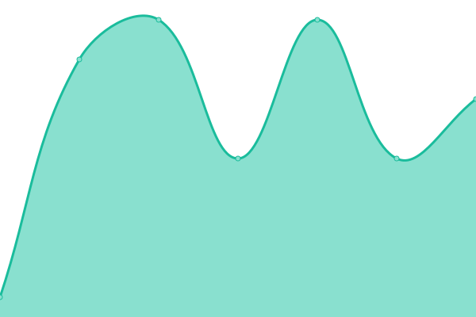
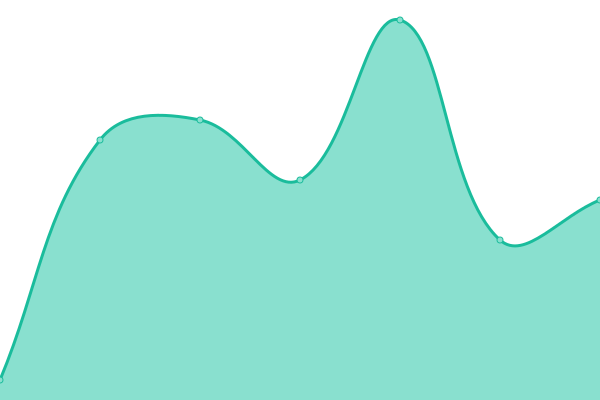
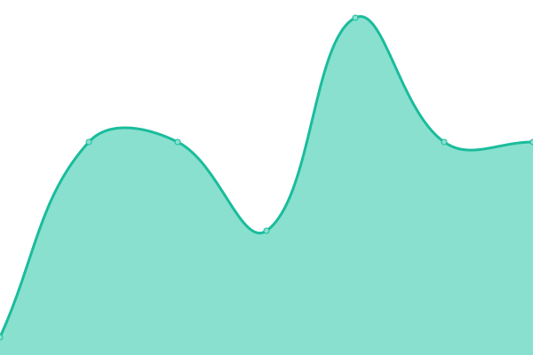
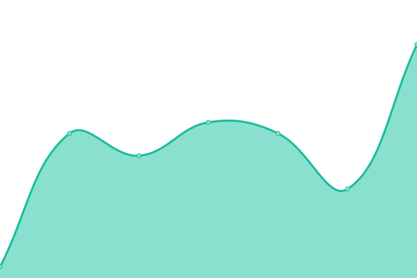
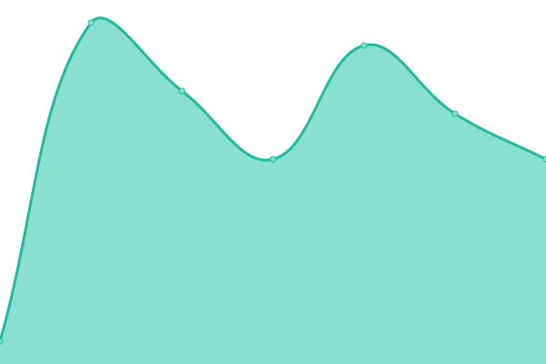
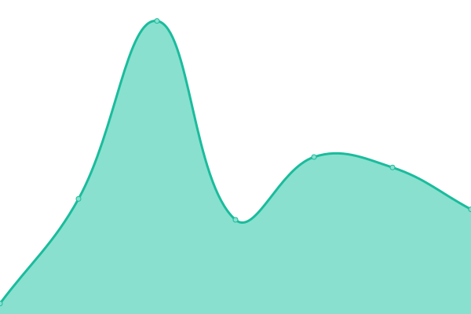
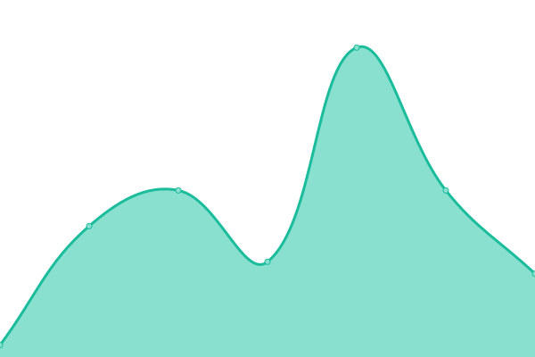
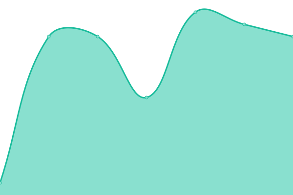
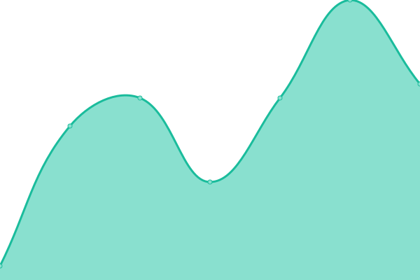
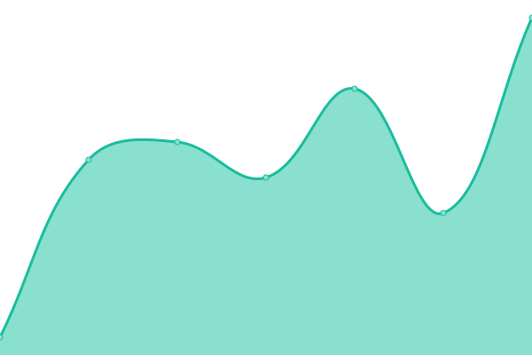

# [📈 Live Status](https://status.httpstatus.xyz): <!--live status--> **🟩 All systems operational**

This repository contains the open-source uptime monitor and status page for [Sam Petherbridge](peth.me), powered by [Upptime](https://github.com/upptime/upptime).

With [Upptime](https://upptime.js.org), you can get your own unlimited and free uptime monitor and status page, powered entirely by a GitHub repository. We use [Issues](https://github.com/SamPetherbridge/status.httpstatus.xyz/issues) as incident reports, [Actions](https://github.com/SamPetherbridge/status.httpstatus.xyz/actions) as uptime monitors, and [Pages](https://status.httpstatus.xyz) for the status page.

<!--start: status pages-->
<!-- This summary is generated by Upptime (https://github.com/upptime/upptime) -->
<!-- Do not edit this manually, your changes will be overwritten -->
<!-- prettier-ignore -->
| URL | Status | History | Response Time | Uptime |
| --- | ------ | ------- | ------------- | ------ |
|  [200 Ok - GET](https://statuscodes.peth.me/200) | 🟩 Up | [200-ok-get.yml](https://github.com/SamPetherbridge/status.statuscodes.peth.me/commits/HEAD/history/200-ok-get.yml) | 

 76ms
     
 | 

<a href="https://status.statuscodes.peth.me/history/200-ok-get">100.00%</a>
    

|  [200 Ok - POST](https://statuscodes.peth.me/200) | 🟩 Up | [200-ok-post.yml](https://github.com/SamPetherbridge/status.statuscodes.peth.me/commits/HEAD/history/200-ok-post.yml) | 

 16ms
     
 | 

<a href="https://status.statuscodes.peth.me/history/200-ok-post">100.00%</a>
    

|  [200 Ok - PUT](https://statuscodes.peth.me/200) | 🟩 Up | [200-ok-put.yml](https://github.com/SamPetherbridge/status.statuscodes.peth.me/commits/HEAD/history/200-ok-put.yml) | 

 17ms
     
 | 

<a href="https://status.statuscodes.peth.me/history/200-ok-put">100.00%</a>
    

|  [200 Ok - PATCH](https://statuscodes.peth.me/200) | 🟩 Up | [200-ok-patch.yml](https://github.com/SamPetherbridge/status.statuscodes.peth.me/commits/HEAD/history/200-ok-patch.yml) | 

 20ms
     
 | 

<a href="https://status.statuscodes.peth.me/history/200-ok-patch">100.00%</a>
    

|  [200 Ok - DELETE](https://statuscodes.peth.me/200) | 🟩 Up | [200-ok-delete.yml](https://github.com/SamPetherbridge/status.statuscodes.peth.me/commits/HEAD/history/200-ok-delete.yml) | 

 19ms
     
 | 

<a href="https://status.statuscodes.peth.me/history/200-ok-delete">100.00%</a>
    

|  [200 Ok - COPY](https://statuscodes.peth.me/200) | 🟩 Up | [200-ok-copy.yml](https://github.com/SamPetherbridge/status.statuscodes.peth.me/commits/HEAD/history/200-ok-copy.yml) | 

 20ms
     
 | 

<a href="https://status.statuscodes.peth.me/history/200-ok-copy">100.00%</a>
    

|  [200 Ok - HEAD](https://statuscodes.peth.me/200) | 🟩 Up | [200-ok-head.yml](https://github.com/SamPetherbridge/status.statuscodes.peth.me/commits/HEAD/history/200-ok-head.yml) | 

 16ms
     
 | 

<a href="https://status.statuscodes.peth.me/history/200-ok-head">100.00%</a>
    

|  [200 Ok - OPTIONS](https://statuscodes.peth.me/200) | 🟩 Up | [200-ok-options.yml](https://github.com/SamPetherbridge/status.statuscodes.peth.me/commits/HEAD/history/200-ok-options.yml) | 

 18ms
     
 | 

<a href="https://status.statuscodes.peth.me/history/200-ok-options">100.00%</a>
    

|  [200 Ok - LOCK](https://statuscodes.peth.me/200) | 🟩 Up | [200-ok-lock.yml](https://github.com/SamPetherbridge/status.statuscodes.peth.me/commits/HEAD/history/200-ok-lock.yml) | 

 19ms
     
 | 

<a href="https://status.statuscodes.peth.me/history/200-ok-lock">100.00%</a>
    

|  [200 Ok - UNLOCK](https://statuscodes.peth.me/200) | 🟩 Up | [200-ok-unlock.yml](https://github.com/SamPetherbridge/status.statuscodes.peth.me/commits/HEAD/history/200-ok-unlock.yml) | 

 15ms
     
 | 

<a href="https://status.statuscodes.peth.me/history/200-ok-unlock">100.00%</a>
    

|  [200 Ok - PROPFIND](https://statuscodes.peth.me/200) | 🟩 Up | [200-ok-propfind.yml](https://github.com/SamPetherbridge/status.statuscodes.peth.me/commits/HEAD/history/200-ok-propfind.yml) | 

 17ms
     
 | 

<a href="https://status.statuscodes.peth.me/history/200-ok-propfind">100.00%</a>
    

|  [201 - GET](https://statuscodes.peth.me/201) | 🟩 Up | [201-get.yml](https://github.com/SamPetherbridge/status.statuscodes.peth.me/commits/HEAD/history/201-get.yml) | 

 17ms
     
 | 

<a href="https://status.statuscodes.peth.me/history/201-get">100.00%</a>
    

|  [202 - GET](https://statuscodes.peth.me/202) | 🟩 Up | [202-get.yml](https://github.com/SamPetherbridge/status.statuscodes.peth.me/commits/HEAD/history/202-get.yml) | 

 17ms
     
 | 

<a href="https://status.statuscodes.peth.me/history/202-get">100.00%</a>
    

|  [203 - GET](https://statuscodes.peth.me/203) | 🟩 Up | [203-get.yml](https://github.com/SamPetherbridge/status.statuscodes.peth.me/commits/HEAD/history/203-get.yml) | 

 16ms
     
 | 

<a href="https://status.statuscodes.peth.me/history/203-get">100.00%</a>
    

|  [204 - GET](https://statuscodes.peth.me/204) | 🟩 Up | [204-get.yml](https://github.com/SamPetherbridge/status.statuscodes.peth.me/commits/HEAD/history/204-get.yml) | 

 17ms
     
 | 

<a href="https://status.statuscodes.peth.me/history/204-get">100.00%</a>
    

|  [205 - GET](https://statuscodes.peth.me/205) | 🟩 Up | [205-get.yml](https://github.com/SamPetherbridge/status.statuscodes.peth.me/commits/HEAD/history/205-get.yml) | 

 15ms
     
 | 

<a href="https://status.statuscodes.peth.me/history/205-get">100.00%</a>
    

|  [206 - GET](https://statuscodes.peth.me/206) | 🟩 Up | [206-get.yml](https://github.com/SamPetherbridge/status.statuscodes.peth.me/commits/HEAD/history/206-get.yml) | 

 16ms
     
 | 

<a href="https://status.statuscodes.peth.me/history/206-get">100.00%</a>
    

|  [207 - GET](https://statuscodes.peth.me/207) | 🟩 Up | [207-get.yml](https://github.com/SamPetherbridge/status.statuscodes.peth.me/commits/HEAD/history/207-get.yml) | 

 16ms
     
 | 

<a href="https://status.statuscodes.peth.me/history/207-get">100.00%</a>
    

|  [208 - GET](https://statuscodes.peth.me/208) | 🟩 Up | [208-get.yml](https://github.com/SamPetherbridge/status.statuscodes.peth.me/commits/HEAD/history/208-get.yml) | 

 15ms
     
 | 

<a href="https://status.statuscodes.peth.me/history/208-get">100.00%</a>
    

|  [226 - GET](https://statuscodes.peth.me/226) | 🟩 Up | [226-get.yml](https://github.com/SamPetherbridge/status.statuscodes.peth.me/commits/HEAD/history/226-get.yml) | 

 19ms
     
 | 

<a href="https://status.statuscodes.peth.me/history/226-get">100.00%</a>
    

|  [300 - GET](https://statuscodes.peth.me/300) | 🟩 Up | [300-get.yml](https://github.com/SamPetherbridge/status.statuscodes.peth.me/commits/HEAD/history/300-get.yml) | 

 17ms
     
 | 

<a href="https://status.statuscodes.peth.me/history/300-get">100.00%</a>
    

|  [301 - GET](https://statuscodes.peth.me/301) | 🟩 Up | [301-get.yml](https://github.com/SamPetherbridge/status.statuscodes.peth.me/commits/HEAD/history/301-get.yml) | 

 17ms
     
 | 

<a href="https://status.statuscodes.peth.me/history/301-get">100.00%</a>
    

|  [302 - GET](https://statuscodes.peth.me/302) | 🟩 Up | [302-get.yml](https://github.com/SamPetherbridge/status.statuscodes.peth.me/commits/HEAD/history/302-get.yml) | 

 16ms
     
 | 

<a href="https://status.statuscodes.peth.me/history/302-get">100.00%</a>
    

|  [303 - GET](https://statuscodes.peth.me/303) | 🟩 Up | [303-get.yml](https://github.com/SamPetherbridge/status.statuscodes.peth.me/commits/HEAD/history/303-get.yml) | 

 18ms
     
 | 

<a href="https://status.statuscodes.peth.me/history/303-get">100.00%</a>
    

|  [304 - GET](https://statuscodes.peth.me/304) | 🟩 Up | [304-get.yml](https://github.com/SamPetherbridge/status.statuscodes.peth.me/commits/HEAD/history/304-get.yml) | 

 16ms
     
 | 

<a href="https://status.statuscodes.peth.me/history/304-get">100.00%</a>
    

|  [307 - GET](https://statuscodes.peth.me/307) | 🟩 Up | [307-get.yml](https://github.com/SamPetherbridge/status.statuscodes.peth.me/commits/HEAD/history/307-get.yml) | 

 17ms
     
 | 

<a href="https://status.statuscodes.peth.me/history/307-get">100.00%</a>
    

|  [308 - GET](https://statuscodes.peth.me/308) | 🟩 Up | [308-get.yml](https://github.com/SamPetherbridge/status.statuscodes.peth.me/commits/HEAD/history/308-get.yml) | 

 16ms
     
 | 

<a href="https://status.statuscodes.peth.me/history/308-get">100.00%</a>
    

|  [400 - GET](https://statuscodes.peth.me/400) | 🟩 Up | [400-get.yml](https://github.com/SamPetherbridge/status.statuscodes.peth.me/commits/HEAD/history/400-get.yml) | 

 16ms
     
 | 

<a href="https://status.statuscodes.peth.me/history/400-get">100.00%</a>
    

|  [401 - GET](https://statuscodes.peth.me/401) | 🟩 Up | [401-get.yml](https://github.com/SamPetherbridge/status.statuscodes.peth.me/commits/HEAD/history/401-get.yml) | 

 16ms
     
 | 

<a href="https://status.statuscodes.peth.me/history/401-get">100.00%</a>
    

|  [402 - GET](https://statuscodes.peth.me/402) | 🟩 Up | [402-get.yml](https://github.com/SamPetherbridge/status.statuscodes.peth.me/commits/HEAD/history/402-get.yml) | 

 17ms
     
 | 

<a href="https://status.statuscodes.peth.me/history/402-get">100.00%</a>
    

|  [403 - GET](https://statuscodes.peth.me/403) | 🟩 Up | [403-get.yml](https://github.com/SamPetherbridge/status.statuscodes.peth.me/commits/HEAD/history/403-get.yml) | 

 17ms
     
 | 

<a href="https://status.statuscodes.peth.me/history/403-get">100.00%</a>
    

|  [404 - GET](https://statuscodes.peth.me/404) | 🟩 Up | [404-get.yml](https://github.com/SamPetherbridge/status.statuscodes.peth.me/commits/HEAD/history/404-get.yml) | 

 16ms
     
 | 

<a href="https://status.statuscodes.peth.me/history/404-get">100.00%</a>
    

|  [405 - GET](https://statuscodes.peth.me/405) | 🟩 Up | [405-get.yml](https://github.com/SamPetherbridge/status.statuscodes.peth.me/commits/HEAD/history/405-get.yml) | 

 15ms
     
 | 

<a href="https://status.statuscodes.peth.me/history/405-get">100.00%</a>
    

|  [406 - GET](https://statuscodes.peth.me/406) | 🟩 Up | [406-get.yml](https://github.com/SamPetherbridge/status.statuscodes.peth.me/commits/HEAD/history/406-get.yml) | 

 18ms
     
 | 

<a href="https://status.statuscodes.peth.me/history/406-get">100.00%</a>
    

|  [407 - GET](https://statuscodes.peth.me/407) | 🟩 Up | [407-get.yml](https://github.com/SamPetherbridge/status.statuscodes.peth.me/commits/HEAD/history/407-get.yml) | 

 15ms
     
 | 

<a href="https://status.statuscodes.peth.me/history/407-get">100.00%</a>
    

|  [408 - GET](https://statuscodes.peth.me/408) | 🟩 Up | [408-get.yml](https://github.com/SamPetherbridge/status.statuscodes.peth.me/commits/HEAD/history/408-get.yml) | 

 15ms
     
 | 

<a href="https://status.statuscodes.peth.me/history/408-get">100.00%</a>
    

|  [409 - GET](https://statuscodes.peth.me/409) | 🟩 Up | [409-get.yml](https://github.com/SamPetherbridge/status.statuscodes.peth.me/commits/HEAD/history/409-get.yml) | 

 16ms
     
 | 

<a href="https://status.statuscodes.peth.me/history/409-get">100.00%</a>
    

|  [410 - GET](https://statuscodes.peth.me/410) | 🟩 Up | [410-get.yml](https://github.com/SamPetherbridge/status.statuscodes.peth.me/commits/HEAD/history/410-get.yml) | 

 16ms
     
 | 

<a href="https://status.statuscodes.peth.me/history/410-get">100.00%</a>
    

|  [411 - GET](https://statuscodes.peth.me/411) | 🟩 Up | [411-get.yml](https://github.com/SamPetherbridge/status.statuscodes.peth.me/commits/HEAD/history/411-get.yml) | 

 17ms
     
 | 

<a href="https://status.statuscodes.peth.me/history/411-get">100.00%</a>
    

|  [412 - GET](https://statuscodes.peth.me/412) | 🟩 Up | [412-get.yml](https://github.com/SamPetherbridge/status.statuscodes.peth.me/commits/HEAD/history/412-get.yml) | 

 15ms
     
 | 

<a href="https://status.statuscodes.peth.me/history/412-get">100.00%</a>
    

|  [413 - GET](https://statuscodes.peth.me/413) | 🟩 Up | [413-get.yml](https://github.com/SamPetherbridge/status.statuscodes.peth.me/commits/HEAD/history/413-get.yml) | 

 14ms
     
 | 

<a href="https://status.statuscodes.peth.me/history/413-get">100.00%</a>
    

|  [414 - GET](https://statuscodes.peth.me/414) | 🟩 Up | [414-get.yml](https://github.com/SamPetherbridge/status.statuscodes.peth.me/commits/HEAD/history/414-get.yml) | 

 16ms
     
 | 

<a href="https://status.statuscodes.peth.me/history/414-get">100.00%</a>
    

|  [415 - GET](https://statuscodes.peth.me/415) | 🟩 Up | [415-get.yml](https://github.com/SamPetherbridge/status.statuscodes.peth.me/commits/HEAD/history/415-get.yml) | 

 16ms
     
 | 

<a href="https://status.statuscodes.peth.me/history/415-get">100.00%</a>
    

|  [416 - GET](https://statuscodes.peth.me/416) | 🟩 Up | [416-get.yml](https://github.com/SamPetherbridge/status.statuscodes.peth.me/commits/HEAD/history/416-get.yml) | 

 15ms
     
 | 

<a href="https://status.statuscodes.peth.me/history/416-get">100.00%</a>
    

|  [417 - GET](https://statuscodes.peth.me/417) | 🟩 Up | [417-get.yml](https://github.com/SamPetherbridge/status.statuscodes.peth.me/commits/HEAD/history/417-get.yml) | 

 17ms
     
 | 

<a href="https://status.statuscodes.peth.me/history/417-get">100.00%</a>
    

|  [418 - GET](https://statuscodes.peth.me/418) | 🟩 Up | [418-get.yml](https://github.com/SamPetherbridge/status.statuscodes.peth.me/commits/HEAD/history/418-get.yml) | 

 16ms
     
 | 

<a href="https://status.statuscodes.peth.me/history/418-get">100.00%</a>
    

|  [421 - GET](https://statuscodes.peth.me/421) | 🟩 Up | [421-get.yml](https://github.com/SamPetherbridge/status.statuscodes.peth.me/commits/HEAD/history/421-get.yml) | 

 17ms
     
 | 

<a href="https://status.statuscodes.peth.me/history/421-get">100.00%</a>
    

|  [422 - GET](https://statuscodes.peth.me/422) | 🟩 Up | [422-get.yml](https://github.com/SamPetherbridge/status.statuscodes.peth.me/commits/HEAD/history/422-get.yml) | 

 14ms
     
 | 

<a href="https://status.statuscodes.peth.me/history/422-get">100.00%</a>
    

|  [423 - GET](https://statuscodes.peth.me/423) | 🟩 Up | [423-get.yml](https://github.com/SamPetherbridge/status.statuscodes.peth.me/commits/HEAD/history/423-get.yml) | 

 16ms
     
 | 

<a href="https://status.statuscodes.peth.me/history/423-get">100.00%</a>
    

|  [424 - GET](https://statuscodes.peth.me/424) | 🟩 Up | [424-get.yml](https://github.com/SamPetherbridge/status.statuscodes.peth.me/commits/HEAD/history/424-get.yml) | 

 16ms
     
 | 

<a href="https://status.statuscodes.peth.me/history/424-get">100.00%</a>
    

|  [425 - GET](https://statuscodes.peth.me/425) | 🟩 Up | [425-get.yml](https://github.com/SamPetherbridge/status.statuscodes.peth.me/commits/HEAD/history/425-get.yml) | 

 17ms
     
 | 

<a href="https://status.statuscodes.peth.me/history/425-get">100.00%</a>
    

|  [426 - GET](https://statuscodes.peth.me/426) | 🟩 Up | [426-get.yml](https://github.com/SamPetherbridge/status.statuscodes.peth.me/commits/HEAD/history/426-get.yml) | 

 16ms
     
 | 

<a href="https://status.statuscodes.peth.me/history/426-get">100.00%</a>
    

|  [428 - GET](https://statuscodes.peth.me/428) | 🟩 Up | [428-get.yml](https://github.com/SamPetherbridge/status.statuscodes.peth.me/commits/HEAD/history/428-get.yml) | 

 14ms
     
 | 

<a href="https://status.statuscodes.peth.me/history/428-get">100.00%</a>
    

|  [429 - GET](https://statuscodes.peth.me/429) | 🟩 Up | [429-get.yml](https://github.com/SamPetherbridge/status.statuscodes.peth.me/commits/HEAD/history/429-get.yml) | 

 15ms
     
 | 

<a href="https://status.statuscodes.peth.me/history/429-get">100.00%</a>
    

|  [431 - GET](https://statuscodes.peth.me/431) | 🟩 Up | [431-get.yml](https://github.com/SamPetherbridge/status.statuscodes.peth.me/commits/HEAD/history/431-get.yml) | 

 15ms
     
 | 

<a href="https://status.statuscodes.peth.me/history/431-get">100.00%</a>
    

|  [451 - GET](https://statuscodes.peth.me/451) | 🟩 Up | [451-get.yml](https://github.com/SamPetherbridge/status.statuscodes.peth.me/commits/HEAD/history/451-get.yml) | 

 15ms
     
 | 

<a href="https://status.statuscodes.peth.me/history/451-get">100.00%</a>
    

|  [500 - GET](https://statuscodes.peth.me/500) | 🟩 Up | [500-get.yml](https://github.com/SamPetherbridge/status.statuscodes.peth.me/commits/HEAD/history/500-get.yml) | 

 15ms
     
 | 

<a href="https://status.statuscodes.peth.me/history/500-get">100.00%</a>
    

|  [501 - GET](https://statuscodes.peth.me/501) | 🟩 Up | [501-get.yml](https://github.com/SamPetherbridge/status.statuscodes.peth.me/commits/HEAD/history/501-get.yml) | 

 18ms
     
 | 

<a href="https://status.statuscodes.peth.me/history/501-get">100.00%</a>
    

|  [502 - GET](https://statuscodes.peth.me/502) | 🟩 Up | [502-get.yml](https://github.com/SamPetherbridge/status.statuscodes.peth.me/commits/HEAD/history/502-get.yml) | 

 15ms
     
 | 

<a href="https://status.statuscodes.peth.me/history/502-get">100.00%</a>
    

|  [503 - GET](https://statuscodes.peth.me/503) | 🟩 Up | [503-get.yml](https://github.com/SamPetherbridge/status.statuscodes.peth.me/commits/HEAD/history/503-get.yml) | 

 16ms
     
 | 

<a href="https://status.statuscodes.peth.me/history/503-get">100.00%</a>
    

|  [504 - GET](https://statuscodes.peth.me/504) | 🟩 Up | [504-get.yml](https://github.com/SamPetherbridge/status.statuscodes.peth.me/commits/HEAD/history/504-get.yml) | 

 15ms
     
 | 

<a href="https://status.statuscodes.peth.me/history/504-get">100.00%</a>
    

|  [505 - GET](https://statuscodes.peth.me/505) | 🟩 Up | [505-get.yml](https://github.com/SamPetherbridge/status.statuscodes.peth.me/commits/HEAD/history/505-get.yml) | 

 18ms
     
 | 

<a href="https://status.statuscodes.peth.me/history/505-get">100.00%</a>
    

|  [506 - GET](https://statuscodes.peth.me/506) | 🟩 Up | [506-get.yml](https://github.com/SamPetherbridge/status.statuscodes.peth.me/commits/HEAD/history/506-get.yml) | 

 15ms
     
 | 

<a href="https://status.statuscodes.peth.me/history/506-get">100.00%</a>
    

|  [507 - GET](https://statuscodes.peth.me/507) | 🟩 Up | [507-get.yml](https://github.com/SamPetherbridge/status.statuscodes.peth.me/commits/HEAD/history/507-get.yml) | 

 15ms
     
 | 

<a href="https://status.statuscodes.peth.me/history/507-get">100.00%</a>
    

|  [508 - GET](https://statuscodes.peth.me/508) | 🟩 Up | [508-get.yml](https://github.com/SamPetherbridge/status.statuscodes.peth.me/commits/HEAD/history/508-get.yml) | 

 14ms
     
 | 

<a href="https://status.statuscodes.peth.me/history/508-get">100.00%</a>
    

|  [509 - GET](https://statuscodes.peth.me/509) | 🟩 Up | [509-get.yml](https://github.com/SamPetherbridge/status.statuscodes.peth.me/commits/HEAD/history/509-get.yml) | 

 17ms
     
 | 

<a href="https://status.statuscodes.peth.me/history/509-get">100.00%</a>
    

|  [510 - GET](https://statuscodes.peth.me/510) | 🟩 Up | [510-get.yml](https://github.com/SamPetherbridge/status.statuscodes.peth.me/commits/HEAD/history/510-get.yml) | 

 15ms
     
 | 

<a href="https://status.statuscodes.peth.me/history/510-get">100.00%</a>
    

|  [511 - GET](https://statuscodes.peth.me/511) | 🟩 Up | [511-get.yml](https://github.com/SamPetherbridge/status.statuscodes.peth.me/commits/HEAD/history/511-get.yml) | 

 19ms
     
 | 

<a href="https://status.statuscodes.peth.me/history/511-get">100.00%</a>
    

|  [520 - GET](https://statuscodes.peth.me/520) | 🟩 Up | [520-get.yml](https://github.com/SamPetherbridge/status.statuscodes.peth.me/commits/HEAD/history/520-get.yml) | 

 15ms
     
 | 

<a href="https://status.statuscodes.peth.me/history/520-get">100.00%</a>
    

|  [521 - GET](https://statuscodes.peth.me/521) | 🟩 Up | [521-get.yml](https://github.com/SamPetherbridge/status.statuscodes.peth.me/commits/HEAD/history/521-get.yml) | 

 14ms
     
 | 

<a href="https://status.statuscodes.peth.me/history/521-get">100.00%</a>
    

|  [522 - GET](https://statuscodes.peth.me/522) | 🟩 Up | [522-get.yml](https://github.com/SamPetherbridge/status.statuscodes.peth.me/commits/HEAD/history/522-get.yml) | 

 16ms
     
 | 

<a href="https://status.statuscodes.peth.me/history/522-get">100.00%</a>
    

|  [523 - GET](https://statuscodes.peth.me/523) | 🟩 Up | [523-get.yml](https://github.com/SamPetherbridge/status.statuscodes.peth.me/commits/HEAD/history/523-get.yml) | 

 14ms
     
 | 

<a href="https://status.statuscodes.peth.me/history/523-get">100.00%</a>
    

|  [524 - GET](https://statuscodes.peth.me/524) | 🟩 Up | [524-get.yml](https://github.com/SamPetherbridge/status.statuscodes.peth.me/commits/HEAD/history/524-get.yml) | 

 16ms
     
 | 

<a href="https://status.statuscodes.peth.me/history/524-get">100.00%</a>
    

|  [525 - GET](https://statuscodes.peth.me/525) | 🟩 Up | [525-get.yml](https://github.com/SamPetherbridge/status.statuscodes.peth.me/commits/HEAD/history/525-get.yml) | 

 14ms
     
 | 

<a href="https://status.statuscodes.peth.me/history/525-get">100.00%</a>
    

|  [526 - GET](https://statuscodes.peth.me/526) | 🟩 Up | [526-get.yml](https://github.com/SamPetherbridge/status.statuscodes.peth.me/commits/HEAD/history/526-get.yml) | 

 16ms
     
 | 

<a href="https://status.statuscodes.peth.me/history/526-get">100.00%</a>
    

|  [527 - GET](https://statuscodes.peth.me/527) | 🟩 Up | [527-get.yml](https://github.com/SamPetherbridge/status.statuscodes.peth.me/commits/HEAD/history/527-get.yml) | 

 17ms
     
 | 

<a href="https://status.statuscodes.peth.me/history/527-get">100.00%</a>
    

|  [530 - GET](https://statuscodes.peth.me/530) | 🟩 Up | [530-get.yml](https://github.com/SamPetherbridge/status.statuscodes.peth.me/commits/HEAD/history/530-get.yml) | 

 14ms
     
 | 

<a href="https://status.statuscodes.peth.me/history/530-get">100.00%</a>
    

|  [598 - GET](https://statuscodes.peth.me/598) | 🟩 Up | [598-get.yml](https://github.com/SamPetherbridge/status.statuscodes.peth.me/commits/HEAD/history/598-get.yml) | 

 15ms
     
 | 

<a href="https://status.statuscodes.peth.me/history/598-get">100.00%</a>
    

|  [599 - GET](https://statuscodes.peth.me/599) | 🟩 Up | [599-get.yml](https://github.com/SamPetherbridge/status.statuscodes.peth.me/commits/HEAD/history/599-get.yml) | 

 14ms
     
 | 

<a href="https://status.statuscodes.peth.me/history/599-get">100.00%</a>
    

<!--end: status pages-->

[**Visit our status website →**](https://status.httpstatus.xyz)

## 📄 License

- Powered by: [Upptime](https://github.com/upptime/upptime)
- Code: [MIT](./LICENSE) © [Sam Petherbridge](peth.me)
- Data in the `./history` directory: [Open Database License](https://opendatacommons.org/licenses/odbl/1-0/)
