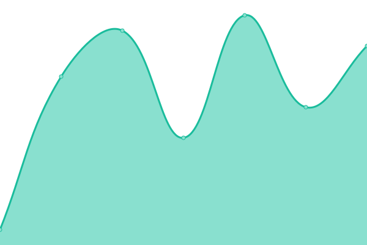
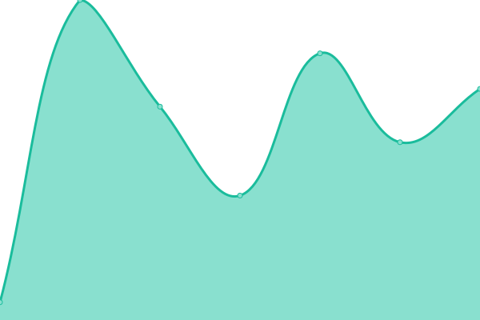
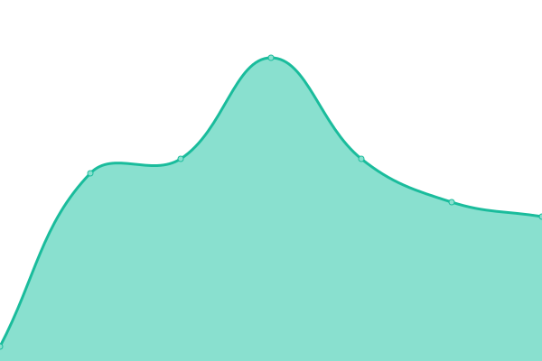
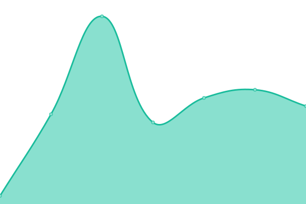
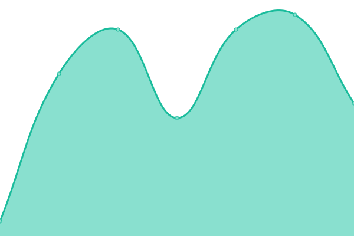

# [📈 Live Status](https://status.httpstatus.xyz): <!--live status--> **🟩 All systems operational**

This repository contains the open-source uptime monitor and status page for [Sam Petherbridge](peth.me), powered by [Upptime](https://github.com/upptime/upptime).

With [Upptime](https://upptime.js.org), you can get your own unlimited and free uptime monitor and status page, powered entirely by a GitHub repository. We use [Issues](https://github.com/SamPetherbridge/status.httpstatus.xyz/issues) as incident reports, [Actions](https://github.com/SamPetherbridge/status.httpstatus.xyz/actions) as uptime monitors, and [Pages](https://status.httpstatus.xyz) for the status page.

<!--start: status pages-->
<!-- This summary is generated by Upptime (https://github.com/upptime/upptime) -->
<!-- Do not edit this manually, your changes will be overwritten -->
<!-- prettier-ignore -->
| URL | Status | History | Response Time | Uptime |
| --- | ------ | ------- | ------------- | ------ |
|  [200 Ok - GET](https://httpstatus.xyz/200) | 🟩 Up | [200-ok-get.yml](https://github.com/SamPetherbridge/status.httpstatus.xyz/commits/master/history/200-ok-get.yml) | 

 109ms
     
 | 

<a href="https://status.httpstatus.xyz/history/200-ok-get">100.00%</a>
    

|  [200 Ok - POST](https://httpstatus.xyz/200) | 🟩 Up | [200-ok-post.yml](https://github.com/SamPetherbridge/status.httpstatus.xyz/commits/master/history/200-ok-post.yml) | 

 19ms
     
 | 

<a href="https://status.httpstatus.xyz/history/200-ok-post">100.00%</a>
    

|  [200 Ok - PUT](https://httpstatus.xyz/200) | 🟩 Up | [200-ok-put.yml](https://github.com/SamPetherbridge/status.httpstatus.xyz/commits/master/history/200-ok-put.yml) | 

 17ms
     
 | 

<a href="https://status.httpstatus.xyz/history/200-ok-put">100.00%</a>
    

|  [200 Ok - PATCH](https://httpstatus.xyz/200) | 🟩 Up | [200-ok-patch.yml](https://github.com/SamPetherbridge/status.httpstatus.xyz/commits/master/history/200-ok-patch.yml) | 

 16ms
     
 | 

<a href="https://status.httpstatus.xyz/history/200-ok-patch">100.00%</a>
    

|  [200 Ok - DELETE](https://httpstatus.xyz/200) | 🟩 Up | [200-ok-delete.yml](https://github.com/SamPetherbridge/status.httpstatus.xyz/commits/master/history/200-ok-delete.yml) | 

 18ms
     
 | 

<a href="https://status.httpstatus.xyz/history/200-ok-delete">100.00%</a>
    

|  [200 Ok - COPY](https://httpstatus.xyz/200) | 🟩 Up | [200-ok-copy.yml](https://github.com/SamPetherbridge/status.httpstatus.xyz/commits/master/history/200-ok-copy.yml) | 

 17ms
     
 | 

<a href="https://status.httpstatus.xyz/history/200-ok-copy">100.00%</a>
    

|  [200 Ok - HEAD](https://httpstatus.xyz/200) | 🟩 Up | [200-ok-head.yml](https://github.com/SamPetherbridge/status.httpstatus.xyz/commits/master/history/200-ok-head.yml) | 

 21ms
     
 | 

<a href="https://status.httpstatus.xyz/history/200-ok-head">100.00%</a>
    

|  [200 Ok - OPTIONS](https://httpstatus.xyz/200) | 🟩 Up | [200-ok-options.yml](https://github.com/SamPetherbridge/status.httpstatus.xyz/commits/master/history/200-ok-options.yml) | 

 19ms
     
 | 

<a href="https://status.httpstatus.xyz/history/200-ok-options">100.00%</a>
    

|  [200 Ok - LOCK](https://httpstatus.xyz/200) | 🟩 Up | [200-ok-lock.yml](https://github.com/SamPetherbridge/status.httpstatus.xyz/commits/master/history/200-ok-lock.yml) | 

 16ms
     
 | 

<a href="https://status.httpstatus.xyz/history/200-ok-lock">100.00%</a>
    

|  [200 Ok - UNLOCK](https://httpstatus.xyz/200) | 🟩 Up | [200-ok-unlock.yml](https://github.com/SamPetherbridge/status.httpstatus.xyz/commits/master/history/200-ok-unlock.yml) | 

 22ms
     
 | 

<a href="https://status.httpstatus.xyz/history/200-ok-unlock">100.00%</a>
    

|  [200 Ok - PROPFIND](https://httpstatus.xyz/200) | 🟩 Up | [200-ok-propfind.yml](https://github.com/SamPetherbridge/status.httpstatus.xyz/commits/master/history/200-ok-propfind.yml) | 

 19ms
     
 | 

<a href="https://status.httpstatus.xyz/history/200-ok-propfind">100.00%</a>
    

|  [201 - GET](https://httpstatus.xyz/201) | 🟩 Up | [201-get.yml](https://github.com/SamPetherbridge/status.httpstatus.xyz/commits/master/history/201-get.yml) | 

 26ms
     
 | 

<a href="https://status.httpstatus.xyz/history/201-get">100.00%</a>
    

|  [201 - POST](https://httpstatus.xyz/201) | 🟩 Up | [201-post.yml](https://github.com/SamPetherbridge/status.httpstatus.xyz/commits/master/history/201-post.yml) | 

 24ms
     
 | 

<a href="https://status.httpstatus.xyz/history/201-post">100.00%</a>
    

|  [201 - PUT](https://httpstatus.xyz/201) | 🟩 Up | [201-put.yml](https://github.com/SamPetherbridge/status.httpstatus.xyz/commits/master/history/201-put.yml) | 

 16ms
     
 | 

<a href="https://status.httpstatus.xyz/history/201-put">100.00%</a>
    

|  [201 - PATCH](https://httpstatus.xyz/201) | 🟩 Up | [201-patch.yml](https://github.com/SamPetherbridge/status.httpstatus.xyz/commits/master/history/201-patch.yml) | 

 17ms
     
 | 

<a href="https://status.httpstatus.xyz/history/201-patch">100.00%</a>
    

|  [201 - DELETE](https://httpstatus.xyz/201) | 🟩 Up | [201-delete.yml](https://github.com/SamPetherbridge/status.httpstatus.xyz/commits/master/history/201-delete.yml) | 

 16ms
     
 | 

<a href="https://status.httpstatus.xyz/history/201-delete">100.00%</a>
    

|  [201 - COPY](https://httpstatus.xyz/201) | 🟩 Up | [201-copy.yml](https://github.com/SamPetherbridge/status.httpstatus.xyz/commits/master/history/201-copy.yml) | 

 16ms
     
 | 

<a href="https://status.httpstatus.xyz/history/201-copy">100.00%</a>
    

|  [201 - HEAD](https://httpstatus.xyz/201) | 🟩 Up | [201-head.yml](https://github.com/SamPetherbridge/status.httpstatus.xyz/commits/master/history/201-head.yml) | 

 15ms
     
 | 

<a href="https://status.httpstatus.xyz/history/201-head">100.00%</a>
    

|  [201 - OPTIONS](https://httpstatus.xyz/201) | 🟩 Up | [201-options.yml](https://github.com/SamPetherbridge/status.httpstatus.xyz/commits/master/history/201-options.yml) | 

 17ms
     
 | 

<a href="https://status.httpstatus.xyz/history/201-options">100.00%</a>
    

|  [201 - LOCK](https://httpstatus.xyz/201) | 🟩 Up | [201-lock.yml](https://github.com/SamPetherbridge/status.httpstatus.xyz/commits/master/history/201-lock.yml) | 

 16ms
     
 | 

<a href="https://status.httpstatus.xyz/history/201-lock">100.00%</a>
    

|  [201 - UNLOCK](https://httpstatus.xyz/201) | 🟩 Up | [201-unlock.yml](https://github.com/SamPetherbridge/status.httpstatus.xyz/commits/master/history/201-unlock.yml) | 

 22ms
     
 | 

<a href="https://status.httpstatus.xyz/history/201-unlock">100.00%</a>
    

|  [201 - PROPFIND](https://httpstatus.xyz/201) | 🟩 Up | [201-propfind.yml](https://github.com/SamPetherbridge/status.httpstatus.xyz/commits/master/history/201-propfind.yml) | 

 19ms
     
 | 

<a href="https://status.httpstatus.xyz/history/201-propfind">100.00%</a>
    

|  [202 - GET](https://httpstatus.xyz/202) | 🟩 Up | [202-get.yml](https://github.com/SamPetherbridge/status.httpstatus.xyz/commits/master/history/202-get.yml) | 

 15ms
     
 | 

<a href="https://status.httpstatus.xyz/history/202-get">100.00%</a>
    

|  [202 - POST](https://httpstatus.xyz/202) | 🟩 Up | [202-post.yml](https://github.com/SamPetherbridge/status.httpstatus.xyz/commits/master/history/202-post.yml) | 

 17ms
     
 | 

<a href="https://status.httpstatus.xyz/history/202-post">100.00%</a>
    

|  [202 - PUT](https://httpstatus.xyz/202) | 🟩 Up | [202-put.yml](https://github.com/SamPetherbridge/status.httpstatus.xyz/commits/master/history/202-put.yml) | 

 18ms
     
 | 

<a href="https://status.httpstatus.xyz/history/202-put">100.00%</a>
    

|  [202 - PATCH](https://httpstatus.xyz/202) | 🟩 Up | [202-patch.yml](https://github.com/SamPetherbridge/status.httpstatus.xyz/commits/master/history/202-patch.yml) | 

 15ms
     
 | 

<a href="https://status.httpstatus.xyz/history/202-patch">100.00%</a>
    

|  [202 - DELETE](https://httpstatus.xyz/202) | 🟩 Up | [202-delete.yml](https://github.com/SamPetherbridge/status.httpstatus.xyz/commits/master/history/202-delete.yml) | 

 17ms
     
 | 

<a href="https://status.httpstatus.xyz/history/202-delete">100.00%</a>
    

|  [202 - COPY](https://httpstatus.xyz/202) | 🟩 Up | [202-copy.yml](https://github.com/SamPetherbridge/status.httpstatus.xyz/commits/master/history/202-copy.yml) | 

 17ms
     
 | 

<a href="https://status.httpstatus.xyz/history/202-copy">100.00%</a>
    

|  [202 - HEAD](https://httpstatus.xyz/202) | 🟩 Up | [202-head.yml](https://github.com/SamPetherbridge/status.httpstatus.xyz/commits/master/history/202-head.yml) | 

 17ms
     
 | 

<a href="https://status.httpstatus.xyz/history/202-head">100.00%</a>
    

|  [202 - OPTIONS](https://httpstatus.xyz/202) | 🟩 Up | [202-options.yml](https://github.com/SamPetherbridge/status.httpstatus.xyz/commits/master/history/202-options.yml) | 

 18ms
     
 | 

<a href="https://status.httpstatus.xyz/history/202-options">100.00%</a>
    

|  [202 - LOCK](https://httpstatus.xyz/202) | 🟩 Up | [202-lock.yml](https://github.com/SamPetherbridge/status.httpstatus.xyz/commits/master/history/202-lock.yml) | 

 22ms
     
 | 

<a href="https://status.httpstatus.xyz/history/202-lock">100.00%</a>
    

|  [202 - UNLOCK](https://httpstatus.xyz/202) | 🟩 Up | [202-unlock.yml](https://github.com/SamPetherbridge/status.httpstatus.xyz/commits/master/history/202-unlock.yml) | 

 24ms
     
 | 

<a href="https://status.httpstatus.xyz/history/202-unlock">100.00%</a>
    

|  [202 - PROPFIND](https://httpstatus.xyz/202) | 🟩 Up | [202-propfind.yml](https://github.com/SamPetherbridge/status.httpstatus.xyz/commits/master/history/202-propfind.yml) | 

 15ms
     
 | 

<a href="https://status.httpstatus.xyz/history/202-propfind">100.00%</a>
    

|  [203 - GET](https://httpstatus.xyz/203) | 🟩 Up | [203-get.yml](https://github.com/SamPetherbridge/status.httpstatus.xyz/commits/master/history/203-get.yml) | 

 17ms
     
 | 

<a href="https://status.httpstatus.xyz/history/203-get">100.00%</a>
    

|  [203 - POST](https://httpstatus.xyz/203) | 🟩 Up | [203-post.yml](https://github.com/SamPetherbridge/status.httpstatus.xyz/commits/master/history/203-post.yml) | 

 18ms
     
 | 

<a href="https://status.httpstatus.xyz/history/203-post">100.00%</a>
    

|  [203 - PUT](https://httpstatus.xyz/203) | 🟩 Up | [203-put.yml](https://github.com/SamPetherbridge/status.httpstatus.xyz/commits/master/history/203-put.yml) | 

 19ms
     
 | 

<a href="https://status.httpstatus.xyz/history/203-put">100.00%</a>
    

|  [203 - PATCH](https://httpstatus.xyz/203) | 🟩 Up | [203-patch.yml](https://github.com/SamPetherbridge/status.httpstatus.xyz/commits/master/history/203-patch.yml) | 

 17ms
     
 | 

<a href="https://status.httpstatus.xyz/history/203-patch">100.00%</a>
    

|  [203 - DELETE](https://httpstatus.xyz/203) | 🟩 Up | [203-delete.yml](https://github.com/SamPetherbridge/status.httpstatus.xyz/commits/master/history/203-delete.yml) | 

 16ms
     
 | 

<a href="https://status.httpstatus.xyz/history/203-delete">100.00%</a>
    

|  [203 - COPY](https://httpstatus.xyz/203) | 🟩 Up | [203-copy.yml](https://github.com/SamPetherbridge/status.httpstatus.xyz/commits/master/history/203-copy.yml) | 

 16ms
     
 | 

<a href="https://status.httpstatus.xyz/history/203-copy">100.00%</a>
    

|  [203 - HEAD](https://httpstatus.xyz/203) | 🟩 Up | [203-head.yml](https://github.com/SamPetherbridge/status.httpstatus.xyz/commits/master/history/203-head.yml) | 

 18ms
     
 | 

<a href="https://status.httpstatus.xyz/history/203-head">100.00%</a>
    

|  [203 - OPTIONS](https://httpstatus.xyz/203) | 🟩 Up | [203-options.yml](https://github.com/SamPetherbridge/status.httpstatus.xyz/commits/master/history/203-options.yml) | 

 17ms
     
 | 

<a href="https://status.httpstatus.xyz/history/203-options">100.00%</a>
    

|  [203 - LOCK](https://httpstatus.xyz/203) | 🟩 Up | [203-lock.yml](https://github.com/SamPetherbridge/status.httpstatus.xyz/commits/master/history/203-lock.yml) | 

 15ms
     
 | 

<a href="https://status.httpstatus.xyz/history/203-lock">100.00%</a>
    

|  [203 - UNLOCK](https://httpstatus.xyz/203) | 🟩 Up | [203-unlock.yml](https://github.com/SamPetherbridge/status.httpstatus.xyz/commits/master/history/203-unlock.yml) | 

 20ms
     
 | 

<a href="https://status.httpstatus.xyz/history/203-unlock">100.00%</a>
    

|  [203 - PROPFIND](https://httpstatus.xyz/203) | 🟩 Up | [203-propfind.yml](https://github.com/SamPetherbridge/status.httpstatus.xyz/commits/master/history/203-propfind.yml) | 

 16ms
     
 | 

<a href="https://status.httpstatus.xyz/history/203-propfind">100.00%</a>
    

|  [204 - GET](https://httpstatus.xyz/204) | 🟩 Up | [204-get.yml](https://github.com/SamPetherbridge/status.httpstatus.xyz/commits/master/history/204-get.yml) | 

 17ms
     
 | 

<a href="https://status.httpstatus.xyz/history/204-get">100.00%</a>
    

|  [204 - POST](https://httpstatus.xyz/204) | 🟩 Up | [204-post.yml](https://github.com/SamPetherbridge/status.httpstatus.xyz/commits/master/history/204-post.yml) | 

 17ms
     
 | 

<a href="https://status.httpstatus.xyz/history/204-post">100.00%</a>
    

|  [204 - PUT](https://httpstatus.xyz/204) | 🟩 Up | [204-put.yml](https://github.com/SamPetherbridge/status.httpstatus.xyz/commits/master/history/204-put.yml) | 

 15ms
     
 | 

<a href="https://status.httpstatus.xyz/history/204-put">100.00%</a>
    

|  [204 - PATCH](https://httpstatus.xyz/204) | 🟩 Up | [204-patch.yml](https://github.com/SamPetherbridge/status.httpstatus.xyz/commits/master/history/204-patch.yml) | 

 19ms
     
 | 

<a href="https://status.httpstatus.xyz/history/204-patch">100.00%</a>
    

|  [204 - DELETE](https://httpstatus.xyz/204) | 🟩 Up | [204-delete.yml](https://github.com/SamPetherbridge/status.httpstatus.xyz/commits/master/history/204-delete.yml) | 

 18ms
     
 | 

<a href="https://status.httpstatus.xyz/history/204-delete">100.00%</a>
    

|  [204 - COPY](https://httpstatus.xyz/204) | 🟩 Up | [204-copy.yml](https://github.com/SamPetherbridge/status.httpstatus.xyz/commits/master/history/204-copy.yml) | 

 18ms
     
 | 

<a href="https://status.httpstatus.xyz/history/204-copy">100.00%</a>
    

|  [204 - HEAD](https://httpstatus.xyz/204) | 🟩 Up | [204-head.yml](https://github.com/SamPetherbridge/status.httpstatus.xyz/commits/master/history/204-head.yml) | 

 15ms
     
 | 

<a href="https://status.httpstatus.xyz/history/204-head">100.00%</a>
    

|  [204 - OPTIONS](https://httpstatus.xyz/204) | 🟩 Up | [204-options.yml](https://github.com/SamPetherbridge/status.httpstatus.xyz/commits/master/history/204-options.yml) | 

 15ms
     
 | 

<a href="https://status.httpstatus.xyz/history/204-options">100.00%</a>
    

|  [204 - LOCK](https://httpstatus.xyz/204) | 🟩 Up | [204-lock.yml](https://github.com/SamPetherbridge/status.httpstatus.xyz/commits/master/history/204-lock.yml) | 

 14ms
     
 | 

<a href="https://status.httpstatus.xyz/history/204-lock">100.00%</a>
    

|  [204 - UNLOCK](https://httpstatus.xyz/204) | 🟩 Up | [204-unlock.yml](https://github.com/SamPetherbridge/status.httpstatus.xyz/commits/master/history/204-unlock.yml) | 

 20ms
     
 | 

<a href="https://status.httpstatus.xyz/history/204-unlock">100.00%</a>
    

|  [204 - PROPFIND](https://httpstatus.xyz/204) | 🟩 Up | [204-propfind.yml](https://github.com/SamPetherbridge/status.httpstatus.xyz/commits/master/history/204-propfind.yml) | 

 18ms
     
 | 

<a href="https://status.httpstatus.xyz/history/204-propfind">100.00%</a>
    

|  [205 - GET](https://httpstatus.xyz/205) | 🟩 Up | [205-get.yml](https://github.com/SamPetherbridge/status.httpstatus.xyz/commits/master/history/205-get.yml) | 

 17ms
     
 | 

<a href="https://status.httpstatus.xyz/history/205-get">100.00%</a>
    

|  [205 - POST](https://httpstatus.xyz/205) | 🟩 Up | [205-post.yml](https://github.com/SamPetherbridge/status.httpstatus.xyz/commits/master/history/205-post.yml) | 

 16ms
     
 | 

<a href="https://status.httpstatus.xyz/history/205-post">100.00%</a>
    

|  [205 - PUT](https://httpstatus.xyz/205) | 🟩 Up | [205-put.yml](https://github.com/SamPetherbridge/status.httpstatus.xyz/commits/master/history/205-put.yml) | 

 17ms
     
 | 

<a href="https://status.httpstatus.xyz/history/205-put">100.00%</a>
    

|  [205 - PATCH](https://httpstatus.xyz/205) | 🟩 Up | [205-patch.yml](https://github.com/SamPetherbridge/status.httpstatus.xyz/commits/master/history/205-patch.yml) | 

 17ms
     
 | 

<a href="https://status.httpstatus.xyz/history/205-patch">100.00%</a>
    

|  [205 - DELETE](https://httpstatus.xyz/205) | 🟩 Up | [205-delete.yml](https://github.com/SamPetherbridge/status.httpstatus.xyz/commits/master/history/205-delete.yml) | 

 16ms
     
 | 

<a href="https://status.httpstatus.xyz/history/205-delete">100.00%</a>
    

|  [205 - COPY](https://httpstatus.xyz/205) | 🟩 Up | [205-copy.yml](https://github.com/SamPetherbridge/status.httpstatus.xyz/commits/master/history/205-copy.yml) | 

 15ms
     
 | 

<a href="https://status.httpstatus.xyz/history/205-copy">100.00%</a>
    

|  [205 - HEAD](https://httpstatus.xyz/205) | 🟩 Up | [205-head.yml](https://github.com/SamPetherbridge/status.httpstatus.xyz/commits/master/history/205-head.yml) | 

 17ms
     
 | 

<a href="https://status.httpstatus.xyz/history/205-head">100.00%</a>
    

|  [205 - OPTIONS](https://httpstatus.xyz/205) | 🟩 Up | [205-options.yml](https://github.com/SamPetherbridge/status.httpstatus.xyz/commits/master/history/205-options.yml) | 

 15ms
     
 | 

<a href="https://status.httpstatus.xyz/history/205-options">100.00%</a>
    

|  [205 - LOCK](https://httpstatus.xyz/205) | 🟩 Up | [205-lock.yml](https://github.com/SamPetherbridge/status.httpstatus.xyz/commits/master/history/205-lock.yml) | 

 23ms
     
 | 

<a href="https://status.httpstatus.xyz/history/205-lock">100.00%</a>
    

|  [205 - UNLOCK](https://httpstatus.xyz/205) | 🟩 Up | [205-unlock.yml](https://github.com/SamPetherbridge/status.httpstatus.xyz/commits/master/history/205-unlock.yml) | 

 16ms
     
 | 

<a href="https://status.httpstatus.xyz/history/205-unlock">100.00%</a>
    

|  [205 - PROPFIND](https://httpstatus.xyz/205) | 🟩 Up | [205-propfind.yml](https://github.com/SamPetherbridge/status.httpstatus.xyz/commits/master/history/205-propfind.yml) | 

 14ms
     
 | 

<a href="https://status.httpstatus.xyz/history/205-propfind">100.00%</a>
    

|  [206 - GET](https://httpstatus.xyz/206) | 🟩 Up | [206-get.yml](https://github.com/SamPetherbridge/status.httpstatus.xyz/commits/master/history/206-get.yml) | 

 16ms
     
 | 

<a href="https://status.httpstatus.xyz/history/206-get">100.00%</a>
    

|  [206 - POST](https://httpstatus.xyz/206) | 🟩 Up | [206-post.yml](https://github.com/SamPetherbridge/status.httpstatus.xyz/commits/master/history/206-post.yml) | 

 15ms
     
 | 

<a href="https://status.httpstatus.xyz/history/206-post">100.00%</a>
    

|  [206 - PUT](https://httpstatus.xyz/206) | 🟩 Up | [206-put.yml](https://github.com/SamPetherbridge/status.httpstatus.xyz/commits/master/history/206-put.yml) | 

 16ms
     
 | 

<a href="https://status.httpstatus.xyz/history/206-put">100.00%</a>
    

|  [206 - PATCH](https://httpstatus.xyz/206) | 🟩 Up | [206-patch.yml](https://github.com/SamPetherbridge/status.httpstatus.xyz/commits/master/history/206-patch.yml) | 

 17ms
     
 | 

<a href="https://status.httpstatus.xyz/history/206-patch">100.00%</a>
    

|  [206 - DELETE](https://httpstatus.xyz/206) | 🟩 Up | [206-delete.yml](https://github.com/SamPetherbridge/status.httpstatus.xyz/commits/master/history/206-delete.yml) | 

 17ms
     
 | 

<a href="https://status.httpstatus.xyz/history/206-delete">100.00%</a>
    

|  [206 - COPY](https://httpstatus.xyz/206) | 🟩 Up | [206-copy.yml](https://github.com/SamPetherbridge/status.httpstatus.xyz/commits/master/history/206-copy.yml) | 

 16ms
     
 | 

<a href="https://status.httpstatus.xyz/history/206-copy">100.00%</a>
    

|  [206 - HEAD](https://httpstatus.xyz/206) | 🟩 Up | [206-head.yml](https://github.com/SamPetherbridge/status.httpstatus.xyz/commits/master/history/206-head.yml) | 

 14ms
     
 | 

<a href="https://status.httpstatus.xyz/history/206-head">100.00%</a>
    

|  [206 - OPTIONS](https://httpstatus.xyz/206) | 🟩 Up | [206-options.yml](https://github.com/SamPetherbridge/status.httpstatus.xyz/commits/master/history/206-options.yml) | 

 17ms
     
 | 

<a href="https://status.httpstatus.xyz/history/206-options">100.00%</a>
    

|  [206 - LOCK](https://httpstatus.xyz/206) | 🟩 Up | [206-lock.yml](https://github.com/SamPetherbridge/status.httpstatus.xyz/commits/master/history/206-lock.yml) | 

 15ms
     
 | 

<a href="https://status.httpstatus.xyz/history/206-lock">100.00%</a>
    

|  [206 - UNLOCK](https://httpstatus.xyz/206) | 🟩 Up | [206-unlock.yml](https://github.com/SamPetherbridge/status.httpstatus.xyz/commits/master/history/206-unlock.yml) | 

 15ms
     
 | 

<a href="https://status.httpstatus.xyz/history/206-unlock">100.00%</a>
    

|  [206 - PROPFIND](https://httpstatus.xyz/206) | 🟩 Up | [206-propfind.yml](https://github.com/SamPetherbridge/status.httpstatus.xyz/commits/master/history/206-propfind.yml) | 

 14ms
     
 | 

<a href="https://status.httpstatus.xyz/history/206-propfind">100.00%</a>
    

|  [207 - GET](https://httpstatus.xyz/207) | 🟩 Up | [207-get.yml](https://github.com/SamPetherbridge/status.httpstatus.xyz/commits/master/history/207-get.yml) | 

 15ms
     
 | 

<a href="https://status.httpstatus.xyz/history/207-get">100.00%</a>
    

|  [207 - POST](https://httpstatus.xyz/207) | 🟩 Up | [207-post.yml](https://github.com/SamPetherbridge/status.httpstatus.xyz/commits/master/history/207-post.yml) | 

 17ms
     
 | 

<a href="https://status.httpstatus.xyz/history/207-post">100.00%</a>
    

|  [207 - PUT](https://httpstatus.xyz/207) | 🟩 Up | [207-put.yml](https://github.com/SamPetherbridge/status.httpstatus.xyz/commits/master/history/207-put.yml) | 

 19ms
     
 | 

<a href="https://status.httpstatus.xyz/history/207-put">100.00%</a>
    

|  [207 - PATCH](https://httpstatus.xyz/207) | 🟩 Up | [207-patch.yml](https://github.com/SamPetherbridge/status.httpstatus.xyz/commits/master/history/207-patch.yml) | 

 18ms
     
 | 

<a href="https://status.httpstatus.xyz/history/207-patch">100.00%</a>
    

|  [207 - DELETE](https://httpstatus.xyz/207) | 🟩 Up | [207-delete.yml](https://github.com/SamPetherbridge/status.httpstatus.xyz/commits/master/history/207-delete.yml) | 

 15ms
     
 | 

<a href="https://status.httpstatus.xyz/history/207-delete">100.00%</a>
    

|  [207 - COPY](https://httpstatus.xyz/207) | 🟩 Up | [207-copy.yml](https://github.com/SamPetherbridge/status.httpstatus.xyz/commits/master/history/207-copy.yml) | 

 17ms
     
 | 

<a href="https://status.httpstatus.xyz/history/207-copy">100.00%</a>
    

|  [207 - HEAD](https://httpstatus.xyz/207) | 🟩 Up | [207-head.yml](https://github.com/SamPetherbridge/status.httpstatus.xyz/commits/master/history/207-head.yml) | 

 19ms
     
 | 

<a href="https://status.httpstatus.xyz/history/207-head">100.00%</a>
    

|  [207 - OPTIONS](https://httpstatus.xyz/207) | 🟩 Up | [207-options.yml](https://github.com/SamPetherbridge/status.httpstatus.xyz/commits/master/history/207-options.yml) | 

 18ms
     
 | 

<a href="https://status.httpstatus.xyz/history/207-options">100.00%</a>
    

|  [207 - LOCK](https://httpstatus.xyz/207) | 🟩 Up | [207-lock.yml](https://github.com/SamPetherbridge/status.httpstatus.xyz/commits/master/history/207-lock.yml) | 

 20ms
     
 | 

<a href="https://status.httpstatus.xyz/history/207-lock">100.00%</a>
    

|  [207 - UNLOCK](https://httpstatus.xyz/207) | 🟩 Up | [207-unlock.yml](https://github.com/SamPetherbridge/status.httpstatus.xyz/commits/master/history/207-unlock.yml) | 

 15ms
     
 | 

<a href="https://status.httpstatus.xyz/history/207-unlock">100.00%</a>
    

|  [207 - PROPFIND](https://httpstatus.xyz/207) | 🟩 Up | [207-propfind.yml](https://github.com/SamPetherbridge/status.httpstatus.xyz/commits/master/history/207-propfind.yml) | 

 16ms
     
 | 

<a href="https://status.httpstatus.xyz/history/207-propfind">100.00%</a>
    

|  [208 - GET](https://httpstatus.xyz/208) | 🟩 Up | [208-get.yml](https://github.com/SamPetherbridge/status.httpstatus.xyz/commits/master/history/208-get.yml) | 

 19ms
     
 | 

<a href="https://status.httpstatus.xyz/history/208-get">100.00%</a>
    

|  [208 - POST](https://httpstatus.xyz/208) | 🟩 Up | [208-post.yml](https://github.com/SamPetherbridge/status.httpstatus.xyz/commits/master/history/208-post.yml) | 

 15ms
     
 | 

<a href="https://status.httpstatus.xyz/history/208-post">100.00%</a>
    

|  [208 - PUT](https://httpstatus.xyz/208) | 🟩 Up | [208-put.yml](https://github.com/SamPetherbridge/status.httpstatus.xyz/commits/master/history/208-put.yml) | 

 17ms
     
 | 

<a href="https://status.httpstatus.xyz/history/208-put">100.00%</a>
    

|  [208 - PATCH](https://httpstatus.xyz/208) | 🟩 Up | [208-patch.yml](https://github.com/SamPetherbridge/status.httpstatus.xyz/commits/master/history/208-patch.yml) | 

 27ms
     
 | 

<a href="https://status.httpstatus.xyz/history/208-patch">100.00%</a>
    

|  [208 - DELETE](https://httpstatus.xyz/208) | 🟩 Up | [208-delete.yml](https://github.com/SamPetherbridge/status.httpstatus.xyz/commits/master/history/208-delete.yml) | 

 15ms
     
 | 

<a href="https://status.httpstatus.xyz/history/208-delete">100.00%</a>
    

|  [208 - COPY](https://httpstatus.xyz/208) | 🟩 Up | [208-copy.yml](https://github.com/SamPetherbridge/status.httpstatus.xyz/commits/master/history/208-copy.yml) | 

 17ms
     
 | 

<a href="https://status.httpstatus.xyz/history/208-copy">100.00%</a>
    

|  [208 - HEAD](https://httpstatus.xyz/208) | 🟩 Up | [208-head.yml](https://github.com/SamPetherbridge/status.httpstatus.xyz/commits/master/history/208-head.yml) | 

 17ms
     
 | 

<a href="https://status.httpstatus.xyz/history/208-head">100.00%</a>
    

|  [208 - OPTIONS](https://httpstatus.xyz/208) | 🟩 Up | [208-options.yml](https://github.com/SamPetherbridge/status.httpstatus.xyz/commits/master/history/208-options.yml) | 

 14ms
     
 | 

<a href="https://status.httpstatus.xyz/history/208-options">100.00%</a>
    

|  [208 - LOCK](https://httpstatus.xyz/208) | 🟩 Up | [208-lock.yml](https://github.com/SamPetherbridge/status.httpstatus.xyz/commits/master/history/208-lock.yml) | 

 19ms
     
 | 

<a href="https://status.httpstatus.xyz/history/208-lock">100.00%</a>
    

|  [208 - UNLOCK](https://httpstatus.xyz/208) | 🟩 Up | [208-unlock.yml](https://github.com/SamPetherbridge/status.httpstatus.xyz/commits/master/history/208-unlock.yml) | 

 18ms
     
 | 

<a href="https://status.httpstatus.xyz/history/208-unlock">100.00%</a>
    

|  [208 - PROPFIND](https://httpstatus.xyz/208) | 🟩 Up | [208-propfind.yml](https://github.com/SamPetherbridge/status.httpstatus.xyz/commits/master/history/208-propfind.yml) | 

 15ms
     
 | 

<a href="https://status.httpstatus.xyz/history/208-propfind">100.00%</a>
    

|  [226 - GET](https://httpstatus.xyz/226) | 🟩 Up | [226-get.yml](https://github.com/SamPetherbridge/status.httpstatus.xyz/commits/master/history/226-get.yml) | 

 16ms
     
 | 

<a href="https://status.httpstatus.xyz/history/226-get">100.00%</a>
    

|  [226 - POST](https://httpstatus.xyz/226) | 🟩 Up | [226-post.yml](https://github.com/SamPetherbridge/status.httpstatus.xyz/commits/master/history/226-post.yml) | 

 18ms
     
 | 

<a href="https://status.httpstatus.xyz/history/226-post">100.00%</a>
    

|  [226 - PUT](https://httpstatus.xyz/226) | 🟩 Up | [226-put.yml](https://github.com/SamPetherbridge/status.httpstatus.xyz/commits/master/history/226-put.yml) | 

 19ms
     
 | 

<a href="https://status.httpstatus.xyz/history/226-put">100.00%</a>
    

|  [226 - PATCH](https://httpstatus.xyz/226) | 🟩 Up | [226-patch.yml](https://github.com/SamPetherbridge/status.httpstatus.xyz/commits/master/history/226-patch.yml) | 

 18ms
     
 | 

<a href="https://status.httpstatus.xyz/history/226-patch">100.00%</a>
    

|  [226 - DELETE](https://httpstatus.xyz/226) | 🟩 Up | [226-delete.yml](https://github.com/SamPetherbridge/status.httpstatus.xyz/commits/master/history/226-delete.yml) | 

 16ms
     
 | 

<a href="https://status.httpstatus.xyz/history/226-delete">100.00%</a>
    

|  [226 - COPY](https://httpstatus.xyz/226) | 🟩 Up | [226-copy.yml](https://github.com/SamPetherbridge/status.httpstatus.xyz/commits/master/history/226-copy.yml) | 

 17ms
     
 | 

<a href="https://status.httpstatus.xyz/history/226-copy">100.00%</a>
    

|  [226 - HEAD](https://httpstatus.xyz/226) | 🟩 Up | [226-head.yml](https://github.com/SamPetherbridge/status.httpstatus.xyz/commits/master/history/226-head.yml) | 

 18ms
     
 | 

<a href="https://status.httpstatus.xyz/history/226-head">100.00%</a>
    

|  [226 - OPTIONS](https://httpstatus.xyz/226) | 🟩 Up | [226-options.yml](https://github.com/SamPetherbridge/status.httpstatus.xyz/commits/master/history/226-options.yml) | 

 18ms
     
 | 

<a href="https://status.httpstatus.xyz/history/226-options">100.00%</a>
    

|  [226 - LOCK](https://httpstatus.xyz/226) | 🟩 Up | [226-lock.yml](https://github.com/SamPetherbridge/status.httpstatus.xyz/commits/master/history/226-lock.yml) | 

 16ms
     
 | 

<a href="https://status.httpstatus.xyz/history/226-lock">100.00%</a>
    

|  [226 - UNLOCK](https://httpstatus.xyz/226) | 🟩 Up | [226-unlock.yml](https://github.com/SamPetherbridge/status.httpstatus.xyz/commits/master/history/226-unlock.yml) | 

 17ms
     
 | 

<a href="https://status.httpstatus.xyz/history/226-unlock">100.00%</a>
    

|  [226 - PROPFIND](https://httpstatus.xyz/226) | 🟩 Up | [226-propfind.yml](https://github.com/SamPetherbridge/status.httpstatus.xyz/commits/master/history/226-propfind.yml) | 

 16ms
     
 | 

<a href="https://status.httpstatus.xyz/history/226-propfind">100.00%</a>
    

|  [300 - GET](https://httpstatus.xyz/300) | 🟩 Up | [300-get.yml](https://github.com/SamPetherbridge/status.httpstatus.xyz/commits/master/history/300-get.yml) | 

 15ms
     
 | 

<a href="https://status.httpstatus.xyz/history/300-get">100.00%</a>
    

|  [300 - POST](https://httpstatus.xyz/300) | 🟩 Up | [300-post.yml](https://github.com/SamPetherbridge/status.httpstatus.xyz/commits/master/history/300-post.yml) | 

 14ms
     
 | 

<a href="https://status.httpstatus.xyz/history/300-post">100.00%</a>
    

|  [300 - PUT](https://httpstatus.xyz/300) | 🟩 Up | [300-put.yml](https://github.com/SamPetherbridge/status.httpstatus.xyz/commits/master/history/300-put.yml) | 

 20ms
     
 | 

<a href="https://status.httpstatus.xyz/history/300-put">100.00%</a>
    

|  [300 - PATCH](https://httpstatus.xyz/300) | 🟩 Up | [300-patch.yml](https://github.com/SamPetherbridge/status.httpstatus.xyz/commits/master/history/300-patch.yml) | 

 15ms
     
 | 

<a href="https://status.httpstatus.xyz/history/300-patch">100.00%</a>
    

|  [300 - DELETE](https://httpstatus.xyz/300) | 🟩 Up | [300-delete.yml](https://github.com/SamPetherbridge/status.httpstatus.xyz/commits/master/history/300-delete.yml) | 

 16ms
     
 | 

<a href="https://status.httpstatus.xyz/history/300-delete">100.00%</a>
    

|  [300 - COPY](https://httpstatus.xyz/300) | 🟩 Up | [300-copy.yml](https://github.com/SamPetherbridge/status.httpstatus.xyz/commits/master/history/300-copy.yml) | 

 15ms
     
 | 

<a href="https://status.httpstatus.xyz/history/300-copy">100.00%</a>
    

|  [300 - HEAD](https://httpstatus.xyz/300) | 🟩 Up | [300-head.yml](https://github.com/SamPetherbridge/status.httpstatus.xyz/commits/master/history/300-head.yml) | 

 15ms
     
 | 

<a href="https://status.httpstatus.xyz/history/300-head">100.00%</a>
    

|  [300 - OPTIONS](https://httpstatus.xyz/300) | 🟩 Up | [300-options.yml](https://github.com/SamPetherbridge/status.httpstatus.xyz/commits/master/history/300-options.yml) | 

 15ms
     
 | 

<a href="https://status.httpstatus.xyz/history/300-options">100.00%</a>
    

|  [300 - LOCK](https://httpstatus.xyz/300) | 🟩 Up | [300-lock.yml](https://github.com/SamPetherbridge/status.httpstatus.xyz/commits/master/history/300-lock.yml) | 

 16ms
     
 | 

<a href="https://status.httpstatus.xyz/history/300-lock">100.00%</a>
    

|  [300 - UNLOCK](https://httpstatus.xyz/300) | 🟩 Up | [300-unlock.yml](https://github.com/SamPetherbridge/status.httpstatus.xyz/commits/master/history/300-unlock.yml) | 

 19ms
     
 | 

<a href="https://status.httpstatus.xyz/history/300-unlock">100.00%</a>
    

|  [300 - PROPFIND](https://httpstatus.xyz/300) | 🟩 Up | [300-propfind.yml](https://github.com/SamPetherbridge/status.httpstatus.xyz/commits/master/history/300-propfind.yml) | 

 16ms
     
 | 

<a href="https://status.httpstatus.xyz/history/300-propfind">100.00%</a>
    

|  [301 - GET](https://httpstatus.xyz/301) | 🟩 Up | [301-get.yml](https://github.com/SamPetherbridge/status.httpstatus.xyz/commits/master/history/301-get.yml) | 

 15ms
     
 | 

<a href="https://status.httpstatus.xyz/history/301-get">100.00%</a>
    

|  [301 - POST](https://httpstatus.xyz/301) | 🟩 Up | [301-post.yml](https://github.com/SamPetherbridge/status.httpstatus.xyz/commits/master/history/301-post.yml) | 

 14ms
     
 | 

<a href="https://status.httpstatus.xyz/history/301-post">100.00%</a>
    

|  [301 - PUT](https://httpstatus.xyz/301) | 🟩 Up | [301-put.yml](https://github.com/SamPetherbridge/status.httpstatus.xyz/commits/master/history/301-put.yml) | 

 17ms
     
 | 

<a href="https://status.httpstatus.xyz/history/301-put">100.00%</a>
    

|  [301 - PATCH](https://httpstatus.xyz/301) | 🟩 Up | [301-patch.yml](https://github.com/SamPetherbridge/status.httpstatus.xyz/commits/master/history/301-patch.yml) | 

 15ms
     
 | 

<a href="https://status.httpstatus.xyz/history/301-patch">100.00%</a>
    

|  [301 - DELETE](https://httpstatus.xyz/301) | 🟩 Up | [301-delete.yml](https://github.com/SamPetherbridge/status.httpstatus.xyz/commits/master/history/301-delete.yml) | 

 19ms
     
 | 

<a href="https://status.httpstatus.xyz/history/301-delete">100.00%</a>
    

|  [301 - COPY](https://httpstatus.xyz/301) | 🟩 Up | [301-copy.yml](https://github.com/SamPetherbridge/status.httpstatus.xyz/commits/master/history/301-copy.yml) | 

 16ms
     
 | 

<a href="https://status.httpstatus.xyz/history/301-copy">100.00%</a>
    

|  [301 - HEAD](https://httpstatus.xyz/301) | 🟩 Up | [301-head.yml](https://github.com/SamPetherbridge/status.httpstatus.xyz/commits/master/history/301-head.yml) | 

 14ms
     
 | 

<a href="https://status.httpstatus.xyz/history/301-head">100.00%</a>
    

|  [301 - OPTIONS](https://httpstatus.xyz/301) | 🟩 Up | [301-options.yml](https://github.com/SamPetherbridge/status.httpstatus.xyz/commits/master/history/301-options.yml) | 

 19ms
     
 | 

<a href="https://status.httpstatus.xyz/history/301-options">100.00%</a>
    

|  [301 - LOCK](https://httpstatus.xyz/301) | 🟩 Up | [301-lock.yml](https://github.com/SamPetherbridge/status.httpstatus.xyz/commits/master/history/301-lock.yml) | 

 16ms
     
 | 

<a href="https://status.httpstatus.xyz/history/301-lock">100.00%</a>
    

|  [301 - UNLOCK](https://httpstatus.xyz/301) | 🟩 Up | [301-unlock.yml](https://github.com/SamPetherbridge/status.httpstatus.xyz/commits/master/history/301-unlock.yml) | 

 15ms
     
 | 

<a href="https://status.httpstatus.xyz/history/301-unlock">100.00%</a>
    

|  [301 - PROPFIND](https://httpstatus.xyz/301) | 🟩 Up | [301-propfind.yml](https://github.com/SamPetherbridge/status.httpstatus.xyz/commits/master/history/301-propfind.yml) | 

 18ms
     
 | 

<a href="https://status.httpstatus.xyz/history/301-propfind">100.00%</a>
    

|  [302 - GET](https://httpstatus.xyz/302) | 🟩 Up | [302-get.yml](https://github.com/SamPetherbridge/status.httpstatus.xyz/commits/master/history/302-get.yml) | 

 16ms
     
 | 

<a href="https://status.httpstatus.xyz/history/302-get">100.00%</a>
    

|  [302 - POST](https://httpstatus.xyz/302) | 🟩 Up | [302-post.yml](https://github.com/SamPetherbridge/status.httpstatus.xyz/commits/master/history/302-post.yml) | 

 15ms
     
 | 

<a href="https://status.httpstatus.xyz/history/302-post">100.00%</a>
    

|  [302 - PUT](https://httpstatus.xyz/302) | 🟩 Up | [302-put.yml](https://github.com/SamPetherbridge/status.httpstatus.xyz/commits/master/history/302-put.yml) | 

 16ms
     
 | 

<a href="https://status.httpstatus.xyz/history/302-put">100.00%</a>
    

|  [302 - PATCH](https://httpstatus.xyz/302) | 🟩 Up | [302-patch.yml](https://github.com/SamPetherbridge/status.httpstatus.xyz/commits/master/history/302-patch.yml) | 

 16ms
     
 | 

<a href="https://status.httpstatus.xyz/history/302-patch">100.00%</a>
    

|  [302 - DELETE](https://httpstatus.xyz/302) | 🟩 Up | [302-delete.yml](https://github.com/SamPetherbridge/status.httpstatus.xyz/commits/master/history/302-delete.yml) | 

 14ms
     
 | 

<a href="https://status.httpstatus.xyz/history/302-delete">100.00%</a>
    

|  [302 - COPY](https://httpstatus.xyz/302) | 🟩 Up | [302-copy.yml](https://github.com/SamPetherbridge/status.httpstatus.xyz/commits/master/history/302-copy.yml) | 

 20ms
     
 | 

<a href="https://status.httpstatus.xyz/history/302-copy">100.00%</a>
    

|  [302 - HEAD](https://httpstatus.xyz/302) | 🟩 Up | [302-head.yml](https://github.com/SamPetherbridge/status.httpstatus.xyz/commits/master/history/302-head.yml) | 

 15ms
     
 | 

<a href="https://status.httpstatus.xyz/history/302-head">100.00%</a>
    

|  [302 - OPTIONS](https://httpstatus.xyz/302) | 🟩 Up | [302-options.yml](https://github.com/SamPetherbridge/status.httpstatus.xyz/commits/master/history/302-options.yml) | 

 17ms
     
 | 

<a href="https://status.httpstatus.xyz/history/302-options">100.00%</a>
    

|  [302 - LOCK](https://httpstatus.xyz/302) | 🟩 Up | [302-lock.yml](https://github.com/SamPetherbridge/status.httpstatus.xyz/commits/master/history/302-lock.yml) | 

 17ms
     
 | 

<a href="https://status.httpstatus.xyz/history/302-lock">100.00%</a>
    

|  [302 - UNLOCK](https://httpstatus.xyz/302) | 🟩 Up | [302-unlock.yml](https://github.com/SamPetherbridge/status.httpstatus.xyz/commits/master/history/302-unlock.yml) | 

 23ms
     
 | 

<a href="https://status.httpstatus.xyz/history/302-unlock">100.00%</a>
    

|  [302 - PROPFIND](https://httpstatus.xyz/302) | 🟩 Up | [302-propfind.yml](https://github.com/SamPetherbridge/status.httpstatus.xyz/commits/master/history/302-propfind.yml) | 

 15ms
     
 | 

<a href="https://status.httpstatus.xyz/history/302-propfind">100.00%</a>
    

|  [303 - GET](https://httpstatus.xyz/303) | 🟩 Up | [303-get.yml](https://github.com/SamPetherbridge/status.httpstatus.xyz/commits/master/history/303-get.yml) | 

 16ms
     
 | 

<a href="https://status.httpstatus.xyz/history/303-get">100.00%</a>
    

|  [303 - POST](https://httpstatus.xyz/303) | 🟩 Up | [303-post.yml](https://github.com/SamPetherbridge/status.httpstatus.xyz/commits/master/history/303-post.yml) | 

 14ms
     
 | 

<a href="https://status.httpstatus.xyz/history/303-post">100.00%</a>
    

|  [303 - PUT](https://httpstatus.xyz/303) | 🟩 Up | [303-put.yml](https://github.com/SamPetherbridge/status.httpstatus.xyz/commits/master/history/303-put.yml) | 

 16ms
     
 | 

<a href="https://status.httpstatus.xyz/history/303-put">100.00%</a>
    

|  [303 - PATCH](https://httpstatus.xyz/303) | 🟩 Up | [303-patch.yml](https://github.com/SamPetherbridge/status.httpstatus.xyz/commits/master/history/303-patch.yml) | 

 14ms
     
 | 

<a href="https://status.httpstatus.xyz/history/303-patch">100.00%</a>
    

|  [303 - DELETE](https://httpstatus.xyz/303) | 🟩 Up | [303-delete.yml](https://github.com/SamPetherbridge/status.httpstatus.xyz/commits/master/history/303-delete.yml) | 

 14ms
     
 | 

<a href="https://status.httpstatus.xyz/history/303-delete">100.00%</a>
    

|  [303 - COPY](https://httpstatus.xyz/303) | 🟩 Up | [303-copy.yml](https://github.com/SamPetherbridge/status.httpstatus.xyz/commits/master/history/303-copy.yml) | 

 15ms
     
 | 

<a href="https://status.httpstatus.xyz/history/303-copy">100.00%</a>
    

|  [303 - HEAD](https://httpstatus.xyz/303) | 🟩 Up | [303-head.yml](https://github.com/SamPetherbridge/status.httpstatus.xyz/commits/master/history/303-head.yml) | 

 17ms
     
 | 

<a href="https://status.httpstatus.xyz/history/303-head">100.00%</a>
    

|  [303 - OPTIONS](https://httpstatus.xyz/303) | 🟩 Up | [303-options.yml](https://github.com/SamPetherbridge/status.httpstatus.xyz/commits/master/history/303-options.yml) | 

 17ms
     
 | 

<a href="https://status.httpstatus.xyz/history/303-options">100.00%</a>
    

|  [303 - LOCK](https://httpstatus.xyz/303) | 🟩 Up | [303-lock.yml](https://github.com/SamPetherbridge/status.httpstatus.xyz/commits/master/history/303-lock.yml) | 

 19ms
     
 | 

<a href="https://status.httpstatus.xyz/history/303-lock">100.00%</a>
    

|  [303 - UNLOCK](https://httpstatus.xyz/303) | 🟩 Up | [303-unlock.yml](https://github.com/SamPetherbridge/status.httpstatus.xyz/commits/master/history/303-unlock.yml) | 

 16ms
     
 | 

<a href="https://status.httpstatus.xyz/history/303-unlock">100.00%</a>
    

|  [303 - PROPFIND](https://httpstatus.xyz/303) | 🟩 Up | [303-propfind.yml](https://github.com/SamPetherbridge/status.httpstatus.xyz/commits/master/history/303-propfind.yml) | 

 16ms
     
 | 

<a href="https://status.httpstatus.xyz/history/303-propfind">100.00%</a>
    

|  [304 - GET](https://httpstatus.xyz/304) | 🟩 Up | [304-get.yml](https://github.com/SamPetherbridge/status.httpstatus.xyz/commits/master/history/304-get.yml) | 

 15ms
     
 | 

<a href="https://status.httpstatus.xyz/history/304-get">100.00%</a>
    

|  [304 - POST](https://httpstatus.xyz/304) | 🟩 Up | [304-post.yml](https://github.com/SamPetherbridge/status.httpstatus.xyz/commits/master/history/304-post.yml) | 

 15ms
     
 | 

<a href="https://status.httpstatus.xyz/history/304-post">100.00%</a>
    

|  [304 - PUT](https://httpstatus.xyz/304) | 🟩 Up | [304-put.yml](https://github.com/SamPetherbridge/status.httpstatus.xyz/commits/master/history/304-put.yml) | 

 17ms
     
 | 

<a href="https://status.httpstatus.xyz/history/304-put">100.00%</a>
    

|  [304 - PATCH](https://httpstatus.xyz/304) | 🟩 Up | [304-patch.yml](https://github.com/SamPetherbridge/status.httpstatus.xyz/commits/master/history/304-patch.yml) | 

 18ms
     
 | 

<a href="https://status.httpstatus.xyz/history/304-patch">100.00%</a>
    

|  [304 - DELETE](https://httpstatus.xyz/304) | 🟩 Up | [304-delete.yml](https://github.com/SamPetherbridge/status.httpstatus.xyz/commits/master/history/304-delete.yml) | 

 15ms
     
 | 

<a href="https://status.httpstatus.xyz/history/304-delete">100.00%</a>
    

|  [304 - COPY](https://httpstatus.xyz/304) | 🟩 Up | [304-copy.yml](https://github.com/SamPetherbridge/status.httpstatus.xyz/commits/master/history/304-copy.yml) | 

 19ms
     
 | 

<a href="https://status.httpstatus.xyz/history/304-copy">100.00%</a>
    

|  [304 - HEAD](https://httpstatus.xyz/304) | 🟩 Up | [304-head.yml](https://github.com/SamPetherbridge/status.httpstatus.xyz/commits/master/history/304-head.yml) | 

 16ms
     
 | 

<a href="https://status.httpstatus.xyz/history/304-head">100.00%</a>
    

|  [304 - OPTIONS](https://httpstatus.xyz/304) | 🟩 Up | [304-options.yml](https://github.com/SamPetherbridge/status.httpstatus.xyz/commits/master/history/304-options.yml) | 

 16ms
     
 | 

<a href="https://status.httpstatus.xyz/history/304-options">100.00%</a>
    

|  [304 - LOCK](https://httpstatus.xyz/304) | 🟩 Up | [304-lock.yml](https://github.com/SamPetherbridge/status.httpstatus.xyz/commits/master/history/304-lock.yml) | 

 17ms
     
 | 

<a href="https://status.httpstatus.xyz/history/304-lock">100.00%</a>
    

|  [304 - UNLOCK](https://httpstatus.xyz/304) | 🟩 Up | [304-unlock.yml](https://github.com/SamPetherbridge/status.httpstatus.xyz/commits/master/history/304-unlock.yml) | 

 16ms
     
 | 

<a href="https://status.httpstatus.xyz/history/304-unlock">100.00%</a>
    

|  [304 - PROPFIND](https://httpstatus.xyz/304) | 🟩 Up | [304-propfind.yml](https://github.com/SamPetherbridge/status.httpstatus.xyz/commits/master/history/304-propfind.yml) | 

 15ms
     
 | 

<a href="https://status.httpstatus.xyz/history/304-propfind">100.00%</a>
    

|  [307 - GET](https://httpstatus.xyz/307) | 🟩 Up | [307-get.yml](https://github.com/SamPetherbridge/status.httpstatus.xyz/commits/master/history/307-get.yml) | 

 15ms
     
 | 

<a href="https://status.httpstatus.xyz/history/307-get">100.00%</a>
    

|  [307 - POST](https://httpstatus.xyz/307) | 🟩 Up | [307-post.yml](https://github.com/SamPetherbridge/status.httpstatus.xyz/commits/master/history/307-post.yml) | 

 16ms
     
 | 

<a href="https://status.httpstatus.xyz/history/307-post">100.00%</a>
    

|  [307 - PUT](https://httpstatus.xyz/307) | 🟩 Up | [307-put.yml](https://github.com/SamPetherbridge/status.httpstatus.xyz/commits/master/history/307-put.yml) | 

 18ms
     
 | 

<a href="https://status.httpstatus.xyz/history/307-put">100.00%</a>
    

|  [307 - PATCH](https://httpstatus.xyz/307) | 🟩 Up | [307-patch.yml](https://github.com/SamPetherbridge/status.httpstatus.xyz/commits/master/history/307-patch.yml) | 

 20ms
     
 | 

<a href="https://status.httpstatus.xyz/history/307-patch">100.00%</a>
    

|  [307 - DELETE](https://httpstatus.xyz/307) | 🟩 Up | [307-delete.yml](https://github.com/SamPetherbridge/status.httpstatus.xyz/commits/master/history/307-delete.yml) | 

 16ms
     
 | 

<a href="https://status.httpstatus.xyz/history/307-delete">100.00%</a>
    

|  [307 - COPY](https://httpstatus.xyz/307) | 🟩 Up | [307-copy.yml](https://github.com/SamPetherbridge/status.httpstatus.xyz/commits/master/history/307-copy.yml) | 

 18ms
     
 | 

<a href="https://status.httpstatus.xyz/history/307-copy">100.00%</a>
    

|  [307 - HEAD](https://httpstatus.xyz/307) | 🟩 Up | [307-head.yml](https://github.com/SamPetherbridge/status.httpstatus.xyz/commits/master/history/307-head.yml) | 

 15ms
     
 | 

<a href="https://status.httpstatus.xyz/history/307-head">100.00%</a>
    

|  [307 - OPTIONS](https://httpstatus.xyz/307) | 🟩 Up | [307-options.yml](https://github.com/SamPetherbridge/status.httpstatus.xyz/commits/master/history/307-options.yml) | 

 17ms
     
 | 

<a href="https://status.httpstatus.xyz/history/307-options">100.00%</a>
    

|  [307 - LOCK](https://httpstatus.xyz/307) | 🟩 Up | [307-lock.yml](https://github.com/SamPetherbridge/status.httpstatus.xyz/commits/master/history/307-lock.yml) | 

 17ms
     
 | 

<a href="https://status.httpstatus.xyz/history/307-lock">100.00%</a>
    

|  [307 - UNLOCK](https://httpstatus.xyz/307) | 🟩 Up | [307-unlock.yml](https://github.com/SamPetherbridge/status.httpstatus.xyz/commits/master/history/307-unlock.yml) | 

 16ms
     
 | 

<a href="https://status.httpstatus.xyz/history/307-unlock">100.00%</a>
    

|  [307 - PROPFIND](https://httpstatus.xyz/307) | 🟩 Up | [307-propfind.yml](https://github.com/SamPetherbridge/status.httpstatus.xyz/commits/master/history/307-propfind.yml) | 

 15ms
     
 | 

<a href="https://status.httpstatus.xyz/history/307-propfind">100.00%</a>
    

|  [308 - GET](https://httpstatus.xyz/308) | 🟩 Up | [308-get.yml](https://github.com/SamPetherbridge/status.httpstatus.xyz/commits/master/history/308-get.yml) | 

 15ms
     
 | 

<a href="https://status.httpstatus.xyz/history/308-get">100.00%</a>
    

|  [308 - POST](https://httpstatus.xyz/308) | 🟩 Up | [308-post.yml](https://github.com/SamPetherbridge/status.httpstatus.xyz/commits/master/history/308-post.yml) | 

 15ms
     
 | 

<a href="https://status.httpstatus.xyz/history/308-post">100.00%</a>
    

|  [308 - PUT](https://httpstatus.xyz/308) | 🟩 Up | [308-put.yml](https://github.com/SamPetherbridge/status.httpstatus.xyz/commits/master/history/308-put.yml) | 

 20ms
     
 | 

<a href="https://status.httpstatus.xyz/history/308-put">100.00%</a>
    

|  [308 - PATCH](https://httpstatus.xyz/308) | 🟩 Up | [308-patch.yml](https://github.com/SamPetherbridge/status.httpstatus.xyz/commits/master/history/308-patch.yml) | 

 16ms
     
 | 

<a href="https://status.httpstatus.xyz/history/308-patch">100.00%</a>
    

|  [308 - DELETE](https://httpstatus.xyz/308) | 🟩 Up | [308-delete.yml](https://github.com/SamPetherbridge/status.httpstatus.xyz/commits/master/history/308-delete.yml) | 

 17ms
     
 | 

<a href="https://status.httpstatus.xyz/history/308-delete">100.00%</a>
    

|  [308 - COPY](https://httpstatus.xyz/308) | 🟩 Up | [308-copy.yml](https://github.com/SamPetherbridge/status.httpstatus.xyz/commits/master/history/308-copy.yml) | 

 21ms
     
 | 

<a href="https://status.httpstatus.xyz/history/308-copy">100.00%</a>
    

|  [308 - HEAD](https://httpstatus.xyz/308) | 🟩 Up | [308-head.yml](https://github.com/SamPetherbridge/status.httpstatus.xyz/commits/master/history/308-head.yml) | 

 15ms
     
 | 

<a href="https://status.httpstatus.xyz/history/308-head">100.00%</a>
    

|  [308 - OPTIONS](https://httpstatus.xyz/308) | 🟩 Up | [308-options.yml](https://github.com/SamPetherbridge/status.httpstatus.xyz/commits/master/history/308-options.yml) | 

 15ms
     
 | 

<a href="https://status.httpstatus.xyz/history/308-options">100.00%</a>
    

|  [308 - LOCK](https://httpstatus.xyz/308) | 🟩 Up | [308-lock.yml](https://github.com/SamPetherbridge/status.httpstatus.xyz/commits/master/history/308-lock.yml) | 

 15ms
     
 | 

<a href="https://status.httpstatus.xyz/history/308-lock">100.00%</a>
    

|  [308 - UNLOCK](https://httpstatus.xyz/308) | 🟩 Up | [308-unlock.yml](https://github.com/SamPetherbridge/status.httpstatus.xyz/commits/master/history/308-unlock.yml) | 

 15ms
     
 | 

<a href="https://status.httpstatus.xyz/history/308-unlock">100.00%</a>
    

|  [308 - PROPFIND](https://httpstatus.xyz/308) | 🟩 Up | [308-propfind.yml](https://github.com/SamPetherbridge/status.httpstatus.xyz/commits/master/history/308-propfind.yml) | 

 16ms
     
 | 

<a href="https://status.httpstatus.xyz/history/308-propfind">100.00%</a>
    

|  [400 - GET](https://httpstatus.xyz/400) | 🟩 Up | [400-get.yml](https://github.com/SamPetherbridge/status.httpstatus.xyz/commits/master/history/400-get.yml) | 

 16ms
     
 | 

<a href="https://status.httpstatus.xyz/history/400-get">100.00%</a>
    

|  [400 - POST](https://httpstatus.xyz/400) | 🟩 Up | [400-post.yml](https://github.com/SamPetherbridge/status.httpstatus.xyz/commits/master/history/400-post.yml) | 

 17ms
     
 | 

<a href="https://status.httpstatus.xyz/history/400-post">100.00%</a>
    

|  [400 - PUT](https://httpstatus.xyz/400) | 🟩 Up | [400-put.yml](https://github.com/SamPetherbridge/status.httpstatus.xyz/commits/master/history/400-put.yml) | 

 16ms
     
 | 

<a href="https://status.httpstatus.xyz/history/400-put">100.00%</a>
    

|  [400 - PATCH](https://httpstatus.xyz/400) | 🟩 Up | [400-patch.yml](https://github.com/SamPetherbridge/status.httpstatus.xyz/commits/master/history/400-patch.yml) | 

 18ms
     
 | 

<a href="https://status.httpstatus.xyz/history/400-patch">100.00%</a>
    

|  [400 - DELETE](https://httpstatus.xyz/400) | 🟩 Up | [400-delete.yml](https://github.com/SamPetherbridge/status.httpstatus.xyz/commits/master/history/400-delete.yml) | 

 18ms
     
 | 

<a href="https://status.httpstatus.xyz/history/400-delete">100.00%</a>
    

|  [400 - COPY](https://httpstatus.xyz/400) | 🟩 Up | [400-copy.yml](https://github.com/SamPetherbridge/status.httpstatus.xyz/commits/master/history/400-copy.yml) | 

 17ms
     
 | 

<a href="https://status.httpstatus.xyz/history/400-copy">100.00%</a>
    

|  [400 - HEAD](https://httpstatus.xyz/400) | 🟩 Up | [400-head.yml](https://github.com/SamPetherbridge/status.httpstatus.xyz/commits/master/history/400-head.yml) | 

 16ms
     
 | 

<a href="https://status.httpstatus.xyz/history/400-head">100.00%</a>
    

|  [400 - OPTIONS](https://httpstatus.xyz/400) | 🟩 Up | [400-options.yml](https://github.com/SamPetherbridge/status.httpstatus.xyz/commits/master/history/400-options.yml) | 

 25ms
     
 | 

<a href="https://status.httpstatus.xyz/history/400-options">100.00%</a>
    

|  [400 - LOCK](https://httpstatus.xyz/400) | 🟩 Up | [400-lock.yml](https://github.com/SamPetherbridge/status.httpstatus.xyz/commits/master/history/400-lock.yml) | 

 16ms
     
 | 

<a href="https://status.httpstatus.xyz/history/400-lock">100.00%</a>
    

|  [400 - UNLOCK](https://httpstatus.xyz/400) | 🟩 Up | [400-unlock.yml](https://github.com/SamPetherbridge/status.httpstatus.xyz/commits/master/history/400-unlock.yml) | 

 15ms
     
 | 

<a href="https://status.httpstatus.xyz/history/400-unlock">100.00%</a>
    

|  [400 - PROPFIND](https://httpstatus.xyz/400) | 🟩 Up | [400-propfind.yml](https://github.com/SamPetherbridge/status.httpstatus.xyz/commits/master/history/400-propfind.yml) | 

 20ms
     
 | 

<a href="https://status.httpstatus.xyz/history/400-propfind">100.00%</a>
    

|  [401 - GET](https://httpstatus.xyz/401) | 🟩 Up | [401-get.yml](https://github.com/SamPetherbridge/status.httpstatus.xyz/commits/master/history/401-get.yml) | 

 16ms
     
 | 

<a href="https://status.httpstatus.xyz/history/401-get">100.00%</a>
    

|  [401 - POST](https://httpstatus.xyz/401) | 🟩 Up | [401-post.yml](https://github.com/SamPetherbridge/status.httpstatus.xyz/commits/master/history/401-post.yml) | 

 16ms
     
 | 

<a href="https://status.httpstatus.xyz/history/401-post">100.00%</a>
    

|  [401 - PUT](https://httpstatus.xyz/401) | 🟩 Up | [401-put.yml](https://github.com/SamPetherbridge/status.httpstatus.xyz/commits/master/history/401-put.yml) | 

 15ms
     
 | 

<a href="https://status.httpstatus.xyz/history/401-put">100.00%</a>
    

|  [401 - PATCH](https://httpstatus.xyz/401) | 🟩 Up | [401-patch.yml](https://github.com/SamPetherbridge/status.httpstatus.xyz/commits/master/history/401-patch.yml) | 

 16ms
     
 | 

<a href="https://status.httpstatus.xyz/history/401-patch">100.00%</a>
    

|  [401 - DELETE](https://httpstatus.xyz/401) | 🟩 Up | [401-delete.yml](https://github.com/SamPetherbridge/status.httpstatus.xyz/commits/master/history/401-delete.yml) | 

 15ms
     
 | 

<a href="https://status.httpstatus.xyz/history/401-delete">100.00%</a>
    

|  [401 - COPY](https://httpstatus.xyz/401) | 🟩 Up | [401-copy.yml](https://github.com/SamPetherbridge/status.httpstatus.xyz/commits/master/history/401-copy.yml) | 

 15ms
     
 | 

<a href="https://status.httpstatus.xyz/history/401-copy">100.00%</a>
    

|  [401 - HEAD](https://httpstatus.xyz/401) | 🟩 Up | [401-head.yml](https://github.com/SamPetherbridge/status.httpstatus.xyz/commits/master/history/401-head.yml) | 

 16ms
     
 | 

<a href="https://status.httpstatus.xyz/history/401-head">100.00%</a>
    

|  [401 - OPTIONS](https://httpstatus.xyz/401) | 🟩 Up | [401-options.yml](https://github.com/SamPetherbridge/status.httpstatus.xyz/commits/master/history/401-options.yml) | 

 15ms
     
 | 

<a href="https://status.httpstatus.xyz/history/401-options">100.00%</a>
    

|  [401 - LOCK](https://httpstatus.xyz/401) | 🟩 Up | [401-lock.yml](https://github.com/SamPetherbridge/status.httpstatus.xyz/commits/master/history/401-lock.yml) | 

 18ms
     
 | 

<a href="https://status.httpstatus.xyz/history/401-lock">100.00%</a>
    

|  [401 - UNLOCK](https://httpstatus.xyz/401) | 🟩 Up | [401-unlock.yml](https://github.com/SamPetherbridge/status.httpstatus.xyz/commits/master/history/401-unlock.yml) | 

 16ms
     
 | 

<a href="https://status.httpstatus.xyz/history/401-unlock">100.00%</a>
    

|  [401 - PROPFIND](https://httpstatus.xyz/401) | 🟩 Up | [401-propfind.yml](https://github.com/SamPetherbridge/status.httpstatus.xyz/commits/master/history/401-propfind.yml) | 

 15ms
     
 | 

<a href="https://status.httpstatus.xyz/history/401-propfind">100.00%</a>
    

|  [402 - GET](https://httpstatus.xyz/402) | 🟩 Up | [402-get.yml](https://github.com/SamPetherbridge/status.httpstatus.xyz/commits/master/history/402-get.yml) | 

 19ms
     
 | 

<a href="https://status.httpstatus.xyz/history/402-get">100.00%</a>
    

|  [402 - POST](https://httpstatus.xyz/402) | 🟩 Up | [402-post.yml](https://github.com/SamPetherbridge/status.httpstatus.xyz/commits/master/history/402-post.yml) | 

 15ms
     
 | 

<a href="https://status.httpstatus.xyz/history/402-post">100.00%</a>
    

|  [402 - PUT](https://httpstatus.xyz/402) | 🟩 Up | [402-put.yml](https://github.com/SamPetherbridge/status.httpstatus.xyz/commits/master/history/402-put.yml) | 

 19ms
     
 | 

<a href="https://status.httpstatus.xyz/history/402-put">100.00%</a>
    

|  [402 - PATCH](https://httpstatus.xyz/402) | 🟩 Up | [402-patch.yml](https://github.com/SamPetherbridge/status.httpstatus.xyz/commits/master/history/402-patch.yml) | 

 14ms
     
 | 

<a href="https://status.httpstatus.xyz/history/402-patch">100.00%</a>
    

|  [402 - DELETE](https://httpstatus.xyz/402) | 🟩 Up | [402-delete.yml](https://github.com/SamPetherbridge/status.httpstatus.xyz/commits/master/history/402-delete.yml) | 

 17ms
     
 | 

<a href="https://status.httpstatus.xyz/history/402-delete">100.00%</a>
    

|  [402 - COPY](https://httpstatus.xyz/402) | 🟩 Up | [402-copy.yml](https://github.com/SamPetherbridge/status.httpstatus.xyz/commits/master/history/402-copy.yml) | 

 16ms
     
 | 

<a href="https://status.httpstatus.xyz/history/402-copy">100.00%</a>
    

|  [402 - HEAD](https://httpstatus.xyz/402) | 🟩 Up | [402-head.yml](https://github.com/SamPetherbridge/status.httpstatus.xyz/commits/master/history/402-head.yml) | 

 15ms
     
 | 

<a href="https://status.httpstatus.xyz/history/402-head">100.00%</a>
    

|  [402 - OPTIONS](https://httpstatus.xyz/402) | 🟩 Up | [402-options.yml](https://github.com/SamPetherbridge/status.httpstatus.xyz/commits/master/history/402-options.yml) | 

 16ms
     
 | 

<a href="https://status.httpstatus.xyz/history/402-options">100.00%</a>
    

|  [402 - LOCK](https://httpstatus.xyz/402) | 🟩 Up | [402-lock.yml](https://github.com/SamPetherbridge/status.httpstatus.xyz/commits/master/history/402-lock.yml) | 

 18ms
     
 | 

<a href="https://status.httpstatus.xyz/history/402-lock">100.00%</a>
    

|  [402 - UNLOCK](https://httpstatus.xyz/402) | 🟩 Up | [402-unlock.yml](https://github.com/SamPetherbridge/status.httpstatus.xyz/commits/master/history/402-unlock.yml) | 

 16ms
     
 | 

<a href="https://status.httpstatus.xyz/history/402-unlock">100.00%</a>
    

|  [402 - PROPFIND](https://httpstatus.xyz/402) | 🟩 Up | [402-propfind.yml](https://github.com/SamPetherbridge/status.httpstatus.xyz/commits/master/history/402-propfind.yml) | 

 21ms
     
 | 

<a href="https://status.httpstatus.xyz/history/402-propfind">100.00%</a>
    

|  [403 - GET](https://httpstatus.xyz/403) | 🟩 Up | [403-get.yml](https://github.com/SamPetherbridge/status.httpstatus.xyz/commits/master/history/403-get.yml) | 

 16ms
     
 | 

<a href="https://status.httpstatus.xyz/history/403-get">100.00%</a>
    

|  [403 - POST](https://httpstatus.xyz/403) | 🟩 Up | [403-post.yml](https://github.com/SamPetherbridge/status.httpstatus.xyz/commits/master/history/403-post.yml) | 

 14ms
     
 | 

<a href="https://status.httpstatus.xyz/history/403-post">100.00%</a>
    

|  [403 - PUT](https://httpstatus.xyz/403) | 🟩 Up | [403-put.yml](https://github.com/SamPetherbridge/status.httpstatus.xyz/commits/master/history/403-put.yml) | 

 15ms
     
 | 

<a href="https://status.httpstatus.xyz/history/403-put">100.00%</a>
    

|  [403 - PATCH](https://httpstatus.xyz/403) | 🟩 Up | [403-patch.yml](https://github.com/SamPetherbridge/status.httpstatus.xyz/commits/master/history/403-patch.yml) | 

 18ms
     
 | 

<a href="https://status.httpstatus.xyz/history/403-patch">100.00%</a>
    

|  [403 - DELETE](https://httpstatus.xyz/403) | 🟩 Up | [403-delete.yml](https://github.com/SamPetherbridge/status.httpstatus.xyz/commits/master/history/403-delete.yml) | 

 15ms
     
 | 

<a href="https://status.httpstatus.xyz/history/403-delete">100.00%</a>
    

|  [403 - COPY](https://httpstatus.xyz/403) | 🟩 Up | [403-copy.yml](https://github.com/SamPetherbridge/status.httpstatus.xyz/commits/master/history/403-copy.yml) | 

 15ms
     
 | 

<a href="https://status.httpstatus.xyz/history/403-copy">100.00%</a>
    

|  [403 - HEAD](https://httpstatus.xyz/403) | 🟩 Up | [403-head.yml](https://github.com/SamPetherbridge/status.httpstatus.xyz/commits/master/history/403-head.yml) | 

 14ms
     
 | 

<a href="https://status.httpstatus.xyz/history/403-head">100.00%</a>
    

|  [403 - OPTIONS](https://httpstatus.xyz/403) | 🟩 Up | [403-options.yml](https://github.com/SamPetherbridge/status.httpstatus.xyz/commits/master/history/403-options.yml) | 

 16ms
     
 | 

<a href="https://status.httpstatus.xyz/history/403-options">100.00%</a>
    

|  [403 - LOCK](https://httpstatus.xyz/403) | 🟩 Up | [403-lock.yml](https://github.com/SamPetherbridge/status.httpstatus.xyz/commits/master/history/403-lock.yml) | 

 16ms
     
 | 

<a href="https://status.httpstatus.xyz/history/403-lock">100.00%</a>
    

|  [403 - UNLOCK](https://httpstatus.xyz/403) | 🟩 Up | [403-unlock.yml](https://github.com/SamPetherbridge/status.httpstatus.xyz/commits/master/history/403-unlock.yml) | 

 16ms
     
 | 

<a href="https://status.httpstatus.xyz/history/403-unlock">100.00%</a>
    

|  [403 - PROPFIND](https://httpstatus.xyz/403) | 🟩 Up | [403-propfind.yml](https://github.com/SamPetherbridge/status.httpstatus.xyz/commits/master/history/403-propfind.yml) | 

 15ms
     
 | 

<a href="https://status.httpstatus.xyz/history/403-propfind">100.00%</a>
    

|  [404 - GET](https://httpstatus.xyz/404) | 🟩 Up | [404-get.yml](https://github.com/SamPetherbridge/status.httpstatus.xyz/commits/master/history/404-get.yml) | 

 16ms
     
 | 

<a href="https://status.httpstatus.xyz/history/404-get">100.00%</a>
    

|  [404 - POST](https://httpstatus.xyz/404) | 🟩 Up | [404-post.yml](https://github.com/SamPetherbridge/status.httpstatus.xyz/commits/master/history/404-post.yml) | 

 16ms
     
 | 

<a href="https://status.httpstatus.xyz/history/404-post">100.00%</a>
    

|  [404 - PUT](https://httpstatus.xyz/404) | 🟩 Up | [404-put.yml](https://github.com/SamPetherbridge/status.httpstatus.xyz/commits/master/history/404-put.yml) | 

 16ms
     
 | 

<a href="https://status.httpstatus.xyz/history/404-put">100.00%</a>
    

|  [404 - PATCH](https://httpstatus.xyz/404) | 🟩 Up | [404-patch.yml](https://github.com/SamPetherbridge/status.httpstatus.xyz/commits/master/history/404-patch.yml) | 

 15ms
     
 | 

<a href="https://status.httpstatus.xyz/history/404-patch">100.00%</a>
    

|  [404 - DELETE](https://httpstatus.xyz/404) | 🟩 Up | [404-delete.yml](https://github.com/SamPetherbridge/status.httpstatus.xyz/commits/master/history/404-delete.yml) | 

 16ms
     
 | 

<a href="https://status.httpstatus.xyz/history/404-delete">100.00%</a>
    

|  [404 - COPY](https://httpstatus.xyz/404) | 🟩 Up | [404-copy.yml](https://github.com/SamPetherbridge/status.httpstatus.xyz/commits/master/history/404-copy.yml) | 

 18ms
     
 | 

<a href="https://status.httpstatus.xyz/history/404-copy">100.00%</a>
    

|  [404 - HEAD](https://httpstatus.xyz/404) | 🟩 Up | [404-head.yml](https://github.com/SamPetherbridge/status.httpstatus.xyz/commits/master/history/404-head.yml) | 

 17ms
     
 | 

<a href="https://status.httpstatus.xyz/history/404-head">100.00%</a>
    

|  [404 - OPTIONS](https://httpstatus.xyz/404) | 🟩 Up | [404-options.yml](https://github.com/SamPetherbridge/status.httpstatus.xyz/commits/master/history/404-options.yml) | 

 15ms
     
 | 

<a href="https://status.httpstatus.xyz/history/404-options">100.00%</a>
    

|  [404 - LOCK](https://httpstatus.xyz/404) | 🟩 Up | [404-lock.yml](https://github.com/SamPetherbridge/status.httpstatus.xyz/commits/master/history/404-lock.yml) | 

 16ms
     
 | 

<a href="https://status.httpstatus.xyz/history/404-lock">100.00%</a>
    

|  [404 - UNLOCK](https://httpstatus.xyz/404) | 🟩 Up | [404-unlock.yml](https://github.com/SamPetherbridge/status.httpstatus.xyz/commits/master/history/404-unlock.yml) | 

 17ms
     
 | 

<a href="https://status.httpstatus.xyz/history/404-unlock">100.00%</a>
    

|  [404 - PROPFIND](https://httpstatus.xyz/404) | 🟩 Up | [404-propfind.yml](https://github.com/SamPetherbridge/status.httpstatus.xyz/commits/master/history/404-propfind.yml) | 

 14ms
     
 | 

<a href="https://status.httpstatus.xyz/history/404-propfind">100.00%</a>
    

|  [405 - GET](https://httpstatus.xyz/405) | 🟩 Up | [405-get.yml](https://github.com/SamPetherbridge/status.httpstatus.xyz/commits/master/history/405-get.yml) | 

 16ms
     
 | 

<a href="https://status.httpstatus.xyz/history/405-get">100.00%</a>
    

|  [405 - POST](https://httpstatus.xyz/405) | 🟩 Up | [405-post.yml](https://github.com/SamPetherbridge/status.httpstatus.xyz/commits/master/history/405-post.yml) | 

 14ms
     
 | 

<a href="https://status.httpstatus.xyz/history/405-post">100.00%</a>
    

|  [405 - PUT](https://httpstatus.xyz/405) | 🟩 Up | [405-put.yml](https://github.com/SamPetherbridge/status.httpstatus.xyz/commits/master/history/405-put.yml) | 

 16ms
     
 | 

<a href="https://status.httpstatus.xyz/history/405-put">100.00%</a>
    

|  [405 - PATCH](https://httpstatus.xyz/405) | 🟩 Up | [405-patch.yml](https://github.com/SamPetherbridge/status.httpstatus.xyz/commits/master/history/405-patch.yml) | 

 16ms
     
 | 

<a href="https://status.httpstatus.xyz/history/405-patch">100.00%</a>
    

|  [405 - DELETE](https://httpstatus.xyz/405) | 🟩 Up | [405-delete.yml](https://github.com/SamPetherbridge/status.httpstatus.xyz/commits/master/history/405-delete.yml) | 

 16ms
     
 | 

<a href="https://status.httpstatus.xyz/history/405-delete">100.00%</a>
    

|  [405 - COPY](https://httpstatus.xyz/405) | 🟩 Up | [405-copy.yml](https://github.com/SamPetherbridge/status.httpstatus.xyz/commits/master/history/405-copy.yml) | 

 29ms
     
 | 

<a href="https://status.httpstatus.xyz/history/405-copy">100.00%</a>
    

|  [405 - HEAD](https://httpstatus.xyz/405) | 🟩 Up | [405-head.yml](https://github.com/SamPetherbridge/status.httpstatus.xyz/commits/master/history/405-head.yml) | 

 18ms
     
 | 

<a href="https://status.httpstatus.xyz/history/405-head">100.00%</a>
    

|  [405 - OPTIONS](https://httpstatus.xyz/405) | 🟩 Up | [405-options.yml](https://github.com/SamPetherbridge/status.httpstatus.xyz/commits/master/history/405-options.yml) | 

 16ms
     
 | 

<a href="https://status.httpstatus.xyz/history/405-options">100.00%</a>
    

|  [405 - LOCK](https://httpstatus.xyz/405) | 🟩 Up | [405-lock.yml](https://github.com/SamPetherbridge/status.httpstatus.xyz/commits/master/history/405-lock.yml) | 

 19ms
     
 | 

<a href="https://status.httpstatus.xyz/history/405-lock">100.00%</a>
    

|  [405 - UNLOCK](https://httpstatus.xyz/405) | 🟩 Up | [405-unlock.yml](https://github.com/SamPetherbridge/status.httpstatus.xyz/commits/master/history/405-unlock.yml) | 

 19ms
     
 | 

<a href="https://status.httpstatus.xyz/history/405-unlock">100.00%</a>
    

|  [405 - PROPFIND](https://httpstatus.xyz/405) | 🟩 Up | [405-propfind.yml](https://github.com/SamPetherbridge/status.httpstatus.xyz/commits/master/history/405-propfind.yml) | 

 17ms
     
 | 

<a href="https://status.httpstatus.xyz/history/405-propfind">100.00%</a>
    

|  [406 - GET](https://httpstatus.xyz/406) | 🟩 Up | [406-get.yml](https://github.com/SamPetherbridge/status.httpstatus.xyz/commits/master/history/406-get.yml) | 

 17ms
     
 | 

<a href="https://status.httpstatus.xyz/history/406-get">100.00%</a>
    

|  [406 - POST](https://httpstatus.xyz/406) | 🟩 Up | [406-post.yml](https://github.com/SamPetherbridge/status.httpstatus.xyz/commits/master/history/406-post.yml) | 

 24ms
     
 | 

<a href="https://status.httpstatus.xyz/history/406-post">100.00%</a>
    

|  [406 - PUT](https://httpstatus.xyz/406) | 🟩 Up | [406-put.yml](https://github.com/SamPetherbridge/status.httpstatus.xyz/commits/master/history/406-put.yml) | 

 16ms
     
 | 

<a href="https://status.httpstatus.xyz/history/406-put">100.00%</a>
    

|  [406 - PATCH](https://httpstatus.xyz/406) | 🟩 Up | [406-patch.yml](https://github.com/SamPetherbridge/status.httpstatus.xyz/commits/master/history/406-patch.yml) | 

 19ms
     
 | 

<a href="https://status.httpstatus.xyz/history/406-patch">100.00%</a>
    

|  [406 - DELETE](https://httpstatus.xyz/406) | 🟩 Up | [406-delete.yml](https://github.com/SamPetherbridge/status.httpstatus.xyz/commits/master/history/406-delete.yml) | 

 14ms
     
 | 

<a href="https://status.httpstatus.xyz/history/406-delete">100.00%</a>
    

|  [406 - COPY](https://httpstatus.xyz/406) | 🟩 Up | [406-copy.yml](https://github.com/SamPetherbridge/status.httpstatus.xyz/commits/master/history/406-copy.yml) | 

 17ms
     
 | 

<a href="https://status.httpstatus.xyz/history/406-copy">100.00%</a>
    

|  [406 - HEAD](https://httpstatus.xyz/406) | 🟩 Up | [406-head.yml](https://github.com/SamPetherbridge/status.httpstatus.xyz/commits/master/history/406-head.yml) | 

 22ms
     
 | 

<a href="https://status.httpstatus.xyz/history/406-head">100.00%</a>
    

|  [406 - OPTIONS](https://httpstatus.xyz/406) | 🟩 Up | [406-options.yml](https://github.com/SamPetherbridge/status.httpstatus.xyz/commits/master/history/406-options.yml) | 

 17ms
     
 | 

<a href="https://status.httpstatus.xyz/history/406-options">100.00%</a>
    

|  [406 - LOCK](https://httpstatus.xyz/406) | 🟩 Up | [406-lock.yml](https://github.com/SamPetherbridge/status.httpstatus.xyz/commits/master/history/406-lock.yml) | 

 22ms
     
 | 

<a href="https://status.httpstatus.xyz/history/406-lock">100.00%</a>
    

|  [406 - UNLOCK](https://httpstatus.xyz/406) | 🟩 Up | [406-unlock.yml](https://github.com/SamPetherbridge/status.httpstatus.xyz/commits/master/history/406-unlock.yml) | 

 15ms
     
 | 

<a href="https://status.httpstatus.xyz/history/406-unlock">100.00%</a>
    

|  [406 - PROPFIND](https://httpstatus.xyz/406) | 🟩 Up | [406-propfind.yml](https://github.com/SamPetherbridge/status.httpstatus.xyz/commits/master/history/406-propfind.yml) | 

 16ms
     
 | 

<a href="https://status.httpstatus.xyz/history/406-propfind">100.00%</a>
    

|  [407 - GET](https://httpstatus.xyz/407) | 🟩 Up | [407-get.yml](https://github.com/SamPetherbridge/status.httpstatus.xyz/commits/master/history/407-get.yml) | 

 18ms
     
 | 

<a href="https://status.httpstatus.xyz/history/407-get">100.00%</a>
    

|  [407 - POST](https://httpstatus.xyz/407) | 🟩 Up | [407-post.yml](https://github.com/SamPetherbridge/status.httpstatus.xyz/commits/master/history/407-post.yml) | 

 16ms
     
 | 

<a href="https://status.httpstatus.xyz/history/407-post">100.00%</a>
    

|  [407 - PUT](https://httpstatus.xyz/407) | 🟩 Up | [407-put.yml](https://github.com/SamPetherbridge/status.httpstatus.xyz/commits/master/history/407-put.yml) | 

 17ms
     
 | 

<a href="https://status.httpstatus.xyz/history/407-put">100.00%</a>
    

|  [407 - PATCH](https://httpstatus.xyz/407) | 🟩 Up | [407-patch.yml](https://github.com/SamPetherbridge/status.httpstatus.xyz/commits/master/history/407-patch.yml) | 

 16ms
     
 | 

<a href="https://status.httpstatus.xyz/history/407-patch">100.00%</a>
    

|  [407 - DELETE](https://httpstatus.xyz/407) | 🟩 Up | [407-delete.yml](https://github.com/SamPetherbridge/status.httpstatus.xyz/commits/master/history/407-delete.yml) | 

 15ms
     
 | 

<a href="https://status.httpstatus.xyz/history/407-delete">100.00%</a>
    

|  [407 - COPY](https://httpstatus.xyz/407) | 🟩 Up | [407-copy.yml](https://github.com/SamPetherbridge/status.httpstatus.xyz/commits/master/history/407-copy.yml) | 

 16ms
     
 | 

<a href="https://status.httpstatus.xyz/history/407-copy">100.00%</a>
    

|  [407 - HEAD](https://httpstatus.xyz/407) | 🟩 Up | [407-head.yml](https://github.com/SamPetherbridge/status.httpstatus.xyz/commits/master/history/407-head.yml) | 

 18ms
     
 | 

<a href="https://status.httpstatus.xyz/history/407-head">100.00%</a>
    

|  [407 - OPTIONS](https://httpstatus.xyz/407) | 🟩 Up | [407-options.yml](https://github.com/SamPetherbridge/status.httpstatus.xyz/commits/master/history/407-options.yml) | 

 15ms
     
 | 

<a href="https://status.httpstatus.xyz/history/407-options">100.00%</a>
    

|  [407 - LOCK](https://httpstatus.xyz/407) | 🟩 Up | [407-lock.yml](https://github.com/SamPetherbridge/status.httpstatus.xyz/commits/master/history/407-lock.yml) | 

 16ms
     
 | 

<a href="https://status.httpstatus.xyz/history/407-lock">100.00%</a>
    

|  [407 - UNLOCK](https://httpstatus.xyz/407) | 🟩 Up | [407-unlock.yml](https://github.com/SamPetherbridge/status.httpstatus.xyz/commits/master/history/407-unlock.yml) | 

 15ms
     
 | 

<a href="https://status.httpstatus.xyz/history/407-unlock">100.00%</a>
    

|  [407 - PROPFIND](https://httpstatus.xyz/407) | 🟩 Up | [407-propfind.yml](https://github.com/SamPetherbridge/status.httpstatus.xyz/commits/master/history/407-propfind.yml) | 

 17ms
     
 | 

<a href="https://status.httpstatus.xyz/history/407-propfind">100.00%</a>
    

|  [408 - GET](https://httpstatus.xyz/408) | 🟩 Up | [408-get.yml](https://github.com/SamPetherbridge/status.httpstatus.xyz/commits/master/history/408-get.yml) | 

 16ms
     
 | 

<a href="https://status.httpstatus.xyz/history/408-get">100.00%</a>
    

|  [408 - POST](https://httpstatus.xyz/408) | 🟩 Up | [408-post.yml](https://github.com/SamPetherbridge/status.httpstatus.xyz/commits/master/history/408-post.yml) | 

 16ms
     
 | 

<a href="https://status.httpstatus.xyz/history/408-post">100.00%</a>
    

|  [408 - PUT](https://httpstatus.xyz/408) | 🟩 Up | [408-put.yml](https://github.com/SamPetherbridge/status.httpstatus.xyz/commits/master/history/408-put.yml) | 

 17ms
     
 | 

<a href="https://status.httpstatus.xyz/history/408-put">100.00%</a>
    

|  [408 - PATCH](https://httpstatus.xyz/408) | 🟩 Up | [408-patch.yml](https://github.com/SamPetherbridge/status.httpstatus.xyz/commits/master/history/408-patch.yml) | 

 16ms
     
 | 

<a href="https://status.httpstatus.xyz/history/408-patch">100.00%</a>
    

|  [408 - DELETE](https://httpstatus.xyz/408) | 🟩 Up | [408-delete.yml](https://github.com/SamPetherbridge/status.httpstatus.xyz/commits/master/history/408-delete.yml) | 

 19ms
     
 | 

<a href="https://status.httpstatus.xyz/history/408-delete">100.00%</a>
    

|  [408 - COPY](https://httpstatus.xyz/408) | 🟩 Up | [408-copy.yml](https://github.com/SamPetherbridge/status.httpstatus.xyz/commits/master/history/408-copy.yml) | 

 16ms
     
 | 

<a href="https://status.httpstatus.xyz/history/408-copy">100.00%</a>
    

|  [408 - HEAD](https://httpstatus.xyz/408) | 🟩 Up | [408-head.yml](https://github.com/SamPetherbridge/status.httpstatus.xyz/commits/master/history/408-head.yml) | 

 17ms
     
 | 

<a href="https://status.httpstatus.xyz/history/408-head">100.00%</a>
    

|  [408 - OPTIONS](https://httpstatus.xyz/408) | 🟩 Up | [408-options.yml](https://github.com/SamPetherbridge/status.httpstatus.xyz/commits/master/history/408-options.yml) | 

 16ms
     
 | 

<a href="https://status.httpstatus.xyz/history/408-options">100.00%</a>
    

|  [408 - LOCK](https://httpstatus.xyz/408) | 🟩 Up | [408-lock.yml](https://github.com/SamPetherbridge/status.httpstatus.xyz/commits/master/history/408-lock.yml) | 

 15ms
     
 | 

<a href="https://status.httpstatus.xyz/history/408-lock">100.00%</a>
    

|  [408 - UNLOCK](https://httpstatus.xyz/408) | 🟩 Up | [408-unlock.yml](https://github.com/SamPetherbridge/status.httpstatus.xyz/commits/master/history/408-unlock.yml) | 

 17ms
     
 | 

<a href="https://status.httpstatus.xyz/history/408-unlock">100.00%</a>
    

|  [408 - PROPFIND](https://httpstatus.xyz/408) | 🟩 Up | [408-propfind.yml](https://github.com/SamPetherbridge/status.httpstatus.xyz/commits/master/history/408-propfind.yml) | 

 20ms
     
 | 

<a href="https://status.httpstatus.xyz/history/408-propfind">100.00%</a>
    

|  [409 - GET](https://httpstatus.xyz/409) | 🟩 Up | [409-get.yml](https://github.com/SamPetherbridge/status.httpstatus.xyz/commits/master/history/409-get.yml) | 

 16ms
     
 | 

<a href="https://status.httpstatus.xyz/history/409-get">100.00%</a>
    

|  [409 - POST](https://httpstatus.xyz/409) | 🟩 Up | [409-post.yml](https://github.com/SamPetherbridge/status.httpstatus.xyz/commits/master/history/409-post.yml) | 

 16ms
     
 | 

<a href="https://status.httpstatus.xyz/history/409-post">100.00%</a>
    

|  [409 - PUT](https://httpstatus.xyz/409) | 🟩 Up | [409-put.yml](https://github.com/SamPetherbridge/status.httpstatus.xyz/commits/master/history/409-put.yml) | 

 17ms
     
 | 

<a href="https://status.httpstatus.xyz/history/409-put">100.00%</a>
    

|  [409 - PATCH](https://httpstatus.xyz/409) | 🟩 Up | [409-patch.yml](https://github.com/SamPetherbridge/status.httpstatus.xyz/commits/master/history/409-patch.yml) | 

 16ms
     
 | 

<a href="https://status.httpstatus.xyz/history/409-patch">100.00%</a>
    

|  [409 - DELETE](https://httpstatus.xyz/409) | 🟩 Up | [409-delete.yml](https://github.com/SamPetherbridge/status.httpstatus.xyz/commits/master/history/409-delete.yml) | 

 15ms
     
 | 

<a href="https://status.httpstatus.xyz/history/409-delete">100.00%</a>
    

|  [409 - COPY](https://httpstatus.xyz/409) | 🟩 Up | [409-copy.yml](https://github.com/SamPetherbridge/status.httpstatus.xyz/commits/master/history/409-copy.yml) | 

 17ms
     
 | 

<a href="https://status.httpstatus.xyz/history/409-copy">100.00%</a>
    

|  [409 - HEAD](https://httpstatus.xyz/409) | 🟩 Up | [409-head.yml](https://github.com/SamPetherbridge/status.httpstatus.xyz/commits/master/history/409-head.yml) | 

 25ms
     
 | 

<a href="https://status.httpstatus.xyz/history/409-head">100.00%</a>
    

|  [409 - OPTIONS](https://httpstatus.xyz/409) | 🟩 Up | [409-options.yml](https://github.com/SamPetherbridge/status.httpstatus.xyz/commits/master/history/409-options.yml) | 

 17ms
     
 | 

<a href="https://status.httpstatus.xyz/history/409-options">100.00%</a>
    

|  [409 - LOCK](https://httpstatus.xyz/409) | 🟩 Up | [409-lock.yml](https://github.com/SamPetherbridge/status.httpstatus.xyz/commits/master/history/409-lock.yml) | 

 14ms
     
 | 

<a href="https://status.httpstatus.xyz/history/409-lock">100.00%</a>
    

|  [409 - UNLOCK](https://httpstatus.xyz/409) | 🟩 Up | [409-unlock.yml](https://github.com/SamPetherbridge/status.httpstatus.xyz/commits/master/history/409-unlock.yml) | 

 15ms
     
 | 

<a href="https://status.httpstatus.xyz/history/409-unlock">100.00%</a>
    

|  [409 - PROPFIND](https://httpstatus.xyz/409) | 🟩 Up | [409-propfind.yml](https://github.com/SamPetherbridge/status.httpstatus.xyz/commits/master/history/409-propfind.yml) | 

 15ms
     
 | 

<a href="https://status.httpstatus.xyz/history/409-propfind">100.00%</a>
    

|  [410 - GET](https://httpstatus.xyz/410) | 🟩 Up | [410-get.yml](https://github.com/SamPetherbridge/status.httpstatus.xyz/commits/master/history/410-get.yml) | 

 15ms
     
 | 

<a href="https://status.httpstatus.xyz/history/410-get">100.00%</a>
    

|  [410 - POST](https://httpstatus.xyz/410) | 🟩 Up | [410-post.yml](https://github.com/SamPetherbridge/status.httpstatus.xyz/commits/master/history/410-post.yml) | 

 17ms
     
 | 

<a href="https://status.httpstatus.xyz/history/410-post">100.00%</a>
    

|  [410 - PUT](https://httpstatus.xyz/410) | 🟩 Up | [410-put.yml](https://github.com/SamPetherbridge/status.httpstatus.xyz/commits/master/history/410-put.yml) | 

 18ms
     
 | 

<a href="https://status.httpstatus.xyz/history/410-put">100.00%</a>
    

|  [410 - PATCH](https://httpstatus.xyz/410) | 🟩 Up | [410-patch.yml](https://github.com/SamPetherbridge/status.httpstatus.xyz/commits/master/history/410-patch.yml) | 

 25ms
     
 | 

<a href="https://status.httpstatus.xyz/history/410-patch">100.00%</a>
    

|  [410 - DELETE](https://httpstatus.xyz/410) | 🟩 Up | [410-delete.yml](https://github.com/SamPetherbridge/status.httpstatus.xyz/commits/master/history/410-delete.yml) | 

 15ms
     
 | 

<a href="https://status.httpstatus.xyz/history/410-delete">100.00%</a>
    

|  [410 - COPY](https://httpstatus.xyz/410) | 🟩 Up | [410-copy.yml](https://github.com/SamPetherbridge/status.httpstatus.xyz/commits/master/history/410-copy.yml) | 

 19ms
     
 | 

<a href="https://status.httpstatus.xyz/history/410-copy">100.00%</a>
    

|  [410 - HEAD](https://httpstatus.xyz/410) | 🟩 Up | [410-head.yml](https://github.com/SamPetherbridge/status.httpstatus.xyz/commits/master/history/410-head.yml) | 

 16ms
     
 | 

<a href="https://status.httpstatus.xyz/history/410-head">100.00%</a>
    

|  [410 - OPTIONS](https://httpstatus.xyz/410) | 🟩 Up | [410-options.yml](https://github.com/SamPetherbridge/status.httpstatus.xyz/commits/master/history/410-options.yml) | 

 15ms
     
 | 

<a href="https://status.httpstatus.xyz/history/410-options">100.00%</a>
    

|  [410 - LOCK](https://httpstatus.xyz/410) | 🟩 Up | [410-lock.yml](https://github.com/SamPetherbridge/status.httpstatus.xyz/commits/master/history/410-lock.yml) | 

 18ms
     
 | 

<a href="https://status.httpstatus.xyz/history/410-lock">100.00%</a>
    

|  [410 - UNLOCK](https://httpstatus.xyz/410) | 🟩 Up | [410-unlock.yml](https://github.com/SamPetherbridge/status.httpstatus.xyz/commits/master/history/410-unlock.yml) | 

 17ms
     
 | 

<a href="https://status.httpstatus.xyz/history/410-unlock">100.00%</a>
    

|  [410 - PROPFIND](https://httpstatus.xyz/410) | 🟩 Up | [410-propfind.yml](https://github.com/SamPetherbridge/status.httpstatus.xyz/commits/master/history/410-propfind.yml) | 

 18ms
     
 | 

<a href="https://status.httpstatus.xyz/history/410-propfind">100.00%</a>
    

|  [411 - GET](https://httpstatus.xyz/411) | 🟩 Up | [411-get.yml](https://github.com/SamPetherbridge/status.httpstatus.xyz/commits/master/history/411-get.yml) | 

 16ms
     
 | 

<a href="https://status.httpstatus.xyz/history/411-get">100.00%</a>
    

|  [411 - POST](https://httpstatus.xyz/411) | 🟩 Up | [411-post.yml](https://github.com/SamPetherbridge/status.httpstatus.xyz/commits/master/history/411-post.yml) | 

 16ms
     
 | 

<a href="https://status.httpstatus.xyz/history/411-post">100.00%</a>
    

|  [411 - PUT](https://httpstatus.xyz/411) | 🟩 Up | [411-put.yml](https://github.com/SamPetherbridge/status.httpstatus.xyz/commits/master/history/411-put.yml) | 

 15ms
     
 | 

<a href="https://status.httpstatus.xyz/history/411-put">100.00%</a>
    

|  [411 - PATCH](https://httpstatus.xyz/411) | 🟩 Up | [411-patch.yml](https://github.com/SamPetherbridge/status.httpstatus.xyz/commits/master/history/411-patch.yml) | 

 16ms
     
 | 

<a href="https://status.httpstatus.xyz/history/411-patch">100.00%</a>
    

|  [411 - DELETE](https://httpstatus.xyz/411) | 🟩 Up | [411-delete.yml](https://github.com/SamPetherbridge/status.httpstatus.xyz/commits/master/history/411-delete.yml) | 

 16ms
     
 | 

<a href="https://status.httpstatus.xyz/history/411-delete">100.00%</a>
    

|  [411 - COPY](https://httpstatus.xyz/411) | 🟩 Up | [411-copy.yml](https://github.com/SamPetherbridge/status.httpstatus.xyz/commits/master/history/411-copy.yml) | 

 15ms
     
 | 

<a href="https://status.httpstatus.xyz/history/411-copy">100.00%</a>
    

|  [411 - HEAD](https://httpstatus.xyz/411) | 🟩 Up | [411-head.yml](https://github.com/SamPetherbridge/status.httpstatus.xyz/commits/master/history/411-head.yml) | 

 16ms
     
 | 

<a href="https://status.httpstatus.xyz/history/411-head">100.00%</a>
    

|  [411 - OPTIONS](https://httpstatus.xyz/411) | 🟩 Up | [411-options.yml](https://github.com/SamPetherbridge/status.httpstatus.xyz/commits/master/history/411-options.yml) | 

 17ms
     
 | 

<a href="https://status.httpstatus.xyz/history/411-options">100.00%</a>
    

|  [411 - LOCK](https://httpstatus.xyz/411) | 🟩 Up | [411-lock.yml](https://github.com/SamPetherbridge/status.httpstatus.xyz/commits/master/history/411-lock.yml) | 

 20ms
     
 | 

<a href="https://status.httpstatus.xyz/history/411-lock">100.00%</a>
    

|  [411 - UNLOCK](https://httpstatus.xyz/411) | 🟩 Up | [411-unlock.yml](https://github.com/SamPetherbridge/status.httpstatus.xyz/commits/master/history/411-unlock.yml) | 

 25ms
     
 | 

<a href="https://status.httpstatus.xyz/history/411-unlock">100.00%</a>
    

|  [411 - PROPFIND](https://httpstatus.xyz/411) | 🟩 Up | [411-propfind.yml](https://github.com/SamPetherbridge/status.httpstatus.xyz/commits/master/history/411-propfind.yml) | 

 17ms
     
 | 

<a href="https://status.httpstatus.xyz/history/411-propfind">100.00%</a>
    

|  [412 - GET](https://httpstatus.xyz/412) | 🟩 Up | [412-get.yml](https://github.com/SamPetherbridge/status.httpstatus.xyz/commits/master/history/412-get.yml) | 

 18ms
     
 | 

<a href="https://status.httpstatus.xyz/history/412-get">100.00%</a>
    

|  [412 - POST](https://httpstatus.xyz/412) | 🟩 Up | [412-post.yml](https://github.com/SamPetherbridge/status.httpstatus.xyz/commits/master/history/412-post.yml) | 

 17ms
     
 | 

<a href="https://status.httpstatus.xyz/history/412-post">100.00%</a>
    

|  [412 - PUT](https://httpstatus.xyz/412) | 🟩 Up | [412-put.yml](https://github.com/SamPetherbridge/status.httpstatus.xyz/commits/master/history/412-put.yml) | 

 15ms
     
 | 

<a href="https://status.httpstatus.xyz/history/412-put">100.00%</a>
    

|  [412 - PATCH](https://httpstatus.xyz/412) | 🟩 Up | [412-patch.yml](https://github.com/SamPetherbridge/status.httpstatus.xyz/commits/master/history/412-patch.yml) | 

 15ms
     
 | 

<a href="https://status.httpstatus.xyz/history/412-patch">100.00%</a>
    

|  [412 - DELETE](https://httpstatus.xyz/412) | 🟩 Up | [412-delete.yml](https://github.com/SamPetherbridge/status.httpstatus.xyz/commits/master/history/412-delete.yml) | 

 15ms
     
 | 

<a href="https://status.httpstatus.xyz/history/412-delete">100.00%</a>
    

|  [412 - COPY](https://httpstatus.xyz/412) | 🟩 Up | [412-copy.yml](https://github.com/SamPetherbridge/status.httpstatus.xyz/commits/master/history/412-copy.yml) | 

 16ms
     
 | 

<a href="https://status.httpstatus.xyz/history/412-copy">100.00%</a>
    

|  [412 - HEAD](https://httpstatus.xyz/412) | 🟩 Up | [412-head.yml](https://github.com/SamPetherbridge/status.httpstatus.xyz/commits/master/history/412-head.yml) | 

 17ms
     
 | 

<a href="https://status.httpstatus.xyz/history/412-head">100.00%</a>
    

|  [412 - OPTIONS](https://httpstatus.xyz/412) | 🟩 Up | [412-options.yml](https://github.com/SamPetherbridge/status.httpstatus.xyz/commits/master/history/412-options.yml) | 

 17ms
     
 | 

<a href="https://status.httpstatus.xyz/history/412-options">100.00%</a>
    

|  [412 - LOCK](https://httpstatus.xyz/412) | 🟩 Up | [412-lock.yml](https://github.com/SamPetherbridge/status.httpstatus.xyz/commits/master/history/412-lock.yml) | 

 19ms
     
 | 

<a href="https://status.httpstatus.xyz/history/412-lock">100.00%</a>
    

|  [412 - UNLOCK](https://httpstatus.xyz/412) | 🟩 Up | [412-unlock.yml](https://github.com/SamPetherbridge/status.httpstatus.xyz/commits/master/history/412-unlock.yml) | 

 15ms
     
 | 

<a href="https://status.httpstatus.xyz/history/412-unlock">100.00%</a>
    

|  [412 - PROPFIND](https://httpstatus.xyz/412) | 🟩 Up | [412-propfind.yml](https://github.com/SamPetherbridge/status.httpstatus.xyz/commits/master/history/412-propfind.yml) | 

 18ms
     
 | 

<a href="https://status.httpstatus.xyz/history/412-propfind">100.00%</a>
    

|  [413 - GET](https://httpstatus.xyz/413) | 🟩 Up | [413-get.yml](https://github.com/SamPetherbridge/status.httpstatus.xyz/commits/master/history/413-get.yml) | 

 15ms
     
 | 

<a href="https://status.httpstatus.xyz/history/413-get">100.00%</a>
    

|  [413 - POST](https://httpstatus.xyz/413) | 🟩 Up | [413-post.yml](https://github.com/SamPetherbridge/status.httpstatus.xyz/commits/master/history/413-post.yml) | 

 15ms
     
 | 

<a href="https://status.httpstatus.xyz/history/413-post">100.00%</a>
    

|  [413 - PUT](https://httpstatus.xyz/413) | 🟩 Up | [413-put.yml](https://github.com/SamPetherbridge/status.httpstatus.xyz/commits/master/history/413-put.yml) | 

 18ms
     
 | 

<a href="https://status.httpstatus.xyz/history/413-put">100.00%</a>
    

|  [413 - PATCH](https://httpstatus.xyz/413) | 🟩 Up | [413-patch.yml](https://github.com/SamPetherbridge/status.httpstatus.xyz/commits/master/history/413-patch.yml) | 

 15ms
     
 | 

<a href="https://status.httpstatus.xyz/history/413-patch">100.00%</a>
    

|  [413 - DELETE](https://httpstatus.xyz/413) | 🟩 Up | [413-delete.yml](https://github.com/SamPetherbridge/status.httpstatus.xyz/commits/master/history/413-delete.yml) | 

 15ms
     
 | 

<a href="https://status.httpstatus.xyz/history/413-delete">100.00%</a>
    

|  [413 - COPY](https://httpstatus.xyz/413) | 🟩 Up | [413-copy.yml](https://github.com/SamPetherbridge/status.httpstatus.xyz/commits/master/history/413-copy.yml) | 

 15ms
     
 | 

<a href="https://status.httpstatus.xyz/history/413-copy">100.00%</a>
    

|  [413 - HEAD](https://httpstatus.xyz/413) | 🟩 Up | [413-head.yml](https://github.com/SamPetherbridge/status.httpstatus.xyz/commits/master/history/413-head.yml) | 

 18ms
     
 | 

<a href="https://status.httpstatus.xyz/history/413-head">100.00%</a>
    

|  [413 - OPTIONS](https://httpstatus.xyz/413) | 🟩 Up | [413-options.yml](https://github.com/SamPetherbridge/status.httpstatus.xyz/commits/master/history/413-options.yml) | 

 16ms
     
 | 

<a href="https://status.httpstatus.xyz/history/413-options">100.00%</a>
    

|  [413 - LOCK](https://httpstatus.xyz/413) | 🟩 Up | [413-lock.yml](https://github.com/SamPetherbridge/status.httpstatus.xyz/commits/master/history/413-lock.yml) | 

 16ms
     
 | 

<a href="https://status.httpstatus.xyz/history/413-lock">100.00%</a>
    

|  [413 - UNLOCK](https://httpstatus.xyz/413) | 🟩 Up | [413-unlock.yml](https://github.com/SamPetherbridge/status.httpstatus.xyz/commits/master/history/413-unlock.yml) | 

 17ms
     
 | 

<a href="https://status.httpstatus.xyz/history/413-unlock">100.00%</a>
    

|  [413 - PROPFIND](https://httpstatus.xyz/413) | 🟩 Up | [413-propfind.yml](https://github.com/SamPetherbridge/status.httpstatus.xyz/commits/master/history/413-propfind.yml) | 

 22ms
     
 | 

<a href="https://status.httpstatus.xyz/history/413-propfind">100.00%</a>
    

|  [414 - GET](https://httpstatus.xyz/414) | 🟩 Up | [414-get.yml](https://github.com/SamPetherbridge/status.httpstatus.xyz/commits/master/history/414-get.yml) | 

 32ms
     
 | 

<a href="https://status.httpstatus.xyz/history/414-get">100.00%</a>
    

|  [414 - POST](https://httpstatus.xyz/414) | 🟩 Up | [414-post.yml](https://github.com/SamPetherbridge/status.httpstatus.xyz/commits/master/history/414-post.yml) | 

 15ms
     
 | 

<a href="https://status.httpstatus.xyz/history/414-post">100.00%</a>
    

|  [414 - PUT](https://httpstatus.xyz/414) | 🟩 Up | [414-put.yml](https://github.com/SamPetherbridge/status.httpstatus.xyz/commits/master/history/414-put.yml) | 

 18ms
     
 | 

<a href="https://status.httpstatus.xyz/history/414-put">100.00%</a>
    

|  [414 - PATCH](https://httpstatus.xyz/414) | 🟩 Up | [414-patch.yml](https://github.com/SamPetherbridge/status.httpstatus.xyz/commits/master/history/414-patch.yml) | 

 15ms
     
 | 

<a href="https://status.httpstatus.xyz/history/414-patch">100.00%</a>
    

|  [414 - DELETE](https://httpstatus.xyz/414) | 🟩 Up | [414-delete.yml](https://github.com/SamPetherbridge/status.httpstatus.xyz/commits/master/history/414-delete.yml) | 

 17ms
     
 | 

<a href="https://status.httpstatus.xyz/history/414-delete">100.00%</a>
    

|  [414 - COPY](https://httpstatus.xyz/414) | 🟩 Up | [414-copy.yml](https://github.com/SamPetherbridge/status.httpstatus.xyz/commits/master/history/414-copy.yml) | 

 17ms
     
 | 

<a href="https://status.httpstatus.xyz/history/414-copy">100.00%</a>
    

|  [414 - HEAD](https://httpstatus.xyz/414) | 🟩 Up | [414-head.yml](https://github.com/SamPetherbridge/status.httpstatus.xyz/commits/master/history/414-head.yml) | 

 17ms
     
 | 

<a href="https://status.httpstatus.xyz/history/414-head">100.00%</a>
    

|  [414 - OPTIONS](https://httpstatus.xyz/414) | 🟩 Up | [414-options.yml](https://github.com/SamPetherbridge/status.httpstatus.xyz/commits/master/history/414-options.yml) | 

 17ms
     
 | 

<a href="https://status.httpstatus.xyz/history/414-options">100.00%</a>
    

|  [414 - LOCK](https://httpstatus.xyz/414) | 🟩 Up | [414-lock.yml](https://github.com/SamPetherbridge/status.httpstatus.xyz/commits/master/history/414-lock.yml) | 

 16ms
     
 | 

<a href="https://status.httpstatus.xyz/history/414-lock">100.00%</a>
    

|  [414 - UNLOCK](https://httpstatus.xyz/414) | 🟩 Up | [414-unlock.yml](https://github.com/SamPetherbridge/status.httpstatus.xyz/commits/master/history/414-unlock.yml) | 

 14ms
     
 | 

<a href="https://status.httpstatus.xyz/history/414-unlock">100.00%</a>
    

|  [414 - PROPFIND](https://httpstatus.xyz/414) | 🟩 Up | [414-propfind.yml](https://github.com/SamPetherbridge/status.httpstatus.xyz/commits/master/history/414-propfind.yml) | 

 16ms
     
 | 

<a href="https://status.httpstatus.xyz/history/414-propfind">100.00%</a>
    

|  [415 - GET](https://httpstatus.xyz/415) | 🟩 Up | [415-get.yml](https://github.com/SamPetherbridge/status.httpstatus.xyz/commits/master/history/415-get.yml) | 

 15ms
     
 | 

<a href="https://status.httpstatus.xyz/history/415-get">100.00%</a>
    

|  [415 - POST](https://httpstatus.xyz/415) | 🟩 Up | [415-post.yml](https://github.com/SamPetherbridge/status.httpstatus.xyz/commits/master/history/415-post.yml) | 

 25ms
     
 | 

<a href="https://status.httpstatus.xyz/history/415-post">100.00%</a>
    

|  [415 - PUT](https://httpstatus.xyz/415) | 🟩 Up | [415-put.yml](https://github.com/SamPetherbridge/status.httpstatus.xyz/commits/master/history/415-put.yml) | 

 17ms
     
 | 

<a href="https://status.httpstatus.xyz/history/415-put">100.00%</a>
    

|  [415 - PATCH](https://httpstatus.xyz/415) | 🟩 Up | [415-patch.yml](https://github.com/SamPetherbridge/status.httpstatus.xyz/commits/master/history/415-patch.yml) | 

 16ms
     
 | 

<a href="https://status.httpstatus.xyz/history/415-patch">100.00%</a>
    

|  [415 - DELETE](https://httpstatus.xyz/415) | 🟩 Up | [415-delete.yml](https://github.com/SamPetherbridge/status.httpstatus.xyz/commits/master/history/415-delete.yml) | 

 16ms
     
 | 

<a href="https://status.httpstatus.xyz/history/415-delete">100.00%</a>
    

|  [415 - COPY](https://httpstatus.xyz/415) | 🟩 Up | [415-copy.yml](https://github.com/SamPetherbridge/status.httpstatus.xyz/commits/master/history/415-copy.yml) | 

 17ms
     
 | 

<a href="https://status.httpstatus.xyz/history/415-copy">100.00%</a>
    

|  [415 - HEAD](https://httpstatus.xyz/415) | 🟩 Up | [415-head.yml](https://github.com/SamPetherbridge/status.httpstatus.xyz/commits/master/history/415-head.yml) | 

 16ms
     
 | 

<a href="https://status.httpstatus.xyz/history/415-head">100.00%</a>
    

|  [415 - OPTIONS](https://httpstatus.xyz/415) | 🟩 Up | [415-options.yml](https://github.com/SamPetherbridge/status.httpstatus.xyz/commits/master/history/415-options.yml) | 

 17ms
     
 | 

<a href="https://status.httpstatus.xyz/history/415-options">100.00%</a>
    

|  [415 - LOCK](https://httpstatus.xyz/415) | 🟩 Up | [415-lock.yml](https://github.com/SamPetherbridge/status.httpstatus.xyz/commits/master/history/415-lock.yml) | 

 15ms
     
 | 

<a href="https://status.httpstatus.xyz/history/415-lock">100.00%</a>
    

|  [415 - UNLOCK](https://httpstatus.xyz/415) | 🟩 Up | [415-unlock.yml](https://github.com/SamPetherbridge/status.httpstatus.xyz/commits/master/history/415-unlock.yml) | 

 17ms
     
 | 

<a href="https://status.httpstatus.xyz/history/415-unlock">100.00%</a>
    

|  [415 - PROPFIND](https://httpstatus.xyz/415) | 🟩 Up | [415-propfind.yml](https://github.com/SamPetherbridge/status.httpstatus.xyz/commits/master/history/415-propfind.yml) | 

 16ms
     
 | 

<a href="https://status.httpstatus.xyz/history/415-propfind">100.00%</a>
    

|  [416 - GET](https://httpstatus.xyz/416) | 🟩 Up | [416-get.yml](https://github.com/SamPetherbridge/status.httpstatus.xyz/commits/master/history/416-get.yml) | 

 20ms
     
 | 

<a href="https://status.httpstatus.xyz/history/416-get">100.00%</a>
    

|  [416 - POST](https://httpstatus.xyz/416) | 🟩 Up | [416-post.yml](https://github.com/SamPetherbridge/status.httpstatus.xyz/commits/master/history/416-post.yml) | 

 16ms
     
 | 

<a href="https://status.httpstatus.xyz/history/416-post">100.00%</a>
    

|  [416 - PUT](https://httpstatus.xyz/416) | 🟩 Up | [416-put.yml](https://github.com/SamPetherbridge/status.httpstatus.xyz/commits/master/history/416-put.yml) | 

 20ms
     
 | 

<a href="https://status.httpstatus.xyz/history/416-put">100.00%</a>
    

|  [416 - PATCH](https://httpstatus.xyz/416) | 🟩 Up | [416-patch.yml](https://github.com/SamPetherbridge/status.httpstatus.xyz/commits/master/history/416-patch.yml) | 

 19ms
     
 | 

<a href="https://status.httpstatus.xyz/history/416-patch">100.00%</a>
    

|  [416 - DELETE](https://httpstatus.xyz/416) | 🟩 Up | [416-delete.yml](https://github.com/SamPetherbridge/status.httpstatus.xyz/commits/master/history/416-delete.yml) | 

 15ms
     
 | 

<a href="https://status.httpstatus.xyz/history/416-delete">100.00%</a>
    

|  [416 - COPY](https://httpstatus.xyz/416) | 🟩 Up | [416-copy.yml](https://github.com/SamPetherbridge/status.httpstatus.xyz/commits/master/history/416-copy.yml) | 

 14ms
     
 | 

<a href="https://status.httpstatus.xyz/history/416-copy">100.00%</a>
    

|  [416 - HEAD](https://httpstatus.xyz/416) | 🟩 Up | [416-head.yml](https://github.com/SamPetherbridge/status.httpstatus.xyz/commits/master/history/416-head.yml) | 

 16ms
     
 | 

<a href="https://status.httpstatus.xyz/history/416-head">100.00%</a>
    

|  [416 - OPTIONS](https://httpstatus.xyz/416) | 🟩 Up | [416-options.yml](https://github.com/SamPetherbridge/status.httpstatus.xyz/commits/master/history/416-options.yml) | 

 22ms
     
 | 

<a href="https://status.httpstatus.xyz/history/416-options">100.00%</a>
    

|  [416 - LOCK](https://httpstatus.xyz/416) | 🟩 Up | [416-lock.yml](https://github.com/SamPetherbridge/status.httpstatus.xyz/commits/master/history/416-lock.yml) | 

 19ms
     
 | 

<a href="https://status.httpstatus.xyz/history/416-lock">100.00%</a>
    

|  [416 - UNLOCK](https://httpstatus.xyz/416) | 🟩 Up | [416-unlock.yml](https://github.com/SamPetherbridge/status.httpstatus.xyz/commits/master/history/416-unlock.yml) | 

 17ms
     
 | 

<a href="https://status.httpstatus.xyz/history/416-unlock">100.00%</a>
    

|  [416 - PROPFIND](https://httpstatus.xyz/416) | 🟩 Up | [416-propfind.yml](https://github.com/SamPetherbridge/status.httpstatus.xyz/commits/master/history/416-propfind.yml) | 

 15ms
     
 | 

<a href="https://status.httpstatus.xyz/history/416-propfind">100.00%</a>
    

|  [417 - GET](https://httpstatus.xyz/417) | 🟩 Up | [417-get.yml](https://github.com/SamPetherbridge/status.httpstatus.xyz/commits/master/history/417-get.yml) | 

 18ms
     
 | 

<a href="https://status.httpstatus.xyz/history/417-get">100.00%</a>
    

|  [417 - POST](https://httpstatus.xyz/417) | 🟩 Up | [417-post.yml](https://github.com/SamPetherbridge/status.httpstatus.xyz/commits/master/history/417-post.yml) | 

 15ms
     
 | 

<a href="https://status.httpstatus.xyz/history/417-post">100.00%</a>
    

|  [417 - PUT](https://httpstatus.xyz/417) | 🟩 Up | [417-put.yml](https://github.com/SamPetherbridge/status.httpstatus.xyz/commits/master/history/417-put.yml) | 

 16ms
     
 | 

<a href="https://status.httpstatus.xyz/history/417-put">100.00%</a>
    

|  [417 - PATCH](https://httpstatus.xyz/417) | 🟩 Up | [417-patch.yml](https://github.com/SamPetherbridge/status.httpstatus.xyz/commits/master/history/417-patch.yml) | 

 15ms
     
 | 

<a href="https://status.httpstatus.xyz/history/417-patch">100.00%</a>
    

|  [417 - DELETE](https://httpstatus.xyz/417) | 🟩 Up | [417-delete.yml](https://github.com/SamPetherbridge/status.httpstatus.xyz/commits/master/history/417-delete.yml) | 

 16ms
     
 | 

<a href="https://status.httpstatus.xyz/history/417-delete">100.00%</a>
    

|  [417 - COPY](https://httpstatus.xyz/417) | 🟩 Up | [417-copy.yml](https://github.com/SamPetherbridge/status.httpstatus.xyz/commits/master/history/417-copy.yml) | 

 18ms
     
 | 

<a href="https://status.httpstatus.xyz/history/417-copy">100.00%</a>
    

|  [417 - HEAD](https://httpstatus.xyz/417) | 🟩 Up | [417-head.yml](https://github.com/SamPetherbridge/status.httpstatus.xyz/commits/master/history/417-head.yml) | 

 16ms
     
 | 

<a href="https://status.httpstatus.xyz/history/417-head">100.00%</a>
    

|  [417 - OPTIONS](https://httpstatus.xyz/417) | 🟩 Up | [417-options.yml](https://github.com/SamPetherbridge/status.httpstatus.xyz/commits/master/history/417-options.yml) | 

 15ms
     
 | 

<a href="https://status.httpstatus.xyz/history/417-options">100.00%</a>
    

|  [417 - LOCK](https://httpstatus.xyz/417) | 🟩 Up | [417-lock.yml](https://github.com/SamPetherbridge/status.httpstatus.xyz/commits/master/history/417-lock.yml) | 

 16ms
     
 | 

<a href="https://status.httpstatus.xyz/history/417-lock">100.00%</a>
    

|  [417 - UNLOCK](https://httpstatus.xyz/417) | 🟩 Up | [417-unlock.yml](https://github.com/SamPetherbridge/status.httpstatus.xyz/commits/master/history/417-unlock.yml) | 

 16ms
     
 | 

<a href="https://status.httpstatus.xyz/history/417-unlock">100.00%</a>
    

|  [417 - PROPFIND](https://httpstatus.xyz/417) | 🟩 Up | [417-propfind.yml](https://github.com/SamPetherbridge/status.httpstatus.xyz/commits/master/history/417-propfind.yml) | 

 17ms
     
 | 

<a href="https://status.httpstatus.xyz/history/417-propfind">100.00%</a>
    

|  [418 - GET](https://httpstatus.xyz/418) | 🟩 Up | [418-get.yml](https://github.com/SamPetherbridge/status.httpstatus.xyz/commits/master/history/418-get.yml) | 

 16ms
     
 | 

<a href="https://status.httpstatus.xyz/history/418-get">100.00%</a>
    

|  [418 - POST](https://httpstatus.xyz/418) | 🟩 Up | [418-post.yml](https://github.com/SamPetherbridge/status.httpstatus.xyz/commits/master/history/418-post.yml) | 

 17ms
     
 | 

<a href="https://status.httpstatus.xyz/history/418-post">100.00%</a>
    

|  [418 - PUT](https://httpstatus.xyz/418) | 🟩 Up | [418-put.yml](https://github.com/SamPetherbridge/status.httpstatus.xyz/commits/master/history/418-put.yml) | 

 17ms
     
 | 

<a href="https://status.httpstatus.xyz/history/418-put">100.00%</a>
    

|  [418 - PATCH](https://httpstatus.xyz/418) | 🟩 Up | [418-patch.yml](https://github.com/SamPetherbridge/status.httpstatus.xyz/commits/master/history/418-patch.yml) | 

 16ms
     
 | 

<a href="https://status.httpstatus.xyz/history/418-patch">100.00%</a>
    

|  [418 - DELETE](https://httpstatus.xyz/418) | 🟩 Up | [418-delete.yml](https://github.com/SamPetherbridge/status.httpstatus.xyz/commits/master/history/418-delete.yml) | 

 17ms
     
 | 

<a href="https://status.httpstatus.xyz/history/418-delete">100.00%</a>
    

|  [418 - COPY](https://httpstatus.xyz/418) | 🟩 Up | [418-copy.yml](https://github.com/SamPetherbridge/status.httpstatus.xyz/commits/master/history/418-copy.yml) | 

 23ms
     
 | 

<a href="https://status.httpstatus.xyz/history/418-copy">100.00%</a>
    

|  [418 - HEAD](https://httpstatus.xyz/418) | 🟩 Up | [418-head.yml](https://github.com/SamPetherbridge/status.httpstatus.xyz/commits/master/history/418-head.yml) | 

 16ms
     
 | 

<a href="https://status.httpstatus.xyz/history/418-head">100.00%</a>
    

|  [418 - OPTIONS](https://httpstatus.xyz/418) | 🟩 Up | [418-options.yml](https://github.com/SamPetherbridge/status.httpstatus.xyz/commits/master/history/418-options.yml) | 

 15ms
     
 | 

<a href="https://status.httpstatus.xyz/history/418-options">100.00%</a>
    

|  [418 - LOCK](https://httpstatus.xyz/418) | 🟩 Up | [418-lock.yml](https://github.com/SamPetherbridge/status.httpstatus.xyz/commits/master/history/418-lock.yml) | 

 22ms
     
 | 

<a href="https://status.httpstatus.xyz/history/418-lock">100.00%</a>
    

|  [418 - UNLOCK](https://httpstatus.xyz/418) | 🟩 Up | [418-unlock.yml](https://github.com/SamPetherbridge/status.httpstatus.xyz/commits/master/history/418-unlock.yml) | 

 17ms
     
 | 

<a href="https://status.httpstatus.xyz/history/418-unlock">100.00%</a>
    

|  [418 - PROPFIND](https://httpstatus.xyz/418) | 🟩 Up | [418-propfind.yml](https://github.com/SamPetherbridge/status.httpstatus.xyz/commits/master/history/418-propfind.yml) | 

 16ms
     
 | 

<a href="https://status.httpstatus.xyz/history/418-propfind">100.00%</a>
    

|  [421 - GET](https://httpstatus.xyz/421) | 🟩 Up | [421-get.yml](https://github.com/SamPetherbridge/status.httpstatus.xyz/commits/master/history/421-get.yml) | 

 14ms
     
 | 

<a href="https://status.httpstatus.xyz/history/421-get">100.00%</a>
    

|  [421 - POST](https://httpstatus.xyz/421) | 🟩 Up | [421-post.yml](https://github.com/SamPetherbridge/status.httpstatus.xyz/commits/master/history/421-post.yml) | 

 15ms
     
 | 

<a href="https://status.httpstatus.xyz/history/421-post">100.00%</a>
    

|  [421 - PUT](https://httpstatus.xyz/421) | 🟩 Up | [421-put.yml](https://github.com/SamPetherbridge/status.httpstatus.xyz/commits/master/history/421-put.yml) | 

 16ms
     
 | 

<a href="https://status.httpstatus.xyz/history/421-put">100.00%</a>
    

|  [421 - PATCH](https://httpstatus.xyz/421) | 🟩 Up | [421-patch.yml](https://github.com/SamPetherbridge/status.httpstatus.xyz/commits/master/history/421-patch.yml) | 

 16ms
     
 | 

<a href="https://status.httpstatus.xyz/history/421-patch">100.00%</a>
    

|  [421 - DELETE](https://httpstatus.xyz/421) | 🟩 Up | [421-delete.yml](https://github.com/SamPetherbridge/status.httpstatus.xyz/commits/master/history/421-delete.yml) | 

 15ms
     
 | 

<a href="https://status.httpstatus.xyz/history/421-delete">100.00%</a>
    

|  [421 - COPY](https://httpstatus.xyz/421) | 🟩 Up | [421-copy.yml](https://github.com/SamPetherbridge/status.httpstatus.xyz/commits/master/history/421-copy.yml) | 

 16ms
     
 | 

<a href="https://status.httpstatus.xyz/history/421-copy">100.00%</a>
    

|  [421 - HEAD](https://httpstatus.xyz/421) | 🟩 Up | [421-head.yml](https://github.com/SamPetherbridge/status.httpstatus.xyz/commits/master/history/421-head.yml) | 

 17ms
     
 | 

<a href="https://status.httpstatus.xyz/history/421-head">100.00%</a>
    

|  [421 - OPTIONS](https://httpstatus.xyz/421) | 🟩 Up | [421-options.yml](https://github.com/SamPetherbridge/status.httpstatus.xyz/commits/master/history/421-options.yml) | 

 23ms
     
 | 

<a href="https://status.httpstatus.xyz/history/421-options">100.00%</a>
    

|  [421 - LOCK](https://httpstatus.xyz/421) | 🟩 Up | [421-lock.yml](https://github.com/SamPetherbridge/status.httpstatus.xyz/commits/master/history/421-lock.yml) | 

 15ms
     
 | 

<a href="https://status.httpstatus.xyz/history/421-lock">100.00%</a>
    

|  [421 - UNLOCK](https://httpstatus.xyz/421) | 🟩 Up | [421-unlock.yml](https://github.com/SamPetherbridge/status.httpstatus.xyz/commits/master/history/421-unlock.yml) | 

 15ms
     
 | 

<a href="https://status.httpstatus.xyz/history/421-unlock">100.00%</a>
    

|  [421 - PROPFIND](https://httpstatus.xyz/421) | 🟩 Up | [421-propfind.yml](https://github.com/SamPetherbridge/status.httpstatus.xyz/commits/master/history/421-propfind.yml) | 

 21ms
     
 | 

<a href="https://status.httpstatus.xyz/history/421-propfind">100.00%</a>
    

|  [422 - GET](https://httpstatus.xyz/422) | 🟩 Up | [422-get.yml](https://github.com/SamPetherbridge/status.httpstatus.xyz/commits/master/history/422-get.yml) | 

 18ms
     
 | 

<a href="https://status.httpstatus.xyz/history/422-get">100.00%</a>
    

|  [422 - POST](https://httpstatus.xyz/422) | 🟩 Up | [422-post.yml](https://github.com/SamPetherbridge/status.httpstatus.xyz/commits/master/history/422-post.yml) | 

 16ms
     
 | 

<a href="https://status.httpstatus.xyz/history/422-post">100.00%</a>
    

|  [422 - PUT](https://httpstatus.xyz/422) | 🟩 Up | [422-put.yml](https://github.com/SamPetherbridge/status.httpstatus.xyz/commits/master/history/422-put.yml) | 

 22ms
     
 | 

<a href="https://status.httpstatus.xyz/history/422-put">100.00%</a>
    

|  [422 - PATCH](https://httpstatus.xyz/422) | 🟩 Up | [422-patch.yml](https://github.com/SamPetherbridge/status.httpstatus.xyz/commits/master/history/422-patch.yml) | 

 15ms
     
 | 

<a href="https://status.httpstatus.xyz/history/422-patch">100.00%</a>
    

|  [422 - DELETE](https://httpstatus.xyz/422) | 🟩 Up | [422-delete.yml](https://github.com/SamPetherbridge/status.httpstatus.xyz/commits/master/history/422-delete.yml) | 

 16ms
     
 | 

<a href="https://status.httpstatus.xyz/history/422-delete">100.00%</a>
    

|  [422 - COPY](https://httpstatus.xyz/422) | 🟩 Up | [422-copy.yml](https://github.com/SamPetherbridge/status.httpstatus.xyz/commits/master/history/422-copy.yml) | 

 18ms
     
 | 

<a href="https://status.httpstatus.xyz/history/422-copy">100.00%</a>
    

|  [422 - HEAD](https://httpstatus.xyz/422) | 🟩 Up | [422-head.yml](https://github.com/SamPetherbridge/status.httpstatus.xyz/commits/master/history/422-head.yml) | 

 17ms
     
 | 

<a href="https://status.httpstatus.xyz/history/422-head">100.00%</a>
    

|  [422 - OPTIONS](https://httpstatus.xyz/422) | 🟩 Up | [422-options.yml](https://github.com/SamPetherbridge/status.httpstatus.xyz/commits/master/history/422-options.yml) | 

 16ms
     
 | 

<a href="https://status.httpstatus.xyz/history/422-options">100.00%</a>
    

|  [422 - LOCK](https://httpstatus.xyz/422) | 🟩 Up | [422-lock.yml](https://github.com/SamPetherbridge/status.httpstatus.xyz/commits/master/history/422-lock.yml) | 

 17ms
     
 | 

<a href="https://status.httpstatus.xyz/history/422-lock">100.00%</a>
    

|  [422 - UNLOCK](https://httpstatus.xyz/422) | 🟩 Up | [422-unlock.yml](https://github.com/SamPetherbridge/status.httpstatus.xyz/commits/master/history/422-unlock.yml) | 

 18ms
     
 | 

<a href="https://status.httpstatus.xyz/history/422-unlock">100.00%</a>
    

|  [422 - PROPFIND](https://httpstatus.xyz/422) | 🟩 Up | [422-propfind.yml](https://github.com/SamPetherbridge/status.httpstatus.xyz/commits/master/history/422-propfind.yml) | 

 15ms
     
 | 

<a href="https://status.httpstatus.xyz/history/422-propfind">100.00%</a>
    

|  [423 - GET](https://httpstatus.xyz/423) | 🟩 Up | [423-get.yml](https://github.com/SamPetherbridge/status.httpstatus.xyz/commits/master/history/423-get.yml) | 

 15ms
     
 | 

<a href="https://status.httpstatus.xyz/history/423-get">100.00%</a>
    

|  [423 - POST](https://httpstatus.xyz/423) | 🟩 Up | [423-post.yml](https://github.com/SamPetherbridge/status.httpstatus.xyz/commits/master/history/423-post.yml) | 

 16ms
     
 | 

<a href="https://status.httpstatus.xyz/history/423-post">100.00%</a>
    

|  [423 - PUT](https://httpstatus.xyz/423) | 🟩 Up | [423-put.yml](https://github.com/SamPetherbridge/status.httpstatus.xyz/commits/master/history/423-put.yml) | 

 18ms
     
 | 

<a href="https://status.httpstatus.xyz/history/423-put">100.00%</a>
    

|  [423 - PATCH](https://httpstatus.xyz/423) | 🟩 Up | [423-patch.yml](https://github.com/SamPetherbridge/status.httpstatus.xyz/commits/master/history/423-patch.yml) | 

 15ms
     
 | 

<a href="https://status.httpstatus.xyz/history/423-patch">100.00%</a>
    

|  [423 - DELETE](https://httpstatus.xyz/423) | 🟩 Up | [423-delete.yml](https://github.com/SamPetherbridge/status.httpstatus.xyz/commits/master/history/423-delete.yml) | 

 14ms
     
 | 

<a href="https://status.httpstatus.xyz/history/423-delete">100.00%</a>
    

|  [423 - COPY](https://httpstatus.xyz/423) | 🟩 Up | [423-copy.yml](https://github.com/SamPetherbridge/status.httpstatus.xyz/commits/master/history/423-copy.yml) | 

 17ms
     
 | 

<a href="https://status.httpstatus.xyz/history/423-copy">100.00%</a>
    

|  [423 - HEAD](https://httpstatus.xyz/423) | 🟩 Up | [423-head.yml](https://github.com/SamPetherbridge/status.httpstatus.xyz/commits/master/history/423-head.yml) | 

 18ms
     
 | 

<a href="https://status.httpstatus.xyz/history/423-head">100.00%</a>
    

|  [423 - OPTIONS](https://httpstatus.xyz/423) | 🟩 Up | [423-options.yml](https://github.com/SamPetherbridge/status.httpstatus.xyz/commits/master/history/423-options.yml) | 

 16ms
     
 | 

<a href="https://status.httpstatus.xyz/history/423-options">100.00%</a>
    

|  [423 - LOCK](https://httpstatus.xyz/423) | 🟩 Up | [423-lock.yml](https://github.com/SamPetherbridge/status.httpstatus.xyz/commits/master/history/423-lock.yml) | 

 17ms
     
 | 

<a href="https://status.httpstatus.xyz/history/423-lock">100.00%</a>
    

|  [423 - UNLOCK](https://httpstatus.xyz/423) | 🟩 Up | [423-unlock.yml](https://github.com/SamPetherbridge/status.httpstatus.xyz/commits/master/history/423-unlock.yml) | 

 14ms
     
 | 

<a href="https://status.httpstatus.xyz/history/423-unlock">100.00%</a>
    

|  [423 - PROPFIND](https://httpstatus.xyz/423) | 🟩 Up | [423-propfind.yml](https://github.com/SamPetherbridge/status.httpstatus.xyz/commits/master/history/423-propfind.yml) | 

 19ms
     
 | 

<a href="https://status.httpstatus.xyz/history/423-propfind">100.00%</a>
    

|  [424 - GET](https://httpstatus.xyz/424) | 🟩 Up | [424-get.yml](https://github.com/SamPetherbridge/status.httpstatus.xyz/commits/master/history/424-get.yml) | 

 17ms
     
 | 

<a href="https://status.httpstatus.xyz/history/424-get">100.00%</a>
    

|  [424 - POST](https://httpstatus.xyz/424) | 🟩 Up | [424-post.yml](https://github.com/SamPetherbridge/status.httpstatus.xyz/commits/master/history/424-post.yml) | 

 16ms
     
 | 

<a href="https://status.httpstatus.xyz/history/424-post">100.00%</a>
    

|  [424 - PUT](https://httpstatus.xyz/424) | 🟩 Up | [424-put.yml](https://github.com/SamPetherbridge/status.httpstatus.xyz/commits/master/history/424-put.yml) | 

 17ms
     
 | 

<a href="https://status.httpstatus.xyz/history/424-put">100.00%</a>
    

|  [424 - PATCH](https://httpstatus.xyz/424) | 🟩 Up | [424-patch.yml](https://github.com/SamPetherbridge/status.httpstatus.xyz/commits/master/history/424-patch.yml) | 

 17ms
     
 | 

<a href="https://status.httpstatus.xyz/history/424-patch">100.00%</a>
    

|  [424 - DELETE](https://httpstatus.xyz/424) | 🟩 Up | [424-delete.yml](https://github.com/SamPetherbridge/status.httpstatus.xyz/commits/master/history/424-delete.yml) | 

 16ms
     
 | 

<a href="https://status.httpstatus.xyz/history/424-delete">100.00%</a>
    

|  [424 - COPY](https://httpstatus.xyz/424) | 🟩 Up | [424-copy.yml](https://github.com/SamPetherbridge/status.httpstatus.xyz/commits/master/history/424-copy.yml) | 

 16ms
     
 | 

<a href="https://status.httpstatus.xyz/history/424-copy">100.00%</a>
    

|  [424 - HEAD](https://httpstatus.xyz/424) | 🟩 Up | [424-head.yml](https://github.com/SamPetherbridge/status.httpstatus.xyz/commits/master/history/424-head.yml) | 

 16ms
     
 | 

<a href="https://status.httpstatus.xyz/history/424-head">100.00%</a>
    

|  [424 - OPTIONS](https://httpstatus.xyz/424) | 🟩 Up | [424-options.yml](https://github.com/SamPetherbridge/status.httpstatus.xyz/commits/master/history/424-options.yml) | 

 16ms
     
 | 

<a href="https://status.httpstatus.xyz/history/424-options">100.00%</a>
    

|  [424 - LOCK](https://httpstatus.xyz/424) | 🟩 Up | [424-lock.yml](https://github.com/SamPetherbridge/status.httpstatus.xyz/commits/master/history/424-lock.yml) | 

 17ms
     
 | 

<a href="https://status.httpstatus.xyz/history/424-lock">100.00%</a>
    

|  [424 - UNLOCK](https://httpstatus.xyz/424) | 🟩 Up | [424-unlock.yml](https://github.com/SamPetherbridge/status.httpstatus.xyz/commits/master/history/424-unlock.yml) | 

 18ms
     
 | 

<a href="https://status.httpstatus.xyz/history/424-unlock">100.00%</a>
    

|  [424 - PROPFIND](https://httpstatus.xyz/424) | 🟩 Up | [424-propfind.yml](https://github.com/SamPetherbridge/status.httpstatus.xyz/commits/master/history/424-propfind.yml) | 

 16ms
     
 | 

<a href="https://status.httpstatus.xyz/history/424-propfind">100.00%</a>
    

|  [425 - GET](https://httpstatus.xyz/425) | 🟩 Up | [425-get.yml](https://github.com/SamPetherbridge/status.httpstatus.xyz/commits/master/history/425-get.yml) | 

 15ms
     
 | 

<a href="https://status.httpstatus.xyz/history/425-get">100.00%</a>
    

|  [425 - POST](https://httpstatus.xyz/425) | 🟩 Up | [425-post.yml](https://github.com/SamPetherbridge/status.httpstatus.xyz/commits/master/history/425-post.yml) | 

 17ms
     
 | 

<a href="https://status.httpstatus.xyz/history/425-post">100.00%</a>
    

|  [425 - PUT](https://httpstatus.xyz/425) | 🟩 Up | [425-put.yml](https://github.com/SamPetherbridge/status.httpstatus.xyz/commits/master/history/425-put.yml) | 

 15ms
     
 | 

<a href="https://status.httpstatus.xyz/history/425-put">100.00%</a>
    

|  [425 - PATCH](https://httpstatus.xyz/425) | 🟩 Up | [425-patch.yml](https://github.com/SamPetherbridge/status.httpstatus.xyz/commits/master/history/425-patch.yml) | 

 18ms
     
 | 

<a href="https://status.httpstatus.xyz/history/425-patch">100.00%</a>
    

|  [425 - DELETE](https://httpstatus.xyz/425) | 🟩 Up | [425-delete.yml](https://github.com/SamPetherbridge/status.httpstatus.xyz/commits/master/history/425-delete.yml) | 

 15ms
     
 | 

<a href="https://status.httpstatus.xyz/history/425-delete">100.00%</a>
    

|  [425 - COPY](https://httpstatus.xyz/425) | 🟩 Up | [425-copy.yml](https://github.com/SamPetherbridge/status.httpstatus.xyz/commits/master/history/425-copy.yml) | 

 15ms
     
 | 

<a href="https://status.httpstatus.xyz/history/425-copy">100.00%</a>
    

|  [425 - HEAD](https://httpstatus.xyz/425) | 🟩 Up | [425-head.yml](https://github.com/SamPetherbridge/status.httpstatus.xyz/commits/master/history/425-head.yml) | 

 16ms
     
 | 

<a href="https://status.httpstatus.xyz/history/425-head">100.00%</a>
    

|  [425 - OPTIONS](https://httpstatus.xyz/425) | 🟩 Up | [425-options.yml](https://github.com/SamPetherbridge/status.httpstatus.xyz/commits/master/history/425-options.yml) | 

 17ms
     
 | 

<a href="https://status.httpstatus.xyz/history/425-options">100.00%</a>
    

|  [425 - LOCK](https://httpstatus.xyz/425) | 🟩 Up | [425-lock.yml](https://github.com/SamPetherbridge/status.httpstatus.xyz/commits/master/history/425-lock.yml) | 

 15ms
     
 | 

<a href="https://status.httpstatus.xyz/history/425-lock">100.00%</a>
    

|  [425 - UNLOCK](https://httpstatus.xyz/425) | 🟩 Up | [425-unlock.yml](https://github.com/SamPetherbridge/status.httpstatus.xyz/commits/master/history/425-unlock.yml) | 

 16ms
     
 | 

<a href="https://status.httpstatus.xyz/history/425-unlock">100.00%</a>
    

|  [425 - PROPFIND](https://httpstatus.xyz/425) | 🟩 Up | [425-propfind.yml](https://github.com/SamPetherbridge/status.httpstatus.xyz/commits/master/history/425-propfind.yml) | 

 16ms
     
 | 

<a href="https://status.httpstatus.xyz/history/425-propfind">100.00%</a>
    

|  [426 - GET](https://httpstatus.xyz/426) | 🟩 Up | [426-get.yml](https://github.com/SamPetherbridge/status.httpstatus.xyz/commits/master/history/426-get.yml) | 

 18ms
     
 | 

<a href="https://status.httpstatus.xyz/history/426-get">100.00%</a>
    

|  [426 - POST](https://httpstatus.xyz/426) | 🟩 Up | [426-post.yml](https://github.com/SamPetherbridge/status.httpstatus.xyz/commits/master/history/426-post.yml) | 

 16ms
     
 | 

<a href="https://status.httpstatus.xyz/history/426-post">100.00%</a>
    

|  [426 - PUT](https://httpstatus.xyz/426) | 🟩 Up | [426-put.yml](https://github.com/SamPetherbridge/status.httpstatus.xyz/commits/master/history/426-put.yml) | 

 16ms
     
 | 

<a href="https://status.httpstatus.xyz/history/426-put">100.00%</a>
    

|  [426 - PATCH](https://httpstatus.xyz/426) | 🟩 Up | [426-patch.yml](https://github.com/SamPetherbridge/status.httpstatus.xyz/commits/master/history/426-patch.yml) | 

 15ms
     
 | 

<a href="https://status.httpstatus.xyz/history/426-patch">100.00%</a>
    

|  [426 - DELETE](https://httpstatus.xyz/426) | 🟩 Up | [426-delete.yml](https://github.com/SamPetherbridge/status.httpstatus.xyz/commits/master/history/426-delete.yml) | 

 15ms
     
 | 

<a href="https://status.httpstatus.xyz/history/426-delete">100.00%</a>
    

|  [426 - COPY](https://httpstatus.xyz/426) | 🟩 Up | [426-copy.yml](https://github.com/SamPetherbridge/status.httpstatus.xyz/commits/master/history/426-copy.yml) | 

 15ms
     
 | 

<a href="https://status.httpstatus.xyz/history/426-copy">100.00%</a>
    

|  [426 - HEAD](https://httpstatus.xyz/426) | 🟩 Up | [426-head.yml](https://github.com/SamPetherbridge/status.httpstatus.xyz/commits/master/history/426-head.yml) | 

 16ms
     
 | 

<a href="https://status.httpstatus.xyz/history/426-head">100.00%</a>
    

|  [426 - OPTIONS](https://httpstatus.xyz/426) | 🟩 Up | [426-options.yml](https://github.com/SamPetherbridge/status.httpstatus.xyz/commits/master/history/426-options.yml) | 

 17ms
     
 | 

<a href="https://status.httpstatus.xyz/history/426-options">100.00%</a>
    

|  [426 - LOCK](https://httpstatus.xyz/426) | 🟩 Up | [426-lock.yml](https://github.com/SamPetherbridge/status.httpstatus.xyz/commits/master/history/426-lock.yml) | 

 22ms
     
 | 

<a href="https://status.httpstatus.xyz/history/426-lock">100.00%</a>
    

|  [426 - UNLOCK](https://httpstatus.xyz/426) | 🟩 Up | [426-unlock.yml](https://github.com/SamPetherbridge/status.httpstatus.xyz/commits/master/history/426-unlock.yml) | 

 21ms
     
 | 

<a href="https://status.httpstatus.xyz/history/426-unlock">100.00%</a>
    

|  [426 - PROPFIND](https://httpstatus.xyz/426) | 🟩 Up | [426-propfind.yml](https://github.com/SamPetherbridge/status.httpstatus.xyz/commits/master/history/426-propfind.yml) | 

 15ms
     
 | 

<a href="https://status.httpstatus.xyz/history/426-propfind">100.00%</a>
    

|  [428 - GET](https://httpstatus.xyz/428) | 🟩 Up | [428-get.yml](https://github.com/SamPetherbridge/status.httpstatus.xyz/commits/master/history/428-get.yml) | 

 15ms
     
 | 

<a href="https://status.httpstatus.xyz/history/428-get">100.00%</a>
    

|  [428 - POST](https://httpstatus.xyz/428) | 🟩 Up | [428-post.yml](https://github.com/SamPetherbridge/status.httpstatus.xyz/commits/master/history/428-post.yml) | 

 20ms
     
 | 

<a href="https://status.httpstatus.xyz/history/428-post">100.00%</a>
    

|  [428 - PUT](https://httpstatus.xyz/428) | 🟩 Up | [428-put.yml](https://github.com/SamPetherbridge/status.httpstatus.xyz/commits/master/history/428-put.yml) | 

 16ms
     
 | 

<a href="https://status.httpstatus.xyz/history/428-put">100.00%</a>
    

|  [428 - PATCH](https://httpstatus.xyz/428) | 🟩 Up | [428-patch.yml](https://github.com/SamPetherbridge/status.httpstatus.xyz/commits/master/history/428-patch.yml) | 

 16ms
     
 | 

<a href="https://status.httpstatus.xyz/history/428-patch">100.00%</a>
    

|  [428 - DELETE](https://httpstatus.xyz/428) | 🟩 Up | [428-delete.yml](https://github.com/SamPetherbridge/status.httpstatus.xyz/commits/master/history/428-delete.yml) | 

 16ms
     
 | 

<a href="https://status.httpstatus.xyz/history/428-delete">100.00%</a>
    

|  [428 - COPY](https://httpstatus.xyz/428) | 🟩 Up | [428-copy.yml](https://github.com/SamPetherbridge/status.httpstatus.xyz/commits/master/history/428-copy.yml) | 

 18ms
     
 | 

<a href="https://status.httpstatus.xyz/history/428-copy">100.00%</a>
    

|  [428 - HEAD](https://httpstatus.xyz/428) | 🟩 Up | [428-head.yml](https://github.com/SamPetherbridge/status.httpstatus.xyz/commits/master/history/428-head.yml) | 

 15ms
     
 | 

<a href="https://status.httpstatus.xyz/history/428-head">100.00%</a>
    

|  [428 - OPTIONS](https://httpstatus.xyz/428) | 🟩 Up | [428-options.yml](https://github.com/SamPetherbridge/status.httpstatus.xyz/commits/master/history/428-options.yml) | 

 16ms
     
 | 

<a href="https://status.httpstatus.xyz/history/428-options">100.00%</a>
    

|  [428 - LOCK](https://httpstatus.xyz/428) | 🟩 Up | [428-lock.yml](https://github.com/SamPetherbridge/status.httpstatus.xyz/commits/master/history/428-lock.yml) | 

 17ms
     
 | 

<a href="https://status.httpstatus.xyz/history/428-lock">100.00%</a>
    

|  [428 - UNLOCK](https://httpstatus.xyz/428) | 🟩 Up | [428-unlock.yml](https://github.com/SamPetherbridge/status.httpstatus.xyz/commits/master/history/428-unlock.yml) | 

 17ms
     
 | 

<a href="https://status.httpstatus.xyz/history/428-unlock">100.00%</a>
    

|  [428 - PROPFIND](https://httpstatus.xyz/428) | 🟩 Up | [428-propfind.yml](https://github.com/SamPetherbridge/status.httpstatus.xyz/commits/master/history/428-propfind.yml) | 

 17ms
     
 | 

<a href="https://status.httpstatus.xyz/history/428-propfind">100.00%</a>
    

|  [429 - GET](https://httpstatus.xyz/429) | 🟩 Up | [429-get.yml](https://github.com/SamPetherbridge/status.httpstatus.xyz/commits/master/history/429-get.yml) | 

 16ms
     
 | 

<a href="https://status.httpstatus.xyz/history/429-get">100.00%</a>
    

|  [429 - POST](https://httpstatus.xyz/429) | 🟩 Up | [429-post.yml](https://github.com/SamPetherbridge/status.httpstatus.xyz/commits/master/history/429-post.yml) | 

 18ms
     
 | 

<a href="https://status.httpstatus.xyz/history/429-post">100.00%</a>
    

|  [429 - PUT](https://httpstatus.xyz/429) | 🟩 Up | [429-put.yml](https://github.com/SamPetherbridge/status.httpstatus.xyz/commits/master/history/429-put.yml) | 

 15ms
     
 | 

<a href="https://status.httpstatus.xyz/history/429-put">100.00%</a>
    

|  [429 - PATCH](https://httpstatus.xyz/429) | 🟩 Up | [429-patch.yml](https://github.com/SamPetherbridge/status.httpstatus.xyz/commits/master/history/429-patch.yml) | 

 15ms
     
 | 

<a href="https://status.httpstatus.xyz/history/429-patch">100.00%</a>
    

|  [429 - DELETE](https://httpstatus.xyz/429) | 🟩 Up | [429-delete.yml](https://github.com/SamPetherbridge/status.httpstatus.xyz/commits/master/history/429-delete.yml) | 

 19ms
     
 | 

<a href="https://status.httpstatus.xyz/history/429-delete">100.00%</a>
    

|  [429 - COPY](https://httpstatus.xyz/429) | 🟩 Up | [429-copy.yml](https://github.com/SamPetherbridge/status.httpstatus.xyz/commits/master/history/429-copy.yml) | 

 15ms
     
 | 

<a href="https://status.httpstatus.xyz/history/429-copy">100.00%</a>
    

|  [429 - HEAD](https://httpstatus.xyz/429) | 🟩 Up | [429-head.yml](https://github.com/SamPetherbridge/status.httpstatus.xyz/commits/master/history/429-head.yml) | 

 18ms
     
 | 

<a href="https://status.httpstatus.xyz/history/429-head">100.00%</a>
    

|  [429 - OPTIONS](https://httpstatus.xyz/429) | 🟩 Up | [429-options.yml](https://github.com/SamPetherbridge/status.httpstatus.xyz/commits/master/history/429-options.yml) | 

 15ms
     
 | 

<a href="https://status.httpstatus.xyz/history/429-options">100.00%</a>
    

|  [429 - LOCK](https://httpstatus.xyz/429) | 🟩 Up | [429-lock.yml](https://github.com/SamPetherbridge/status.httpstatus.xyz/commits/master/history/429-lock.yml) | 

 15ms
     
 | 

<a href="https://status.httpstatus.xyz/history/429-lock">100.00%</a>
    

|  [429 - UNLOCK](https://httpstatus.xyz/429) | 🟩 Up | [429-unlock.yml](https://github.com/SamPetherbridge/status.httpstatus.xyz/commits/master/history/429-unlock.yml) | 

 15ms
     
 | 

<a href="https://status.httpstatus.xyz/history/429-unlock">100.00%</a>
    

|  [429 - PROPFIND](https://httpstatus.xyz/429) | 🟩 Up | [429-propfind.yml](https://github.com/SamPetherbridge/status.httpstatus.xyz/commits/master/history/429-propfind.yml) | 

 14ms
     
 | 

<a href="https://status.httpstatus.xyz/history/429-propfind">100.00%</a>
    

|  [431 - GET](https://httpstatus.xyz/431) | 🟩 Up | [431-get.yml](https://github.com/SamPetherbridge/status.httpstatus.xyz/commits/master/history/431-get.yml) | 

 17ms
     
 | 

<a href="https://status.httpstatus.xyz/history/431-get">100.00%</a>
    

|  [431 - POST](https://httpstatus.xyz/431) | 🟩 Up | [431-post.yml](https://github.com/SamPetherbridge/status.httpstatus.xyz/commits/master/history/431-post.yml) | 

 15ms
     
 | 

<a href="https://status.httpstatus.xyz/history/431-post">100.00%</a>
    

|  [431 - PUT](https://httpstatus.xyz/431) | 🟩 Up | [431-put.yml](https://github.com/SamPetherbridge/status.httpstatus.xyz/commits/master/history/431-put.yml) | 

 14ms
     
 | 

<a href="https://status.httpstatus.xyz/history/431-put">100.00%</a>
    

|  [431 - PATCH](https://httpstatus.xyz/431) | 🟩 Up | [431-patch.yml](https://github.com/SamPetherbridge/status.httpstatus.xyz/commits/master/history/431-patch.yml) | 

 19ms
     
 | 

<a href="https://status.httpstatus.xyz/history/431-patch">100.00%</a>
    

|  [431 - DELETE](https://httpstatus.xyz/431) | 🟩 Up | [431-delete.yml](https://github.com/SamPetherbridge/status.httpstatus.xyz/commits/master/history/431-delete.yml) | 

 16ms
     
 | 

<a href="https://status.httpstatus.xyz/history/431-delete">100.00%</a>
    

|  [431 - COPY](https://httpstatus.xyz/431) | 🟩 Up | [431-copy.yml](https://github.com/SamPetherbridge/status.httpstatus.xyz/commits/master/history/431-copy.yml) | 

 17ms
     
 | 

<a href="https://status.httpstatus.xyz/history/431-copy">100.00%</a>
    

|  [431 - HEAD](https://httpstatus.xyz/431) | 🟩 Up | [431-head.yml](https://github.com/SamPetherbridge/status.httpstatus.xyz/commits/master/history/431-head.yml) | 

 15ms
     
 | 

<a href="https://status.httpstatus.xyz/history/431-head">100.00%</a>
    

|  [431 - OPTIONS](https://httpstatus.xyz/431) | 🟩 Up | [431-options.yml](https://github.com/SamPetherbridge/status.httpstatus.xyz/commits/master/history/431-options.yml) | 

 15ms
     
 | 

<a href="https://status.httpstatus.xyz/history/431-options">100.00%</a>
    

|  [431 - LOCK](https://httpstatus.xyz/431) | 🟩 Up | [431-lock.yml](https://github.com/SamPetherbridge/status.httpstatus.xyz/commits/master/history/431-lock.yml) | 

 14ms
     
 | 

<a href="https://status.httpstatus.xyz/history/431-lock">100.00%</a>
    

|  [431 - UNLOCK](https://httpstatus.xyz/431) | 🟩 Up | [431-unlock.yml](https://github.com/SamPetherbridge/status.httpstatus.xyz/commits/master/history/431-unlock.yml) | 

 16ms
     
 | 

<a href="https://status.httpstatus.xyz/history/431-unlock">100.00%</a>
    

|  [431 - PROPFIND](https://httpstatus.xyz/431) | 🟩 Up | [431-propfind.yml](https://github.com/SamPetherbridge/status.httpstatus.xyz/commits/master/history/431-propfind.yml) | 

 21ms
     
 | 

<a href="https://status.httpstatus.xyz/history/431-propfind">100.00%</a>
    

|  [451 - GET](https://httpstatus.xyz/451) | 🟩 Up | [451-get.yml](https://github.com/SamPetherbridge/status.httpstatus.xyz/commits/master/history/451-get.yml) | 

 17ms
     
 | 

<a href="https://status.httpstatus.xyz/history/451-get">100.00%</a>
    

|  [451 - POST](https://httpstatus.xyz/451) | 🟩 Up | [451-post.yml](https://github.com/SamPetherbridge/status.httpstatus.xyz/commits/master/history/451-post.yml) | 

 53ms
     
 | 

<a href="https://status.httpstatus.xyz/history/451-post">100.00%</a>
    

|  [451 - PUT](https://httpstatus.xyz/451) | 🟩 Up | [451-put.yml](https://github.com/SamPetherbridge/status.httpstatus.xyz/commits/master/history/451-put.yml) | 

 14ms
     
 | 

<a href="https://status.httpstatus.xyz/history/451-put">100.00%</a>
    

|  [451 - PATCH](https://httpstatus.xyz/451) | 🟩 Up | [451-patch.yml](https://github.com/SamPetherbridge/status.httpstatus.xyz/commits/master/history/451-patch.yml) | 

 18ms
     
 | 

<a href="https://status.httpstatus.xyz/history/451-patch">100.00%</a>
    

|  [451 - DELETE](https://httpstatus.xyz/451) | 🟩 Up | [451-delete.yml](https://github.com/SamPetherbridge/status.httpstatus.xyz/commits/master/history/451-delete.yml) | 

 14ms
     
 | 

<a href="https://status.httpstatus.xyz/history/451-delete">100.00%</a>
    

|  [451 - COPY](https://httpstatus.xyz/451) | 🟩 Up | [451-copy.yml](https://github.com/SamPetherbridge/status.httpstatus.xyz/commits/master/history/451-copy.yml) | 

 16ms
     
 | 

<a href="https://status.httpstatus.xyz/history/451-copy">100.00%</a>
    

|  [451 - HEAD](https://httpstatus.xyz/451) | 🟩 Up | [451-head.yml](https://github.com/SamPetherbridge/status.httpstatus.xyz/commits/master/history/451-head.yml) | 

 15ms
     
 | 

<a href="https://status.httpstatus.xyz/history/451-head">100.00%</a>
    

|  [451 - OPTIONS](https://httpstatus.xyz/451) | 🟩 Up | [451-options.yml](https://github.com/SamPetherbridge/status.httpstatus.xyz/commits/master/history/451-options.yml) | 

 17ms
     
 | 

<a href="https://status.httpstatus.xyz/history/451-options">100.00%</a>
    

|  [451 - LOCK](https://httpstatus.xyz/451) | 🟩 Up | [451-lock.yml](https://github.com/SamPetherbridge/status.httpstatus.xyz/commits/master/history/451-lock.yml) | 

 16ms
     
 | 

<a href="https://status.httpstatus.xyz/history/451-lock">100.00%</a>
    

|  [451 - UNLOCK](https://httpstatus.xyz/451) | 🟩 Up | [451-unlock.yml](https://github.com/SamPetherbridge/status.httpstatus.xyz/commits/master/history/451-unlock.yml) | 

 16ms
     
 | 

<a href="https://status.httpstatus.xyz/history/451-unlock">100.00%</a>
    

|  [451 - PROPFIND](https://httpstatus.xyz/451) | 🟩 Up | [451-propfind.yml](https://github.com/SamPetherbridge/status.httpstatus.xyz/commits/master/history/451-propfind.yml) | 

 18ms
     
 | 

<a href="https://status.httpstatus.xyz/history/451-propfind">100.00%</a>
    

|  [500 - GET](https://httpstatus.xyz/500) | 🟩 Up | [500-get.yml](https://github.com/SamPetherbridge/status.httpstatus.xyz/commits/master/history/500-get.yml) | 

 17ms
     
 | 

<a href="https://status.httpstatus.xyz/history/500-get">100.00%</a>
    

|  [500 - POST](https://httpstatus.xyz/500) | 🟩 Up | [500-post.yml](https://github.com/SamPetherbridge/status.httpstatus.xyz/commits/master/history/500-post.yml) | 

 17ms
     
 | 

<a href="https://status.httpstatus.xyz/history/500-post">100.00%</a>
    

|  [500 - PUT](https://httpstatus.xyz/500) | 🟩 Up | [500-put.yml](https://github.com/SamPetherbridge/status.httpstatus.xyz/commits/master/history/500-put.yml) | 

 16ms
     
 | 

<a href="https://status.httpstatus.xyz/history/500-put">100.00%</a>
    

|  [500 - PATCH](https://httpstatus.xyz/500) | 🟩 Up | [500-patch.yml](https://github.com/SamPetherbridge/status.httpstatus.xyz/commits/master/history/500-patch.yml) | 

 17ms
     
 | 

<a href="https://status.httpstatus.xyz/history/500-patch">100.00%</a>
    

|  [500 - DELETE](https://httpstatus.xyz/500) | 🟩 Up | [500-delete.yml](https://github.com/SamPetherbridge/status.httpstatus.xyz/commits/master/history/500-delete.yml) | 

 15ms
     
 | 

<a href="https://status.httpstatus.xyz/history/500-delete">100.00%</a>
    

|  [500 - COPY](https://httpstatus.xyz/500) | 🟩 Up | [500-copy.yml](https://github.com/SamPetherbridge/status.httpstatus.xyz/commits/master/history/500-copy.yml) | 

 16ms
     
 | 

<a href="https://status.httpstatus.xyz/history/500-copy">100.00%</a>
    

|  [500 - HEAD](https://httpstatus.xyz/500) | 🟩 Up | [500-head.yml](https://github.com/SamPetherbridge/status.httpstatus.xyz/commits/master/history/500-head.yml) | 

 21ms
     
 | 

<a href="https://status.httpstatus.xyz/history/500-head">100.00%</a>
    

|  [500 - OPTIONS](https://httpstatus.xyz/500) | 🟩 Up | [500-options.yml](https://github.com/SamPetherbridge/status.httpstatus.xyz/commits/master/history/500-options.yml) | 

 17ms
     
 | 

<a href="https://status.httpstatus.xyz/history/500-options">100.00%</a>
    

|  [500 - LOCK](https://httpstatus.xyz/500) | 🟩 Up | [500-lock.yml](https://github.com/SamPetherbridge/status.httpstatus.xyz/commits/master/history/500-lock.yml) | 

 33ms
     
 | 

<a href="https://status.httpstatus.xyz/history/500-lock">100.00%</a>
    

|  [500 - UNLOCK](https://httpstatus.xyz/500) | 🟩 Up | [500-unlock.yml](https://github.com/SamPetherbridge/status.httpstatus.xyz/commits/master/history/500-unlock.yml) | 

 21ms
     
 | 

<a href="https://status.httpstatus.xyz/history/500-unlock">100.00%</a>
    

|  [500 - PROPFIND](https://httpstatus.xyz/500) | 🟩 Up | [500-propfind.yml](https://github.com/SamPetherbridge/status.httpstatus.xyz/commits/master/history/500-propfind.yml) | 

 20ms
     
 | 

<a href="https://status.httpstatus.xyz/history/500-propfind">100.00%</a>
    

|  [501 - GET](https://httpstatus.xyz/501) | 🟩 Up | [501-get.yml](https://github.com/SamPetherbridge/status.httpstatus.xyz/commits/master/history/501-get.yml) | 

 15ms
     
 | 

<a href="https://status.httpstatus.xyz/history/501-get">100.00%</a>
    

|  [501 - POST](https://httpstatus.xyz/501) | 🟩 Up | [501-post.yml](https://github.com/SamPetherbridge/status.httpstatus.xyz/commits/master/history/501-post.yml) | 

 22ms
     
 | 

<a href="https://status.httpstatus.xyz/history/501-post">100.00%</a>
    

|  [501 - PUT](https://httpstatus.xyz/501) | 🟩 Up | [501-put.yml](https://github.com/SamPetherbridge/status.httpstatus.xyz/commits/master/history/501-put.yml) | 

 16ms
     
 | 

<a href="https://status.httpstatus.xyz/history/501-put">100.00%</a>
    

|  [501 - PATCH](https://httpstatus.xyz/501) | 🟩 Up | [501-patch.yml](https://github.com/SamPetherbridge/status.httpstatus.xyz/commits/master/history/501-patch.yml) | 

 21ms
     
 | 

<a href="https://status.httpstatus.xyz/history/501-patch">100.00%</a>
    

|  [501 - DELETE](https://httpstatus.xyz/501) | 🟩 Up | [501-delete.yml](https://github.com/SamPetherbridge/status.httpstatus.xyz/commits/master/history/501-delete.yml) | 

 15ms
     
 | 

<a href="https://status.httpstatus.xyz/history/501-delete">100.00%</a>
    

|  [501 - COPY](https://httpstatus.xyz/501) | 🟩 Up | [501-copy.yml](https://github.com/SamPetherbridge/status.httpstatus.xyz/commits/master/history/501-copy.yml) | 

 16ms
     
 | 

<a href="https://status.httpstatus.xyz/history/501-copy">100.00%</a>
    

|  [501 - HEAD](https://httpstatus.xyz/501) | 🟩 Up | [501-head.yml](https://github.com/SamPetherbridge/status.httpstatus.xyz/commits/master/history/501-head.yml) | 

 15ms
     
 | 

<a href="https://status.httpstatus.xyz/history/501-head">100.00%</a>
    

|  [501 - OPTIONS](https://httpstatus.xyz/501) | 🟩 Up | [501-options.yml](https://github.com/SamPetherbridge/status.httpstatus.xyz/commits/master/history/501-options.yml) | 

 15ms
     
 | 

<a href="https://status.httpstatus.xyz/history/501-options">100.00%</a>
    

|  [501 - LOCK](https://httpstatus.xyz/501) | 🟩 Up | [501-lock.yml](https://github.com/SamPetherbridge/status.httpstatus.xyz/commits/master/history/501-lock.yml) | 

 16ms
     
 | 

<a href="https://status.httpstatus.xyz/history/501-lock">100.00%</a>
    

|  [501 - UNLOCK](https://httpstatus.xyz/501) | 🟩 Up | [501-unlock.yml](https://github.com/SamPetherbridge/status.httpstatus.xyz/commits/master/history/501-unlock.yml) | 

 17ms
     
 | 

<a href="https://status.httpstatus.xyz/history/501-unlock">100.00%</a>
    

|  [501 - PROPFIND](https://httpstatus.xyz/501) | 🟩 Up | [501-propfind.yml](https://github.com/SamPetherbridge/status.httpstatus.xyz/commits/master/history/501-propfind.yml) | 

 14ms
     
 | 

<a href="https://status.httpstatus.xyz/history/501-propfind">100.00%</a>
    

|  [502 - GET](https://httpstatus.xyz/502) | 🟩 Up | [502-get.yml](https://github.com/SamPetherbridge/status.httpstatus.xyz/commits/master/history/502-get.yml) | 

 17ms
     
 | 

<a href="https://status.httpstatus.xyz/history/502-get">100.00%</a>
    

|  [502 - POST](https://httpstatus.xyz/502) | 🟩 Up | [502-post.yml](https://github.com/SamPetherbridge/status.httpstatus.xyz/commits/master/history/502-post.yml) | 

 16ms
     
 | 

<a href="https://status.httpstatus.xyz/history/502-post">100.00%</a>
    

|  [502 - PUT](https://httpstatus.xyz/502) | 🟩 Up | [502-put.yml](https://github.com/SamPetherbridge/status.httpstatus.xyz/commits/master/history/502-put.yml) | 

 16ms
     
 | 

<a href="https://status.httpstatus.xyz/history/502-put">100.00%</a>
    

|  [502 - PATCH](https://httpstatus.xyz/502) | 🟩 Up | [502-patch.yml](https://github.com/SamPetherbridge/status.httpstatus.xyz/commits/master/history/502-patch.yml) | 

 17ms
     
 | 

<a href="https://status.httpstatus.xyz/history/502-patch">100.00%</a>
    

|  [502 - DELETE](https://httpstatus.xyz/502) | 🟩 Up | [502-delete.yml](https://github.com/SamPetherbridge/status.httpstatus.xyz/commits/master/history/502-delete.yml) | 

 16ms
     
 | 

<a href="https://status.httpstatus.xyz/history/502-delete">100.00%</a>
    

|  [502 - COPY](https://httpstatus.xyz/502) | 🟩 Up | [502-copy.yml](https://github.com/SamPetherbridge/status.httpstatus.xyz/commits/master/history/502-copy.yml) | 

 16ms
     
 | 

<a href="https://status.httpstatus.xyz/history/502-copy">100.00%</a>
    

|  [502 - HEAD](https://httpstatus.xyz/502) | 🟩 Up | [502-head.yml](https://github.com/SamPetherbridge/status.httpstatus.xyz/commits/master/history/502-head.yml) | 

 19ms
     
 | 

<a href="https://status.httpstatus.xyz/history/502-head">100.00%</a>
    

|  [502 - OPTIONS](https://httpstatus.xyz/502) | 🟩 Up | [502-options.yml](https://github.com/SamPetherbridge/status.httpstatus.xyz/commits/master/history/502-options.yml) | 

 20ms
     
 | 

<a href="https://status.httpstatus.xyz/history/502-options">100.00%</a>
    

|  [502 - LOCK](https://httpstatus.xyz/502) | 🟩 Up | [502-lock.yml](https://github.com/SamPetherbridge/status.httpstatus.xyz/commits/master/history/502-lock.yml) | 

 18ms
     
 | 

<a href="https://status.httpstatus.xyz/history/502-lock">100.00%</a>
    

|  [502 - UNLOCK](https://httpstatus.xyz/502) | 🟩 Up | [502-unlock.yml](https://github.com/SamPetherbridge/status.httpstatus.xyz/commits/master/history/502-unlock.yml) | 

 16ms
     
 | 

<a href="https://status.httpstatus.xyz/history/502-unlock">100.00%</a>
    

|  [502 - PROPFIND](https://httpstatus.xyz/502) | 🟩 Up | [502-propfind.yml](https://github.com/SamPetherbridge/status.httpstatus.xyz/commits/master/history/502-propfind.yml) | 

 16ms
     
 | 

<a href="https://status.httpstatus.xyz/history/502-propfind">100.00%</a>
    

|  [503 - GET](https://httpstatus.xyz/503) | 🟩 Up | [503-get.yml](https://github.com/SamPetherbridge/status.httpstatus.xyz/commits/master/history/503-get.yml) | 

 15ms
     
 | 

<a href="https://status.httpstatus.xyz/history/503-get">100.00%</a>
    

|  [503 - POST](https://httpstatus.xyz/503) | 🟩 Up | [503-post.yml](https://github.com/SamPetherbridge/status.httpstatus.xyz/commits/master/history/503-post.yml) | 

 16ms
     
 | 

<a href="https://status.httpstatus.xyz/history/503-post">100.00%</a>
    

|  [503 - PUT](https://httpstatus.xyz/503) | 🟩 Up | [503-put.yml](https://github.com/SamPetherbridge/status.httpstatus.xyz/commits/master/history/503-put.yml) | 

 18ms
     
 | 

<a href="https://status.httpstatus.xyz/history/503-put">100.00%</a>
    

|  [503 - PATCH](https://httpstatus.xyz/503) | 🟩 Up | [503-patch.yml](https://github.com/SamPetherbridge/status.httpstatus.xyz/commits/master/history/503-patch.yml) | 

 14ms
     
 | 

<a href="https://status.httpstatus.xyz/history/503-patch">100.00%</a>
    

|  [503 - DELETE](https://httpstatus.xyz/503) | 🟩 Up | [503-delete.yml](https://github.com/SamPetherbridge/status.httpstatus.xyz/commits/master/history/503-delete.yml) | 

 16ms
     
 | 

<a href="https://status.httpstatus.xyz/history/503-delete">100.00%</a>
    

|  [503 - COPY](https://httpstatus.xyz/503) | 🟩 Up | [503-copy.yml](https://github.com/SamPetherbridge/status.httpstatus.xyz/commits/master/history/503-copy.yml) | 

 17ms
     
 | 

<a href="https://status.httpstatus.xyz/history/503-copy">100.00%</a>
    

|  [503 - HEAD](https://httpstatus.xyz/503) | 🟩 Up | [503-head.yml](https://github.com/SamPetherbridge/status.httpstatus.xyz/commits/master/history/503-head.yml) | 

 15ms
     
 | 

<a href="https://status.httpstatus.xyz/history/503-head">100.00%</a>
    

|  [503 - OPTIONS](https://httpstatus.xyz/503) | 🟩 Up | [503-options.yml](https://github.com/SamPetherbridge/status.httpstatus.xyz/commits/master/history/503-options.yml) | 

 17ms
     
 | 

<a href="https://status.httpstatus.xyz/history/503-options">100.00%</a>
    

|  [503 - LOCK](https://httpstatus.xyz/503) | 🟩 Up | [503-lock.yml](https://github.com/SamPetherbridge/status.httpstatus.xyz/commits/master/history/503-lock.yml) | 

 16ms
     
 | 

<a href="https://status.httpstatus.xyz/history/503-lock">100.00%</a>
    

|  [503 - UNLOCK](https://httpstatus.xyz/503) | 🟩 Up | [503-unlock.yml](https://github.com/SamPetherbridge/status.httpstatus.xyz/commits/master/history/503-unlock.yml) | 

 15ms
     
 | 

<a href="https://status.httpstatus.xyz/history/503-unlock">100.00%</a>
    

|  [503 - PROPFIND](https://httpstatus.xyz/503) | 🟩 Up | [503-propfind.yml](https://github.com/SamPetherbridge/status.httpstatus.xyz/commits/master/history/503-propfind.yml) | 

 16ms
     
 | 

<a href="https://status.httpstatus.xyz/history/503-propfind">100.00%</a>
    

|  [504 - GET](https://httpstatus.xyz/504) | 🟩 Up | [504-get.yml](https://github.com/SamPetherbridge/status.httpstatus.xyz/commits/master/history/504-get.yml) | 

 16ms
     
 | 

<a href="https://status.httpstatus.xyz/history/504-get">100.00%</a>
    

|  [504 - POST](https://httpstatus.xyz/504) | 🟩 Up | [504-post.yml](https://github.com/SamPetherbridge/status.httpstatus.xyz/commits/master/history/504-post.yml) | 

 16ms
     
 | 

<a href="https://status.httpstatus.xyz/history/504-post">100.00%</a>
    

|  [504 - PUT](https://httpstatus.xyz/504) | 🟩 Up | [504-put.yml](https://github.com/SamPetherbridge/status.httpstatus.xyz/commits/master/history/504-put.yml) | 

 15ms
     
 | 

<a href="https://status.httpstatus.xyz/history/504-put">100.00%</a>
    

|  [504 - PATCH](https://httpstatus.xyz/504) | 🟩 Up | [504-patch.yml](https://github.com/SamPetherbridge/status.httpstatus.xyz/commits/master/history/504-patch.yml) | 

 15ms
     
 | 

<a href="https://status.httpstatus.xyz/history/504-patch">100.00%</a>
    

|  [504 - DELETE](https://httpstatus.xyz/504) | 🟩 Up | [504-delete.yml](https://github.com/SamPetherbridge/status.httpstatus.xyz/commits/master/history/504-delete.yml) | 

 17ms
     
 | 

<a href="https://status.httpstatus.xyz/history/504-delete">100.00%</a>
    

|  [504 - COPY](https://httpstatus.xyz/504) | 🟩 Up | [504-copy.yml](https://github.com/SamPetherbridge/status.httpstatus.xyz/commits/master/history/504-copy.yml) | 

 16ms
     
 | 

<a href="https://status.httpstatus.xyz/history/504-copy">100.00%</a>
    

|  [504 - HEAD](https://httpstatus.xyz/504) | 🟩 Up | [504-head.yml](https://github.com/SamPetherbridge/status.httpstatus.xyz/commits/master/history/504-head.yml) | 

 18ms
     
 | 

<a href="https://status.httpstatus.xyz/history/504-head">100.00%</a>
    

|  [504 - OPTIONS](https://httpstatus.xyz/504) | 🟩 Up | [504-options.yml](https://github.com/SamPetherbridge/status.httpstatus.xyz/commits/master/history/504-options.yml) | 

 16ms
     
 | 

<a href="https://status.httpstatus.xyz/history/504-options">100.00%</a>
    

|  [504 - LOCK](https://httpstatus.xyz/504) | 🟩 Up | [504-lock.yml](https://github.com/SamPetherbridge/status.httpstatus.xyz/commits/master/history/504-lock.yml) | 

 17ms
     
 | 

<a href="https://status.httpstatus.xyz/history/504-lock">100.00%</a>
    

|  [504 - UNLOCK](https://httpstatus.xyz/504) | 🟩 Up | [504-unlock.yml](https://github.com/SamPetherbridge/status.httpstatus.xyz/commits/master/history/504-unlock.yml) | 

 17ms
     
 | 

<a href="https://status.httpstatus.xyz/history/504-unlock">100.00%</a>
    

|  [504 - PROPFIND](https://httpstatus.xyz/504) | 🟩 Up | [504-propfind.yml](https://github.com/SamPetherbridge/status.httpstatus.xyz/commits/master/history/504-propfind.yml) | 

 19ms
     
 | 

<a href="https://status.httpstatus.xyz/history/504-propfind">100.00%</a>
    

|  [505 - GET](https://httpstatus.xyz/505) | 🟩 Up | [505-get.yml](https://github.com/SamPetherbridge/status.httpstatus.xyz/commits/master/history/505-get.yml) | 

 17ms
     
 | 

<a href="https://status.httpstatus.xyz/history/505-get">100.00%</a>
    

|  [505 - POST](https://httpstatus.xyz/505) | 🟩 Up | [505-post.yml](https://github.com/SamPetherbridge/status.httpstatus.xyz/commits/master/history/505-post.yml) | 

 16ms
     
 | 

<a href="https://status.httpstatus.xyz/history/505-post">100.00%</a>
    

|  [505 - PUT](https://httpstatus.xyz/505) | 🟩 Up | [505-put.yml](https://github.com/SamPetherbridge/status.httpstatus.xyz/commits/master/history/505-put.yml) | 

 17ms
     
 | 

<a href="https://status.httpstatus.xyz/history/505-put">100.00%</a>
    

|  [505 - PATCH](https://httpstatus.xyz/505) | 🟩 Up | [505-patch.yml](https://github.com/SamPetherbridge/status.httpstatus.xyz/commits/master/history/505-patch.yml) | 

 17ms
     
 | 

<a href="https://status.httpstatus.xyz/history/505-patch">100.00%</a>
    

|  [505 - DELETE](https://httpstatus.xyz/505) | 🟩 Up | [505-delete.yml](https://github.com/SamPetherbridge/status.httpstatus.xyz/commits/master/history/505-delete.yml) | 

 20ms
     
 | 

<a href="https://status.httpstatus.xyz/history/505-delete">100.00%</a>
    

|  [505 - COPY](https://httpstatus.xyz/505) | 🟩 Up | [505-copy.yml](https://github.com/SamPetherbridge/status.httpstatus.xyz/commits/master/history/505-copy.yml) | 

 14ms
     
 | 

<a href="https://status.httpstatus.xyz/history/505-copy">100.00%</a>
    

|  [505 - HEAD](https://httpstatus.xyz/505) | 🟩 Up | [505-head.yml](https://github.com/SamPetherbridge/status.httpstatus.xyz/commits/master/history/505-head.yml) | 

 16ms
     
 | 

<a href="https://status.httpstatus.xyz/history/505-head">100.00%</a>
    

|  [505 - OPTIONS](https://httpstatus.xyz/505) | 🟩 Up | [505-options.yml](https://github.com/SamPetherbridge/status.httpstatus.xyz/commits/master/history/505-options.yml) | 

 15ms
     
 | 

<a href="https://status.httpstatus.xyz/history/505-options">100.00%</a>
    

|  [505 - LOCK](https://httpstatus.xyz/505) | 🟩 Up | [505-lock.yml](https://github.com/SamPetherbridge/status.httpstatus.xyz/commits/master/history/505-lock.yml) | 

 15ms
     
 | 

<a href="https://status.httpstatus.xyz/history/505-lock">100.00%</a>
    

|  [505 - UNLOCK](https://httpstatus.xyz/505) | 🟩 Up | [505-unlock.yml](https://github.com/SamPetherbridge/status.httpstatus.xyz/commits/master/history/505-unlock.yml) | 

 18ms
     
 | 

<a href="https://status.httpstatus.xyz/history/505-unlock">100.00%</a>
    

|  [505 - PROPFIND](https://httpstatus.xyz/505) | 🟩 Up | [505-propfind.yml](https://github.com/SamPetherbridge/status.httpstatus.xyz/commits/master/history/505-propfind.yml) | 

 15ms
     
 | 

<a href="https://status.httpstatus.xyz/history/505-propfind">100.00%</a>
    

|  [506 - GET](https://httpstatus.xyz/506) | 🟩 Up | [506-get.yml](https://github.com/SamPetherbridge/status.httpstatus.xyz/commits/master/history/506-get.yml) | 

 17ms
     
 | 

<a href="https://status.httpstatus.xyz/history/506-get">100.00%</a>
    

|  [506 - POST](https://httpstatus.xyz/506) | 🟩 Up | [506-post.yml](https://github.com/SamPetherbridge/status.httpstatus.xyz/commits/master/history/506-post.yml) | 

 16ms
     
 | 

<a href="https://status.httpstatus.xyz/history/506-post">100.00%</a>
    

|  [506 - PUT](https://httpstatus.xyz/506) | 🟩 Up | [506-put.yml](https://github.com/SamPetherbridge/status.httpstatus.xyz/commits/master/history/506-put.yml) | 

 15ms
     
 | 

<a href="https://status.httpstatus.xyz/history/506-put">100.00%</a>
    

|  [506 - PATCH](https://httpstatus.xyz/506) | 🟩 Up | [506-patch.yml](https://github.com/SamPetherbridge/status.httpstatus.xyz/commits/master/history/506-patch.yml) | 

 18ms
     
 | 

<a href="https://status.httpstatus.xyz/history/506-patch">100.00%</a>
    

|  [506 - DELETE](https://httpstatus.xyz/506) | 🟩 Up | [506-delete.yml](https://github.com/SamPetherbridge/status.httpstatus.xyz/commits/master/history/506-delete.yml) | 

 14ms
     
 | 

<a href="https://status.httpstatus.xyz/history/506-delete">100.00%</a>
    

|  [506 - COPY](https://httpstatus.xyz/506) | 🟩 Up | [506-copy.yml](https://github.com/SamPetherbridge/status.httpstatus.xyz/commits/master/history/506-copy.yml) | 

 14ms
     
 | 

<a href="https://status.httpstatus.xyz/history/506-copy">100.00%</a>
    

|  [506 - HEAD](https://httpstatus.xyz/506) | 🟩 Up | [506-head.yml](https://github.com/SamPetherbridge/status.httpstatus.xyz/commits/master/history/506-head.yml) | 

 16ms
     
 | 

<a href="https://status.httpstatus.xyz/history/506-head">100.00%</a>
    

|  [506 - OPTIONS](https://httpstatus.xyz/506) | 🟩 Up | [506-options.yml](https://github.com/SamPetherbridge/status.httpstatus.xyz/commits/master/history/506-options.yml) | 

 18ms
     
 | 

<a href="https://status.httpstatus.xyz/history/506-options">100.00%</a>
    

|  [506 - LOCK](https://httpstatus.xyz/506) | 🟩 Up | [506-lock.yml](https://github.com/SamPetherbridge/status.httpstatus.xyz/commits/master/history/506-lock.yml) | 

 16ms
     
 | 

<a href="https://status.httpstatus.xyz/history/506-lock">100.00%</a>
    

|  [506 - UNLOCK](https://httpstatus.xyz/506) | 🟩 Up | [506-unlock.yml](https://github.com/SamPetherbridge/status.httpstatus.xyz/commits/master/history/506-unlock.yml) | 

 15ms
     
 | 

<a href="https://status.httpstatus.xyz/history/506-unlock">100.00%</a>
    

|  [506 - PROPFIND](https://httpstatus.xyz/506) | 🟩 Up | [506-propfind.yml](https://github.com/SamPetherbridge/status.httpstatus.xyz/commits/master/history/506-propfind.yml) | 

 15ms
     
 | 

<a href="https://status.httpstatus.xyz/history/506-propfind">100.00%</a>
    

|  [507 - GET](https://httpstatus.xyz/507) | 🟩 Up | [507-get.yml](https://github.com/SamPetherbridge/status.httpstatus.xyz/commits/master/history/507-get.yml) | 

 15ms
     
 | 

<a href="https://status.httpstatus.xyz/history/507-get">100.00%</a>
    

|  [507 - POST](https://httpstatus.xyz/507) | 🟩 Up | [507-post.yml](https://github.com/SamPetherbridge/status.httpstatus.xyz/commits/master/history/507-post.yml) | 

 15ms
     
 | 

<a href="https://status.httpstatus.xyz/history/507-post">100.00%</a>
    

|  [507 - PUT](https://httpstatus.xyz/507) | 🟩 Up | [507-put.yml](https://github.com/SamPetherbridge/status.httpstatus.xyz/commits/master/history/507-put.yml) | 

 16ms
     
 | 

<a href="https://status.httpstatus.xyz/history/507-put">100.00%</a>
    

|  [507 - PATCH](https://httpstatus.xyz/507) | 🟩 Up | [507-patch.yml](https://github.com/SamPetherbridge/status.httpstatus.xyz/commits/master/history/507-patch.yml) | 

 16ms
     
 | 

<a href="https://status.httpstatus.xyz/history/507-patch">100.00%</a>
    

|  [507 - DELETE](https://httpstatus.xyz/507) | 🟩 Up | [507-delete.yml](https://github.com/SamPetherbridge/status.httpstatus.xyz/commits/master/history/507-delete.yml) | 

 15ms
     
 | 

<a href="https://status.httpstatus.xyz/history/507-delete">100.00%</a>
    

|  [507 - COPY](https://httpstatus.xyz/507) | 🟩 Up | [507-copy.yml](https://github.com/SamPetherbridge/status.httpstatus.xyz/commits/master/history/507-copy.yml) | 

 17ms
     
 | 

<a href="https://status.httpstatus.xyz/history/507-copy">100.00%</a>
    

|  [507 - HEAD](https://httpstatus.xyz/507) | 🟩 Up | [507-head.yml](https://github.com/SamPetherbridge/status.httpstatus.xyz/commits/master/history/507-head.yml) | 

 16ms
     
 | 

<a href="https://status.httpstatus.xyz/history/507-head">100.00%</a>
    

|  [507 - OPTIONS](https://httpstatus.xyz/507) | 🟩 Up | [507-options.yml](https://github.com/SamPetherbridge/status.httpstatus.xyz/commits/master/history/507-options.yml) | 

 18ms
     
 | 

<a href="https://status.httpstatus.xyz/history/507-options">100.00%</a>
    

|  [507 - LOCK](https://httpstatus.xyz/507) | 🟩 Up | [507-lock.yml](https://github.com/SamPetherbridge/status.httpstatus.xyz/commits/master/history/507-lock.yml) | 

 15ms
     
 | 

<a href="https://status.httpstatus.xyz/history/507-lock">100.00%</a>
    

|  [507 - UNLOCK](https://httpstatus.xyz/507) | 🟩 Up | [507-unlock.yml](https://github.com/SamPetherbridge/status.httpstatus.xyz/commits/master/history/507-unlock.yml) | 

 19ms
     
 | 

<a href="https://status.httpstatus.xyz/history/507-unlock">100.00%</a>
    

|  [507 - PROPFIND](https://httpstatus.xyz/507) | 🟩 Up | [507-propfind.yml](https://github.com/SamPetherbridge/status.httpstatus.xyz/commits/master/history/507-propfind.yml) | 

 15ms
     
 | 

<a href="https://status.httpstatus.xyz/history/507-propfind">100.00%</a>
    

|  [508 - GET](https://httpstatus.xyz/508) | 🟩 Up | [508-get.yml](https://github.com/SamPetherbridge/status.httpstatus.xyz/commits/master/history/508-get.yml) | 

 16ms
     
 | 

<a href="https://status.httpstatus.xyz/history/508-get">100.00%</a>
    

|  [508 - POST](https://httpstatus.xyz/508) | 🟩 Up | [508-post.yml](https://github.com/SamPetherbridge/status.httpstatus.xyz/commits/master/history/508-post.yml) | 

 16ms
     
 | 

<a href="https://status.httpstatus.xyz/history/508-post">100.00%</a>
    

|  [508 - PUT](https://httpstatus.xyz/508) | 🟩 Up | [508-put.yml](https://github.com/SamPetherbridge/status.httpstatus.xyz/commits/master/history/508-put.yml) | 

 26ms
     
 | 

<a href="https://status.httpstatus.xyz/history/508-put">100.00%</a>
    

|  [508 - PATCH](https://httpstatus.xyz/508) | 🟩 Up | [508-patch.yml](https://github.com/SamPetherbridge/status.httpstatus.xyz/commits/master/history/508-patch.yml) | 

 16ms
     
 | 

<a href="https://status.httpstatus.xyz/history/508-patch">100.00%</a>
    

|  [508 - DELETE](https://httpstatus.xyz/508) | 🟩 Up | [508-delete.yml](https://github.com/SamPetherbridge/status.httpstatus.xyz/commits/master/history/508-delete.yml) | 

 18ms
     
 | 

<a href="https://status.httpstatus.xyz/history/508-delete">100.00%</a>
    

|  [508 - COPY](https://httpstatus.xyz/508) | 🟩 Up | [508-copy.yml](https://github.com/SamPetherbridge/status.httpstatus.xyz/commits/master/history/508-copy.yml) | 

 16ms
     
 | 

<a href="https://status.httpstatus.xyz/history/508-copy">100.00%</a>
    

|  [508 - HEAD](https://httpstatus.xyz/508) | 🟩 Up | [508-head.yml](https://github.com/SamPetherbridge/status.httpstatus.xyz/commits/master/history/508-head.yml) | 

 22ms
     
 | 

<a href="https://status.httpstatus.xyz/history/508-head">100.00%</a>
    

|  [508 - OPTIONS](https://httpstatus.xyz/508) | 🟩 Up | [508-options.yml](https://github.com/SamPetherbridge/status.httpstatus.xyz/commits/master/history/508-options.yml) | 

 17ms
     
 | 

<a href="https://status.httpstatus.xyz/history/508-options">100.00%</a>
    

|  [508 - LOCK](https://httpstatus.xyz/508) | 🟩 Up | [508-lock.yml](https://github.com/SamPetherbridge/status.httpstatus.xyz/commits/master/history/508-lock.yml) | 

 18ms
     
 | 

<a href="https://status.httpstatus.xyz/history/508-lock">100.00%</a>
    

|  [508 - UNLOCK](https://httpstatus.xyz/508) | 🟩 Up | [508-unlock.yml](https://github.com/SamPetherbridge/status.httpstatus.xyz/commits/master/history/508-unlock.yml) | 

 19ms
     
 | 

<a href="https://status.httpstatus.xyz/history/508-unlock">100.00%</a>
    

|  [508 - PROPFIND](https://httpstatus.xyz/508) | 🟩 Up | [508-propfind.yml](https://github.com/SamPetherbridge/status.httpstatus.xyz/commits/master/history/508-propfind.yml) | 

 26ms
     
 | 

<a href="https://status.httpstatus.xyz/history/508-propfind">100.00%</a>
    

|  [509 - GET](https://httpstatus.xyz/509) | 🟩 Up | [509-get.yml](https://github.com/SamPetherbridge/status.httpstatus.xyz/commits/master/history/509-get.yml) | 

 20ms
     
 | 

<a href="https://status.httpstatus.xyz/history/509-get">100.00%</a>
    

|  [509 - POST](https://httpstatus.xyz/509) | 🟩 Up | [509-post.yml](https://github.com/SamPetherbridge/status.httpstatus.xyz/commits/master/history/509-post.yml) | 

 17ms
     
 | 

<a href="https://status.httpstatus.xyz/history/509-post">100.00%</a>
    

|  [509 - PUT](https://httpstatus.xyz/509) | 🟩 Up | [509-put.yml](https://github.com/SamPetherbridge/status.httpstatus.xyz/commits/master/history/509-put.yml) | 

 16ms
     
 | 

<a href="https://status.httpstatus.xyz/history/509-put">100.00%</a>
    

|  [509 - PATCH](https://httpstatus.xyz/509) | 🟩 Up | [509-patch.yml](https://github.com/SamPetherbridge/status.httpstatus.xyz/commits/master/history/509-patch.yml) | 

 17ms
     
 | 

<a href="https://status.httpstatus.xyz/history/509-patch">100.00%</a>
    

|  [509 - DELETE](https://httpstatus.xyz/509) | 🟩 Up | [509-delete.yml](https://github.com/SamPetherbridge/status.httpstatus.xyz/commits/master/history/509-delete.yml) | 

 15ms
     
 | 

<a href="https://status.httpstatus.xyz/history/509-delete">100.00%</a>
    

|  [509 - COPY](https://httpstatus.xyz/509) | 🟩 Up | [509-copy.yml](https://github.com/SamPetherbridge/status.httpstatus.xyz/commits/master/history/509-copy.yml) | 

 16ms
     
 | 

<a href="https://status.httpstatus.xyz/history/509-copy">100.00%</a>
    

|  [509 - HEAD](https://httpstatus.xyz/509) | 🟩 Up | [509-head.yml](https://github.com/SamPetherbridge/status.httpstatus.xyz/commits/master/history/509-head.yml) | 

 16ms
     
 | 

<a href="https://status.httpstatus.xyz/history/509-head">100.00%</a>
    

|  [509 - OPTIONS](https://httpstatus.xyz/509) | 🟩 Up | [509-options.yml](https://github.com/SamPetherbridge/status.httpstatus.xyz/commits/master/history/509-options.yml) | 

 16ms
     
 | 

<a href="https://status.httpstatus.xyz/history/509-options">100.00%</a>
    

|  [509 - LOCK](https://httpstatus.xyz/509) | 🟩 Up | [509-lock.yml](https://github.com/SamPetherbridge/status.httpstatus.xyz/commits/master/history/509-lock.yml) | 

 17ms
     
 | 

<a href="https://status.httpstatus.xyz/history/509-lock">100.00%</a>
    

|  [509 - UNLOCK](https://httpstatus.xyz/509) | 🟩 Up | [509-unlock.yml](https://github.com/SamPetherbridge/status.httpstatus.xyz/commits/master/history/509-unlock.yml) | 

 18ms
     
 | 

<a href="https://status.httpstatus.xyz/history/509-unlock">100.00%</a>
    

|  [509 - PROPFIND](https://httpstatus.xyz/509) | 🟩 Up | [509-propfind.yml](https://github.com/SamPetherbridge/status.httpstatus.xyz/commits/master/history/509-propfind.yml) | 

 17ms
     
 | 

<a href="https://status.httpstatus.xyz/history/509-propfind">100.00%</a>
    

|  [510 - GET](https://httpstatus.xyz/510) | 🟩 Up | [510-get.yml](https://github.com/SamPetherbridge/status.httpstatus.xyz/commits/master/history/510-get.yml) | 

 17ms
     
 | 

<a href="https://status.httpstatus.xyz/history/510-get">100.00%</a>
    

|  [510 - POST](https://httpstatus.xyz/510) | 🟩 Up | [510-post.yml](https://github.com/SamPetherbridge/status.httpstatus.xyz/commits/master/history/510-post.yml) | 

 16ms
     
 | 

<a href="https://status.httpstatus.xyz/history/510-post">100.00%</a>
    

|  [510 - PUT](https://httpstatus.xyz/510) | 🟩 Up | [510-put.yml](https://github.com/SamPetherbridge/status.httpstatus.xyz/commits/master/history/510-put.yml) | 

 20ms
     
 | 

<a href="https://status.httpstatus.xyz/history/510-put">100.00%</a>
    

|  [510 - PATCH](https://httpstatus.xyz/510) | 🟩 Up | [510-patch.yml](https://github.com/SamPetherbridge/status.httpstatus.xyz/commits/master/history/510-patch.yml) | 

 17ms
     
 | 

<a href="https://status.httpstatus.xyz/history/510-patch">100.00%</a>
    

|  [510 - DELETE](https://httpstatus.xyz/510) | 🟩 Up | [510-delete.yml](https://github.com/SamPetherbridge/status.httpstatus.xyz/commits/master/history/510-delete.yml) | 

 15ms
     
 | 

<a href="https://status.httpstatus.xyz/history/510-delete">100.00%</a>
    

|  [510 - COPY](https://httpstatus.xyz/510) | 🟩 Up | [510-copy.yml](https://github.com/SamPetherbridge/status.httpstatus.xyz/commits/master/history/510-copy.yml) | 

 15ms
     
 | 

<a href="https://status.httpstatus.xyz/history/510-copy">100.00%</a>
    

|  [510 - HEAD](https://httpstatus.xyz/510) | 🟩 Up | [510-head.yml](https://github.com/SamPetherbridge/status.httpstatus.xyz/commits/master/history/510-head.yml) | 

 17ms
     
 | 

<a href="https://status.httpstatus.xyz/history/510-head">100.00%</a>
    

|  [510 - OPTIONS](https://httpstatus.xyz/510) | 🟩 Up | [510-options.yml](https://github.com/SamPetherbridge/status.httpstatus.xyz/commits/master/history/510-options.yml) | 

 17ms
     
 | 

<a href="https://status.httpstatus.xyz/history/510-options">100.00%</a>
    

|  [510 - LOCK](https://httpstatus.xyz/510) | 🟩 Up | [510-lock.yml](https://github.com/SamPetherbridge/status.httpstatus.xyz/commits/master/history/510-lock.yml) | 

 16ms
     
 | 

<a href="https://status.httpstatus.xyz/history/510-lock">100.00%</a>
    

|  [510 - UNLOCK](https://httpstatus.xyz/510) | 🟩 Up | [510-unlock.yml](https://github.com/SamPetherbridge/status.httpstatus.xyz/commits/master/history/510-unlock.yml) | 

 16ms
     
 | 

<a href="https://status.httpstatus.xyz/history/510-unlock">100.00%</a>
    

|  [510 - PROPFIND](https://httpstatus.xyz/510) | 🟩 Up | [510-propfind.yml](https://github.com/SamPetherbridge/status.httpstatus.xyz/commits/master/history/510-propfind.yml) | 

 17ms
     
 | 

<a href="https://status.httpstatus.xyz/history/510-propfind">100.00%</a>
    

|  [511 - GET](https://httpstatus.xyz/511) | 🟩 Up | [511-get.yml](https://github.com/SamPetherbridge/status.httpstatus.xyz/commits/master/history/511-get.yml) | 

 18ms
     
 | 

<a href="https://status.httpstatus.xyz/history/511-get">100.00%</a>
    

|  [511 - POST](https://httpstatus.xyz/511) | 🟩 Up | [511-post.yml](https://github.com/SamPetherbridge/status.httpstatus.xyz/commits/master/history/511-post.yml) | 

 14ms
     
 | 

<a href="https://status.httpstatus.xyz/history/511-post">100.00%</a>
    

|  [511 - PUT](https://httpstatus.xyz/511) | 🟩 Up | [511-put.yml](https://github.com/SamPetherbridge/status.httpstatus.xyz/commits/master/history/511-put.yml) | 

 15ms
     
 | 

<a href="https://status.httpstatus.xyz/history/511-put">100.00%</a>
    

|  [511 - PATCH](https://httpstatus.xyz/511) | 🟩 Up | [511-patch.yml](https://github.com/SamPetherbridge/status.httpstatus.xyz/commits/master/history/511-patch.yml) | 

 15ms
     
 | 

<a href="https://status.httpstatus.xyz/history/511-patch">100.00%</a>
    

|  [511 - DELETE](https://httpstatus.xyz/511) | 🟩 Up | [511-delete.yml](https://github.com/SamPetherbridge/status.httpstatus.xyz/commits/master/history/511-delete.yml) | 

 20ms
     
 | 

<a href="https://status.httpstatus.xyz/history/511-delete">100.00%</a>
    

|  [511 - COPY](https://httpstatus.xyz/511) | 🟩 Up | [511-copy.yml](https://github.com/SamPetherbridge/status.httpstatus.xyz/commits/master/history/511-copy.yml) | 

 20ms
     
 | 

<a href="https://status.httpstatus.xyz/history/511-copy">100.00%</a>
    

|  [511 - HEAD](https://httpstatus.xyz/511) | 🟩 Up | [511-head.yml](https://github.com/SamPetherbridge/status.httpstatus.xyz/commits/master/history/511-head.yml) | 

 21ms
     
 | 

<a href="https://status.httpstatus.xyz/history/511-head">100.00%</a>
    

|  [511 - OPTIONS](https://httpstatus.xyz/511) | 🟩 Up | [511-options.yml](https://github.com/SamPetherbridge/status.httpstatus.xyz/commits/master/history/511-options.yml) | 

 17ms
     
 | 

<a href="https://status.httpstatus.xyz/history/511-options">100.00%</a>
    

|  [511 - LOCK](https://httpstatus.xyz/511) | 🟩 Up | [511-lock.yml](https://github.com/SamPetherbridge/status.httpstatus.xyz/commits/master/history/511-lock.yml) | 

 16ms
     
 | 

<a href="https://status.httpstatus.xyz/history/511-lock">100.00%</a>
    

|  [511 - UNLOCK](https://httpstatus.xyz/511) | 🟩 Up | [511-unlock.yml](https://github.com/SamPetherbridge/status.httpstatus.xyz/commits/master/history/511-unlock.yml) | 

 16ms
     
 | 

<a href="https://status.httpstatus.xyz/history/511-unlock">100.00%</a>
    

|  [511 - PROPFIND](https://httpstatus.xyz/511) | 🟩 Up | [511-propfind.yml](https://github.com/SamPetherbridge/status.httpstatus.xyz/commits/master/history/511-propfind.yml) | 

 23ms
     
 | 

<a href="https://status.httpstatus.xyz/history/511-propfind">100.00%</a>
    

|  [520 - GET](https://httpstatus.xyz/520) | 🟩 Up | [520-get.yml](https://github.com/SamPetherbridge/status.httpstatus.xyz/commits/master/history/520-get.yml) | 

 17ms
     
 | 

<a href="https://status.httpstatus.xyz/history/520-get">100.00%</a>
    

|  [520 - POST](https://httpstatus.xyz/520) | 🟩 Up | [520-post.yml](https://github.com/SamPetherbridge/status.httpstatus.xyz/commits/master/history/520-post.yml) | 

 15ms
     
 | 

<a href="https://status.httpstatus.xyz/history/520-post">100.00%</a>
    

|  [520 - PUT](https://httpstatus.xyz/520) | 🟩 Up | [520-put.yml](https://github.com/SamPetherbridge/status.httpstatus.xyz/commits/master/history/520-put.yml) | 

 17ms
     
 | 

<a href="https://status.httpstatus.xyz/history/520-put">100.00%</a>
    

|  [520 - PATCH](https://httpstatus.xyz/520) | 🟩 Up | [520-patch.yml](https://github.com/SamPetherbridge/status.httpstatus.xyz/commits/master/history/520-patch.yml) | 

 18ms
     
 | 

<a href="https://status.httpstatus.xyz/history/520-patch">100.00%</a>
    

|  [520 - DELETE](https://httpstatus.xyz/520) | 🟩 Up | [520-delete.yml](https://github.com/SamPetherbridge/status.httpstatus.xyz/commits/master/history/520-delete.yml) | 

 17ms
     
 | 

<a href="https://status.httpstatus.xyz/history/520-delete">100.00%</a>
    

|  [520 - COPY](https://httpstatus.xyz/520) | 🟩 Up | [520-copy.yml](https://github.com/SamPetherbridge/status.httpstatus.xyz/commits/master/history/520-copy.yml) | 

 15ms
     
 | 

<a href="https://status.httpstatus.xyz/history/520-copy">100.00%</a>
    

|  [520 - HEAD](https://httpstatus.xyz/520) | 🟩 Up | [520-head.yml](https://github.com/SamPetherbridge/status.httpstatus.xyz/commits/master/history/520-head.yml) | 

 17ms
     
 | 

<a href="https://status.httpstatus.xyz/history/520-head">100.00%</a>
    

|  [520 - OPTIONS](https://httpstatus.xyz/520) | 🟩 Up | [520-options.yml](https://github.com/SamPetherbridge/status.httpstatus.xyz/commits/master/history/520-options.yml) | 

 19ms
     
 | 

<a href="https://status.httpstatus.xyz/history/520-options">100.00%</a>
    

|  [520 - LOCK](https://httpstatus.xyz/520) | 🟩 Up | [520-lock.yml](https://github.com/SamPetherbridge/status.httpstatus.xyz/commits/master/history/520-lock.yml) | 

 17ms
     
 | 

<a href="https://status.httpstatus.xyz/history/520-lock">100.00%</a>
    

|  [520 - UNLOCK](https://httpstatus.xyz/520) | 🟩 Up | [520-unlock.yml](https://github.com/SamPetherbridge/status.httpstatus.xyz/commits/master/history/520-unlock.yml) | 

 17ms
     
 | 

<a href="https://status.httpstatus.xyz/history/520-unlock">100.00%</a>
    

|  [520 - PROPFIND](https://httpstatus.xyz/520) | 🟩 Up | [520-propfind.yml](https://github.com/SamPetherbridge/status.httpstatus.xyz/commits/master/history/520-propfind.yml) | 

 19ms
     
 | 

<a href="https://status.httpstatus.xyz/history/520-propfind">100.00%</a>
    

|  [521 - GET](https://httpstatus.xyz/521) | 🟩 Up | [521-get.yml](https://github.com/SamPetherbridge/status.httpstatus.xyz/commits/master/history/521-get.yml) | 

 17ms
     
 | 

<a href="https://status.httpstatus.xyz/history/521-get">100.00%</a>
    

|  [521 - POST](https://httpstatus.xyz/521) | 🟩 Up | [521-post.yml](https://github.com/SamPetherbridge/status.httpstatus.xyz/commits/master/history/521-post.yml) | 

 15ms
     
 | 

<a href="https://status.httpstatus.xyz/history/521-post">100.00%</a>
    

|  [521 - PUT](https://httpstatus.xyz/521) | 🟩 Up | [521-put.yml](https://github.com/SamPetherbridge/status.httpstatus.xyz/commits/master/history/521-put.yml) | 

 14ms
     
 | 

<a href="https://status.httpstatus.xyz/history/521-put">100.00%</a>
    

|  [521 - PATCH](https://httpstatus.xyz/521) | 🟩 Up | [521-patch.yml](https://github.com/SamPetherbridge/status.httpstatus.xyz/commits/master/history/521-patch.yml) | 

 16ms
     
 | 

<a href="https://status.httpstatus.xyz/history/521-patch">100.00%</a>
    

|  [521 - DELETE](https://httpstatus.xyz/521) | 🟩 Up | [521-delete.yml](https://github.com/SamPetherbridge/status.httpstatus.xyz/commits/master/history/521-delete.yml) | 

 16ms
     
 | 

<a href="https://status.httpstatus.xyz/history/521-delete">100.00%</a>
    

|  [521 - COPY](https://httpstatus.xyz/521) | 🟩 Up | [521-copy.yml](https://github.com/SamPetherbridge/status.httpstatus.xyz/commits/master/history/521-copy.yml) | 

 17ms
     
 | 

<a href="https://status.httpstatus.xyz/history/521-copy">100.00%</a>
    

|  [521 - HEAD](https://httpstatus.xyz/521) | 🟩 Up | [521-head.yml](https://github.com/SamPetherbridge/status.httpstatus.xyz/commits/master/history/521-head.yml) | 

 17ms
     
 | 

<a href="https://status.httpstatus.xyz/history/521-head">100.00%</a>
    

|  [521 - OPTIONS](https://httpstatus.xyz/521) | 🟩 Up | [521-options.yml](https://github.com/SamPetherbridge/status.httpstatus.xyz/commits/master/history/521-options.yml) | 

 17ms
     
 | 

<a href="https://status.httpstatus.xyz/history/521-options">100.00%</a>
    

|  [521 - LOCK](https://httpstatus.xyz/521) | 🟩 Up | [521-lock.yml](https://github.com/SamPetherbridge/status.httpstatus.xyz/commits/master/history/521-lock.yml) | 

 16ms
     
 | 

<a href="https://status.httpstatus.xyz/history/521-lock">100.00%</a>
    

|  [521 - UNLOCK](https://httpstatus.xyz/521) | 🟩 Up | [521-unlock.yml](https://github.com/SamPetherbridge/status.httpstatus.xyz/commits/master/history/521-unlock.yml) | 

 15ms
     
 | 

<a href="https://status.httpstatus.xyz/history/521-unlock">100.00%</a>
    

|  [521 - PROPFIND](https://httpstatus.xyz/521) | 🟩 Up | [521-propfind.yml](https://github.com/SamPetherbridge/status.httpstatus.xyz/commits/master/history/521-propfind.yml) | 

 14ms
     
 | 

<a href="https://status.httpstatus.xyz/history/521-propfind">100.00%</a>
    

|  [522 - GET](https://httpstatus.xyz/522) | 🟩 Up | [522-get.yml](https://github.com/SamPetherbridge/status.httpstatus.xyz/commits/master/history/522-get.yml) | 

 15ms
     
 | 

<a href="https://status.httpstatus.xyz/history/522-get">100.00%</a>
    

|  [522 - POST](https://httpstatus.xyz/522) | 🟩 Up | [522-post.yml](https://github.com/SamPetherbridge/status.httpstatus.xyz/commits/master/history/522-post.yml) | 

 17ms
     
 | 

<a href="https://status.httpstatus.xyz/history/522-post">100.00%</a>
    

|  [522 - PUT](https://httpstatus.xyz/522) | 🟩 Up | [522-put.yml](https://github.com/SamPetherbridge/status.httpstatus.xyz/commits/master/history/522-put.yml) | 

 15ms
     
 | 

<a href="https://status.httpstatus.xyz/history/522-put">100.00%</a>
    

|  [522 - PATCH](https://httpstatus.xyz/522) | 🟩 Up | [522-patch.yml](https://github.com/SamPetherbridge/status.httpstatus.xyz/commits/master/history/522-patch.yml) | 

 17ms
     
 | 

<a href="https://status.httpstatus.xyz/history/522-patch">100.00%</a>
    

|  [522 - DELETE](https://httpstatus.xyz/522) | 🟩 Up | [522-delete.yml](https://github.com/SamPetherbridge/status.httpstatus.xyz/commits/master/history/522-delete.yml) | 

 19ms
     
 | 

<a href="https://status.httpstatus.xyz/history/522-delete">100.00%</a>
    

|  [522 - COPY](https://httpstatus.xyz/522) | 🟩 Up | [522-copy.yml](https://github.com/SamPetherbridge/status.httpstatus.xyz/commits/master/history/522-copy.yml) | 

 19ms
     
 | 

<a href="https://status.httpstatus.xyz/history/522-copy">100.00%</a>
    

|  [522 - HEAD](https://httpstatus.xyz/522) | 🟩 Up | [522-head.yml](https://github.com/SamPetherbridge/status.httpstatus.xyz/commits/master/history/522-head.yml) | 

 17ms
     
 | 

<a href="https://status.httpstatus.xyz/history/522-head">100.00%</a>
    

|  [522 - OPTIONS](https://httpstatus.xyz/522) | 🟩 Up | [522-options.yml](https://github.com/SamPetherbridge/status.httpstatus.xyz/commits/master/history/522-options.yml) | 

 17ms
     
 | 

<a href="https://status.httpstatus.xyz/history/522-options">100.00%</a>
    

|  [522 - LOCK](https://httpstatus.xyz/522) | 🟩 Up | [522-lock.yml](https://github.com/SamPetherbridge/status.httpstatus.xyz/commits/master/history/522-lock.yml) | 

 16ms
     
 | 

<a href="https://status.httpstatus.xyz/history/522-lock">100.00%</a>
    

|  [522 - UNLOCK](https://httpstatus.xyz/522) | 🟩 Up | [522-unlock.yml](https://github.com/SamPetherbridge/status.httpstatus.xyz/commits/master/history/522-unlock.yml) | 

 17ms
     
 | 

<a href="https://status.httpstatus.xyz/history/522-unlock">100.00%</a>
    

|  [522 - PROPFIND](https://httpstatus.xyz/522) | 🟩 Up | [522-propfind.yml](https://github.com/SamPetherbridge/status.httpstatus.xyz/commits/master/history/522-propfind.yml) | 

 15ms
     
 | 

<a href="https://status.httpstatus.xyz/history/522-propfind">100.00%</a>
    

|  [523 - GET](https://httpstatus.xyz/523) | 🟩 Up | [523-get.yml](https://github.com/SamPetherbridge/status.httpstatus.xyz/commits/master/history/523-get.yml) | 

 21ms
     
 | 

<a href="https://status.httpstatus.xyz/history/523-get">100.00%</a>
    

|  [523 - POST](https://httpstatus.xyz/523) | 🟩 Up | [523-post.yml](https://github.com/SamPetherbridge/status.httpstatus.xyz/commits/master/history/523-post.yml) | 

 16ms
     
 | 

<a href="https://status.httpstatus.xyz/history/523-post">100.00%</a>
    

|  [523 - PUT](https://httpstatus.xyz/523) | 🟩 Up | [523-put.yml](https://github.com/SamPetherbridge/status.httpstatus.xyz/commits/master/history/523-put.yml) | 

 17ms
     
 | 

<a href="https://status.httpstatus.xyz/history/523-put">100.00%</a>
    

|  [523 - PATCH](https://httpstatus.xyz/523) | 🟩 Up | [523-patch.yml](https://github.com/SamPetherbridge/status.httpstatus.xyz/commits/master/history/523-patch.yml) | 

 19ms
     
 | 

<a href="https://status.httpstatus.xyz/history/523-patch">100.00%</a>
    

|  [523 - DELETE](https://httpstatus.xyz/523) | 🟩 Up | [523-delete.yml](https://github.com/SamPetherbridge/status.httpstatus.xyz/commits/master/history/523-delete.yml) | 

 23ms
     
 | 

<a href="https://status.httpstatus.xyz/history/523-delete">100.00%</a>
    

|  [523 - COPY](https://httpstatus.xyz/523) | 🟩 Up | [523-copy.yml](https://github.com/SamPetherbridge/status.httpstatus.xyz/commits/master/history/523-copy.yml) | 

 16ms
     
 | 

<a href="https://status.httpstatus.xyz/history/523-copy">100.00%</a>
    

|  [523 - HEAD](https://httpstatus.xyz/523) | 🟩 Up | [523-head.yml](https://github.com/SamPetherbridge/status.httpstatus.xyz/commits/master/history/523-head.yml) | 

 20ms
     
 | 

<a href="https://status.httpstatus.xyz/history/523-head">100.00%</a>
    

|  [523 - OPTIONS](https://httpstatus.xyz/523) | 🟩 Up | [523-options.yml](https://github.com/SamPetherbridge/status.httpstatus.xyz/commits/master/history/523-options.yml) | 

 17ms
     
 | 

<a href="https://status.httpstatus.xyz/history/523-options">100.00%</a>
    

|  [523 - LOCK](https://httpstatus.xyz/523) | 🟩 Up | [523-lock.yml](https://github.com/SamPetherbridge/status.httpstatus.xyz/commits/master/history/523-lock.yml) | 

 18ms
     
 | 

<a href="https://status.httpstatus.xyz/history/523-lock">100.00%</a>
    

|  [523 - UNLOCK](https://httpstatus.xyz/523) | 🟩 Up | [523-unlock.yml](https://github.com/SamPetherbridge/status.httpstatus.xyz/commits/master/history/523-unlock.yml) | 

 16ms
     
 | 

<a href="https://status.httpstatus.xyz/history/523-unlock">100.00%</a>
    

|  [523 - PROPFIND](https://httpstatus.xyz/523) | 🟩 Up | [523-propfind.yml](https://github.com/SamPetherbridge/status.httpstatus.xyz/commits/master/history/523-propfind.yml) | 

 16ms
     
 | 

<a href="https://status.httpstatus.xyz/history/523-propfind">100.00%</a>
    

|  [524 - GET](https://httpstatus.xyz/524) | 🟩 Up | [524-get.yml](https://github.com/SamPetherbridge/status.httpstatus.xyz/commits/master/history/524-get.yml) | 

 20ms
     
 | 

<a href="https://status.httpstatus.xyz/history/524-get">100.00%</a>
    

|  [524 - POST](https://httpstatus.xyz/524) | 🟩 Up | [524-post.yml](https://github.com/SamPetherbridge/status.httpstatus.xyz/commits/master/history/524-post.yml) | 

 17ms
     
 | 

<a href="https://status.httpstatus.xyz/history/524-post">100.00%</a>
    

|  [524 - PUT](https://httpstatus.xyz/524) | 🟩 Up | [524-put.yml](https://github.com/SamPetherbridge/status.httpstatus.xyz/commits/master/history/524-put.yml) | 

 17ms
     
 | 

<a href="https://status.httpstatus.xyz/history/524-put">100.00%</a>
    

|  [524 - PATCH](https://httpstatus.xyz/524) | 🟩 Up | [524-patch.yml](https://github.com/SamPetherbridge/status.httpstatus.xyz/commits/master/history/524-patch.yml) | 

 15ms
     
 | 

<a href="https://status.httpstatus.xyz/history/524-patch">100.00%</a>
    

|  [524 - DELETE](https://httpstatus.xyz/524) | 🟩 Up | [524-delete.yml](https://github.com/SamPetherbridge/status.httpstatus.xyz/commits/master/history/524-delete.yml) | 

 16ms
     
 | 

<a href="https://status.httpstatus.xyz/history/524-delete">100.00%</a>
    

|  [524 - COPY](https://httpstatus.xyz/524) | 🟩 Up | [524-copy.yml](https://github.com/SamPetherbridge/status.httpstatus.xyz/commits/master/history/524-copy.yml) | 

 20ms
     
 | 

<a href="https://status.httpstatus.xyz/history/524-copy">100.00%</a>
    

|  [524 - HEAD](https://httpstatus.xyz/524) | 🟩 Up | [524-head.yml](https://github.com/SamPetherbridge/status.httpstatus.xyz/commits/master/history/524-head.yml) | 

 17ms
     
 | 

<a href="https://status.httpstatus.xyz/history/524-head">100.00%</a>
    

|  [524 - OPTIONS](https://httpstatus.xyz/524) | 🟩 Up | [524-options.yml](https://github.com/SamPetherbridge/status.httpstatus.xyz/commits/master/history/524-options.yml) | 

 18ms
     
 | 

<a href="https://status.httpstatus.xyz/history/524-options">100.00%</a>
    

|  [524 - LOCK](https://httpstatus.xyz/524) | 🟩 Up | [524-lock.yml](https://github.com/SamPetherbridge/status.httpstatus.xyz/commits/master/history/524-lock.yml) | 

 17ms
     
 | 

<a href="https://status.httpstatus.xyz/history/524-lock">100.00%</a>
    

|  [524 - UNLOCK](https://httpstatus.xyz/524) | 🟩 Up | [524-unlock.yml](https://github.com/SamPetherbridge/status.httpstatus.xyz/commits/master/history/524-unlock.yml) | 

 17ms
     
 | 

<a href="https://status.httpstatus.xyz/history/524-unlock">100.00%</a>
    

|  [524 - PROPFIND](https://httpstatus.xyz/524) | 🟩 Up | [524-propfind.yml](https://github.com/SamPetherbridge/status.httpstatus.xyz/commits/master/history/524-propfind.yml) | 

 17ms
     
 | 

<a href="https://status.httpstatus.xyz/history/524-propfind">100.00%</a>
    

|  [525 - GET](https://httpstatus.xyz/525) | 🟩 Up | [525-get.yml](https://github.com/SamPetherbridge/status.httpstatus.xyz/commits/master/history/525-get.yml) | 

 18ms
     
 | 

<a href="https://status.httpstatus.xyz/history/525-get">100.00%</a>
    

|  [525 - POST](https://httpstatus.xyz/525) | 🟩 Up | [525-post.yml](https://github.com/SamPetherbridge/status.httpstatus.xyz/commits/master/history/525-post.yml) | 

 17ms
     
 | 

<a href="https://status.httpstatus.xyz/history/525-post">100.00%</a>
    

|  [525 - PUT](https://httpstatus.xyz/525) | 🟩 Up | [525-put.yml](https://github.com/SamPetherbridge/status.httpstatus.xyz/commits/master/history/525-put.yml) | 

 16ms
     
 | 

<a href="https://status.httpstatus.xyz/history/525-put">100.00%</a>
    

|  [525 - PATCH](https://httpstatus.xyz/525) | 🟩 Up | [525-patch.yml](https://github.com/SamPetherbridge/status.httpstatus.xyz/commits/master/history/525-patch.yml) | 

 16ms
     
 | 

<a href="https://status.httpstatus.xyz/history/525-patch">100.00%</a>
    

|  [525 - DELETE](https://httpstatus.xyz/525) | 🟩 Up | [525-delete.yml](https://github.com/SamPetherbridge/status.httpstatus.xyz/commits/master/history/525-delete.yml) | 

 22ms
     
 | 

<a href="https://status.httpstatus.xyz/history/525-delete">100.00%</a>
    

|  [525 - COPY](https://httpstatus.xyz/525) | 🟩 Up | [525-copy.yml](https://github.com/SamPetherbridge/status.httpstatus.xyz/commits/master/history/525-copy.yml) | 

 29ms
     
 | 

<a href="https://status.httpstatus.xyz/history/525-copy">100.00%</a>
    

|  [525 - HEAD](https://httpstatus.xyz/525) | 🟩 Up | [525-head.yml](https://github.com/SamPetherbridge/status.httpstatus.xyz/commits/master/history/525-head.yml) | 

 14ms
     
 | 

<a href="https://status.httpstatus.xyz/history/525-head">100.00%</a>
    

|  [525 - OPTIONS](https://httpstatus.xyz/525) | 🟩 Up | [525-options.yml](https://github.com/SamPetherbridge/status.httpstatus.xyz/commits/master/history/525-options.yml) | 

 17ms
     
 | 

<a href="https://status.httpstatus.xyz/history/525-options">100.00%</a>
    

|  [525 - LOCK](https://httpstatus.xyz/525) | 🟩 Up | [525-lock.yml](https://github.com/SamPetherbridge/status.httpstatus.xyz/commits/master/history/525-lock.yml) | 

 17ms
     
 | 

<a href="https://status.httpstatus.xyz/history/525-lock">100.00%</a>
    

|  [525 - UNLOCK](https://httpstatus.xyz/525) | 🟩 Up | [525-unlock.yml](https://github.com/SamPetherbridge/status.httpstatus.xyz/commits/master/history/525-unlock.yml) | 

 25ms
     
 | 

<a href="https://status.httpstatus.xyz/history/525-unlock">100.00%</a>
    

|  [525 - PROPFIND](https://httpstatus.xyz/525) | 🟩 Up | [525-propfind.yml](https://github.com/SamPetherbridge/status.httpstatus.xyz/commits/master/history/525-propfind.yml) | 

 16ms
     
 | 

<a href="https://status.httpstatus.xyz/history/525-propfind">100.00%</a>
    

|  [526 - GET](https://httpstatus.xyz/526) | 🟩 Up | [526-get.yml](https://github.com/SamPetherbridge/status.httpstatus.xyz/commits/master/history/526-get.yml) | 

 18ms
     
 | 

<a href="https://status.httpstatus.xyz/history/526-get">100.00%</a>
    

|  [526 - POST](https://httpstatus.xyz/526) | 🟩 Up | [526-post.yml](https://github.com/SamPetherbridge/status.httpstatus.xyz/commits/master/history/526-post.yml) | 

 19ms
     
 | 

<a href="https://status.httpstatus.xyz/history/526-post">100.00%</a>
    

|  [526 - PUT](https://httpstatus.xyz/526) | 🟩 Up | [526-put.yml](https://github.com/SamPetherbridge/status.httpstatus.xyz/commits/master/history/526-put.yml) | 

 16ms
     
 | 

<a href="https://status.httpstatus.xyz/history/526-put">100.00%</a>
    

|  [526 - PATCH](https://httpstatus.xyz/526) | 🟩 Up | [526-patch.yml](https://github.com/SamPetherbridge/status.httpstatus.xyz/commits/master/history/526-patch.yml) | 

 19ms
     
 | 

<a href="https://status.httpstatus.xyz/history/526-patch">100.00%</a>
    

|  [526 - DELETE](https://httpstatus.xyz/526) | 🟩 Up | [526-delete.yml](https://github.com/SamPetherbridge/status.httpstatus.xyz/commits/master/history/526-delete.yml) | 

 17ms
     
 | 

<a href="https://status.httpstatus.xyz/history/526-delete">100.00%</a>
    

|  [526 - COPY](https://httpstatus.xyz/526) | 🟩 Up | [526-copy.yml](https://github.com/SamPetherbridge/status.httpstatus.xyz/commits/master/history/526-copy.yml) | 

 16ms
     
 | 

<a href="https://status.httpstatus.xyz/history/526-copy">100.00%</a>
    

|  [526 - HEAD](https://httpstatus.xyz/526) | 🟩 Up | [526-head.yml](https://github.com/SamPetherbridge/status.httpstatus.xyz/commits/master/history/526-head.yml) | 

 17ms
     
 | 

<a href="https://status.httpstatus.xyz/history/526-head">100.00%</a>
    

|  [526 - OPTIONS](https://httpstatus.xyz/526) | 🟩 Up | [526-options.yml](https://github.com/SamPetherbridge/status.httpstatus.xyz/commits/master/history/526-options.yml) | 

 15ms
     
 | 

<a href="https://status.httpstatus.xyz/history/526-options">100.00%</a>
    

|  [526 - LOCK](https://httpstatus.xyz/526) | 🟩 Up | [526-lock.yml](https://github.com/SamPetherbridge/status.httpstatus.xyz/commits/master/history/526-lock.yml) | 

 16ms
     
 | 

<a href="https://status.httpstatus.xyz/history/526-lock">100.00%</a>
    

|  [526 - UNLOCK](https://httpstatus.xyz/526) | 🟩 Up | [526-unlock.yml](https://github.com/SamPetherbridge/status.httpstatus.xyz/commits/master/history/526-unlock.yml) | 

 17ms
     
 | 

<a href="https://status.httpstatus.xyz/history/526-unlock">100.00%</a>
    

|  [526 - PROPFIND](https://httpstatus.xyz/526) | 🟩 Up | [526-propfind.yml](https://github.com/SamPetherbridge/status.httpstatus.xyz/commits/master/history/526-propfind.yml) | 

 18ms
     
 | 

<a href="https://status.httpstatus.xyz/history/526-propfind">100.00%</a>
    

|  [527 - GET](https://httpstatus.xyz/527) | 🟩 Up | [527-get.yml](https://github.com/SamPetherbridge/status.httpstatus.xyz/commits/master/history/527-get.yml) | 

 18ms
     
 | 

<a href="https://status.httpstatus.xyz/history/527-get">100.00%</a>
    

|  [527 - POST](https://httpstatus.xyz/527) | 🟩 Up | [527-post.yml](https://github.com/SamPetherbridge/status.httpstatus.xyz/commits/master/history/527-post.yml) | 

 15ms
     
 | 

<a href="https://status.httpstatus.xyz/history/527-post">100.00%</a>
    

|  [527 - PUT](https://httpstatus.xyz/527) | 🟩 Up | [527-put.yml](https://github.com/SamPetherbridge/status.httpstatus.xyz/commits/master/history/527-put.yml) | 

 16ms
     
 | 

<a href="https://status.httpstatus.xyz/history/527-put">100.00%</a>
    

|  [527 - PATCH](https://httpstatus.xyz/527) | 🟩 Up | [527-patch.yml](https://github.com/SamPetherbridge/status.httpstatus.xyz/commits/master/history/527-patch.yml) | 

 16ms
     
 | 

<a href="https://status.httpstatus.xyz/history/527-patch">100.00%</a>
    

|  [527 - DELETE](https://httpstatus.xyz/527) | 🟩 Up | [527-delete.yml](https://github.com/SamPetherbridge/status.httpstatus.xyz/commits/master/history/527-delete.yml) | 

 19ms
     
 | 

<a href="https://status.httpstatus.xyz/history/527-delete">100.00%</a>
    

|  [527 - COPY](https://httpstatus.xyz/527) | 🟩 Up | [527-copy.yml](https://github.com/SamPetherbridge/status.httpstatus.xyz/commits/master/history/527-copy.yml) | 

 21ms
     
 | 

<a href="https://status.httpstatus.xyz/history/527-copy">100.00%</a>
    

|  [527 - HEAD](https://httpstatus.xyz/527) | 🟩 Up | [527-head.yml](https://github.com/SamPetherbridge/status.httpstatus.xyz/commits/master/history/527-head.yml) | 

 17ms
     
 | 

<a href="https://status.httpstatus.xyz/history/527-head">100.00%</a>
    

|  [527 - OPTIONS](https://httpstatus.xyz/527) | 🟩 Up | [527-options.yml](https://github.com/SamPetherbridge/status.httpstatus.xyz/commits/master/history/527-options.yml) | 

 16ms
     
 | 

<a href="https://status.httpstatus.xyz/history/527-options">100.00%</a>
    

|  [527 - LOCK](https://httpstatus.xyz/527) | 🟩 Up | [527-lock.yml](https://github.com/SamPetherbridge/status.httpstatus.xyz/commits/master/history/527-lock.yml) | 

 15ms
     
 | 

<a href="https://status.httpstatus.xyz/history/527-lock">100.00%</a>
    

|  [527 - UNLOCK](https://httpstatus.xyz/527) | 🟩 Up | [527-unlock.yml](https://github.com/SamPetherbridge/status.httpstatus.xyz/commits/master/history/527-unlock.yml) | 

 21ms
     
 | 

<a href="https://status.httpstatus.xyz/history/527-unlock">100.00%</a>
    

|  [527 - PROPFIND](https://httpstatus.xyz/527) | 🟩 Up | [527-propfind.yml](https://github.com/SamPetherbridge/status.httpstatus.xyz/commits/master/history/527-propfind.yml) | 

 15ms
     
 | 

<a href="https://status.httpstatus.xyz/history/527-propfind">100.00%</a>
    

|  [530 - GET](https://httpstatus.xyz/530) | 🟩 Up | [530-get.yml](https://github.com/SamPetherbridge/status.httpstatus.xyz/commits/master/history/530-get.yml) | 

 17ms
     
 | 

<a href="https://status.httpstatus.xyz/history/530-get">100.00%</a>
    

|  [530 - POST](https://httpstatus.xyz/530) | 🟩 Up | [530-post.yml](https://github.com/SamPetherbridge/status.httpstatus.xyz/commits/master/history/530-post.yml) | 

 17ms
     
 | 

<a href="https://status.httpstatus.xyz/history/530-post">100.00%</a>
    

|  [530 - PUT](https://httpstatus.xyz/530) | 🟩 Up | [530-put.yml](https://github.com/SamPetherbridge/status.httpstatus.xyz/commits/master/history/530-put.yml) | 

 16ms
     
 | 

<a href="https://status.httpstatus.xyz/history/530-put">100.00%</a>
    

|  [530 - PATCH](https://httpstatus.xyz/530) | 🟩 Up | [530-patch.yml](https://github.com/SamPetherbridge/status.httpstatus.xyz/commits/master/history/530-patch.yml) | 

 14ms
     
 | 

<a href="https://status.httpstatus.xyz/history/530-patch">100.00%</a>
    

|  [530 - DELETE](https://httpstatus.xyz/530) | 🟩 Up | [530-delete.yml](https://github.com/SamPetherbridge/status.httpstatus.xyz/commits/master/history/530-delete.yml) | 

 16ms
     
 | 

<a href="https://status.httpstatus.xyz/history/530-delete">100.00%</a>
    

|  [530 - COPY](https://httpstatus.xyz/530) | 🟩 Up | [530-copy.yml](https://github.com/SamPetherbridge/status.httpstatus.xyz/commits/master/history/530-copy.yml) | 

 15ms
     
 | 

<a href="https://status.httpstatus.xyz/history/530-copy">100.00%</a>
    

|  [530 - HEAD](https://httpstatus.xyz/530) | 🟩 Up | [530-head.yml](https://github.com/SamPetherbridge/status.httpstatus.xyz/commits/master/history/530-head.yml) | 

 15ms
     
 | 

<a href="https://status.httpstatus.xyz/history/530-head">100.00%</a>
    

|  [530 - OPTIONS](https://httpstatus.xyz/530) | 🟩 Up | [530-options.yml](https://github.com/SamPetherbridge/status.httpstatus.xyz/commits/master/history/530-options.yml) | 

 15ms
     
 | 

<a href="https://status.httpstatus.xyz/history/530-options">100.00%</a>
    

|  [530 - LOCK](https://httpstatus.xyz/530) | 🟩 Up | [530-lock.yml](https://github.com/SamPetherbridge/status.httpstatus.xyz/commits/master/history/530-lock.yml) | 

 17ms
     
 | 

<a href="https://status.httpstatus.xyz/history/530-lock">100.00%</a>
    

|  [530 - UNLOCK](https://httpstatus.xyz/530) | 🟩 Up | [530-unlock.yml](https://github.com/SamPetherbridge/status.httpstatus.xyz/commits/master/history/530-unlock.yml) | 

 17ms
     
 | 

<a href="https://status.httpstatus.xyz/history/530-unlock">100.00%</a>
    

|  [530 - PROPFIND](https://httpstatus.xyz/530) | 🟩 Up | [530-propfind.yml](https://github.com/SamPetherbridge/status.httpstatus.xyz/commits/master/history/530-propfind.yml) | 

 15ms
     
 | 

<a href="https://status.httpstatus.xyz/history/530-propfind">100.00%</a>
    

|  [598 - GET](https://httpstatus.xyz/598) | 🟩 Up | [598-get.yml](https://github.com/SamPetherbridge/status.httpstatus.xyz/commits/master/history/598-get.yml) | 

 16ms
     
 | 

<a href="https://status.httpstatus.xyz/history/598-get">100.00%</a>
    

|  [598 - POST](https://httpstatus.xyz/598) | 🟩 Up | [598-post.yml](https://github.com/SamPetherbridge/status.httpstatus.xyz/commits/master/history/598-post.yml) | 

 19ms
     
 | 

<a href="https://status.httpstatus.xyz/history/598-post">100.00%</a>
    

|  [598 - PUT](https://httpstatus.xyz/598) | 🟩 Up | [598-put.yml](https://github.com/SamPetherbridge/status.httpstatus.xyz/commits/master/history/598-put.yml) | 

 17ms
     
 | 

<a href="https://status.httpstatus.xyz/history/598-put">100.00%</a>
    

|  [598 - PATCH](https://httpstatus.xyz/598) | 🟩 Up | [598-patch.yml](https://github.com/SamPetherbridge/status.httpstatus.xyz/commits/master/history/598-patch.yml) | 

 15ms
     
 | 

<a href="https://status.httpstatus.xyz/history/598-patch">100.00%</a>
    

|  [598 - DELETE](https://httpstatus.xyz/598) | 🟩 Up | [598-delete.yml](https://github.com/SamPetherbridge/status.httpstatus.xyz/commits/master/history/598-delete.yml) | 

 21ms
     
 | 

<a href="https://status.httpstatus.xyz/history/598-delete">100.00%</a>
    

|  [598 - COPY](https://httpstatus.xyz/598) | 🟩 Up | [598-copy.yml](https://github.com/SamPetherbridge/status.httpstatus.xyz/commits/master/history/598-copy.yml) | 

 14ms
     
 | 

<a href="https://status.httpstatus.xyz/history/598-copy">100.00%</a>
    

|  [598 - HEAD](https://httpstatus.xyz/598) | 🟩 Up | [598-head.yml](https://github.com/SamPetherbridge/status.httpstatus.xyz/commits/master/history/598-head.yml) | 

 17ms
     
 | 

<a href="https://status.httpstatus.xyz/history/598-head">100.00%</a>
    

|  [598 - OPTIONS](https://httpstatus.xyz/598) | 🟩 Up | [598-options.yml](https://github.com/SamPetherbridge/status.httpstatus.xyz/commits/master/history/598-options.yml) | 

 20ms
     
 | 

<a href="https://status.httpstatus.xyz/history/598-options">100.00%</a>
    

|  [598 - LOCK](https://httpstatus.xyz/598) | 🟩 Up | [598-lock.yml](https://github.com/SamPetherbridge/status.httpstatus.xyz/commits/master/history/598-lock.yml) | 

 17ms
     
 | 

<a href="https://status.httpstatus.xyz/history/598-lock">100.00%</a>
    

|  [598 - UNLOCK](https://httpstatus.xyz/598) | 🟩 Up | [598-unlock.yml](https://github.com/SamPetherbridge/status.httpstatus.xyz/commits/master/history/598-unlock.yml) | 

 16ms
     
 | 

<a href="https://status.httpstatus.xyz/history/598-unlock">100.00%</a>
    

|  [598 - PROPFIND](https://httpstatus.xyz/598) | 🟩 Up | [598-propfind.yml](https://github.com/SamPetherbridge/status.httpstatus.xyz/commits/master/history/598-propfind.yml) | 

 15ms
     
 | 

<a href="https://status.httpstatus.xyz/history/598-propfind">100.00%</a>
    

|  [599 - GET](https://httpstatus.xyz/599) | 🟩 Up | [599-get.yml](https://github.com/SamPetherbridge/status.httpstatus.xyz/commits/master/history/599-get.yml) | 

 15ms
     
 | 

<a href="https://status.httpstatus.xyz/history/599-get">100.00%</a>
    

|  [599 - POST](https://httpstatus.xyz/599) | 🟩 Up | [599-post.yml](https://github.com/SamPetherbridge/status.httpstatus.xyz/commits/master/history/599-post.yml) | 

 18ms
     
 | 

<a href="https://status.httpstatus.xyz/history/599-post">100.00%</a>
    

|  [599 - PUT](https://httpstatus.xyz/599) | 🟩 Up | [599-put.yml](https://github.com/SamPetherbridge/status.httpstatus.xyz/commits/master/history/599-put.yml) | 

 16ms
     
 | 

<a href="https://status.httpstatus.xyz/history/599-put">100.00%</a>
    

|  [599 - PATCH](https://httpstatus.xyz/599) | 🟩 Up | [599-patch.yml](https://github.com/SamPetherbridge/status.httpstatus.xyz/commits/master/history/599-patch.yml) | 

 16ms
     
 | 

<a href="https://status.httpstatus.xyz/history/599-patch">100.00%</a>
    

|  [599 - DELETE](https://httpstatus.xyz/599) | 🟩 Up | [599-delete.yml](https://github.com/SamPetherbridge/status.httpstatus.xyz/commits/master/history/599-delete.yml) | 

 16ms
     
 | 

<a href="https://status.httpstatus.xyz/history/599-delete">100.00%</a>
    

|  [599 - COPY](https://httpstatus.xyz/599) | 🟩 Up | [599-copy.yml](https://github.com/SamPetherbridge/status.httpstatus.xyz/commits/master/history/599-copy.yml) | 

 15ms
     
 | 

<a href="https://status.httpstatus.xyz/history/599-copy">100.00%</a>
    

|  [599 - HEAD](https://httpstatus.xyz/599) | 🟩 Up | [599-head.yml](https://github.com/SamPetherbridge/status.httpstatus.xyz/commits/master/history/599-head.yml) | 

 19ms
     
 | 

<a href="https://status.httpstatus.xyz/history/599-head">100.00%</a>
    

|  [599 - OPTIONS](https://httpstatus.xyz/599) | 🟩 Up | [599-options.yml](https://github.com/SamPetherbridge/status.httpstatus.xyz/commits/master/history/599-options.yml) | 

 16ms
     
 | 

<a href="https://status.httpstatus.xyz/history/599-options">100.00%</a>
    

|  [599 - LOCK](https://httpstatus.xyz/599) | 🟩 Up | [599-lock.yml](https://github.com/SamPetherbridge/status.httpstatus.xyz/commits/master/history/599-lock.yml) | 

 15ms
     
 | 

<a href="https://status.httpstatus.xyz/history/599-lock">100.00%</a>
    

|  [599 - UNLOCK](https://httpstatus.xyz/599) | 🟩 Up | [599-unlock.yml](https://github.com/SamPetherbridge/status.httpstatus.xyz/commits/master/history/599-unlock.yml) | 

 18ms
     
 | 

<a href="https://status.httpstatus.xyz/history/599-unlock">100.00%</a>
    

|  [599 - PROPFIND](https://httpstatus.xyz/599) | 🟩 Up | [599-propfind.yml](https://github.com/SamPetherbridge/status.httpstatus.xyz/commits/master/history/599-propfind.yml) | 

 17ms
     
 | 

<a href="https://status.httpstatus.xyz/history/599-propfind">100.00%</a>
    

<!--end: status pages-->

[**Visit our status website →**](https://status.httpstatus.xyz)

## 📄 License

- Powered by: [Upptime](https://github.com/upptime/upptime)
- Code: [MIT](./LICENSE) © [Sam Petherbridge](peth.me)
- Data in the `./history` directory: [Open Database License](https://opendatacommons.org/licenses/odbl/1-0/)
