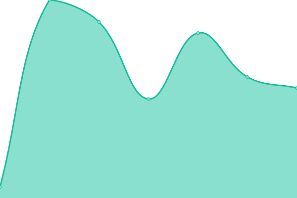
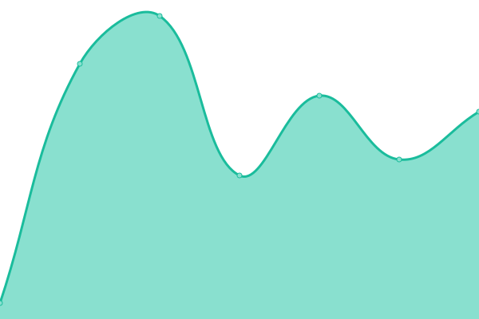
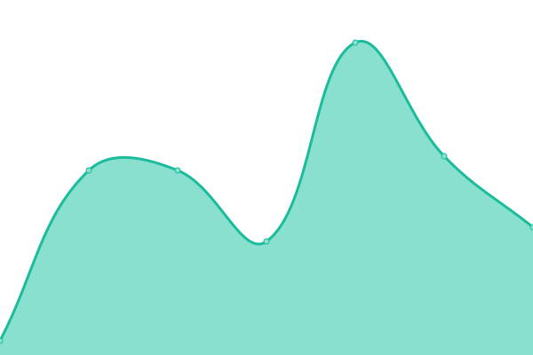

# [📈 Live Status](https://status.httpstatus.xyz): <!--live status--> **🟧 Partial outage**

This repository contains the open-source uptime monitor and status page for [Sam Petherbridge](peth.me), powered by [Upptime](https://github.com/upptime/upptime).

With [Upptime](https://upptime.js.org), you can get your own unlimited and free uptime monitor and status page, powered entirely by a GitHub repository. We use [Issues](https://github.com/SamPetherbridge/status.httpstatus.xyz/issues) as incident reports, [Actions](https://github.com/SamPetherbridge/status.httpstatus.xyz/actions) as uptime monitors, and [Pages](https://status.httpstatus.xyz) for the status page.

<!--start: status pages-->
<!-- This summary is generated by Upptime (https://github.com/upptime/upptime) -->
<!-- Do not edit this manually, your changes will be overwritten -->
<!-- prettier-ignore -->
| URL | Status | History | Response Time | Uptime |
| --- | ------ | ------- | ------------- | ------ |
|  [200 Ok - GET](https://httpstatus.xyz/200) | 🟩 Up | [200-ok-get.yml](https://github.com/SamPetherbridge/status.httpstatus.xyz/commits/master/history/200-ok-get.yml) | 

 89ms
     
 | 

<a href="https://status.httpstatus.xyz/history/200-ok-get">100.00%</a>
    

|  [200 Ok - POST](https://httpstatus.xyz/200) | 🟩 Up | [200-ok-post.yml](https://github.com/SamPetherbridge/status.httpstatus.xyz/commits/master/history/200-ok-post.yml) | 

 16ms
     
 | 

<a href="https://status.httpstatus.xyz/history/200-ok-post">100.00%</a>
    

|  [200 Ok - PUT](https://httpstatus.xyz/200) | 🟩 Up | [200-ok-put.yml](https://github.com/SamPetherbridge/status.httpstatus.xyz/commits/master/history/200-ok-put.yml) | 

 13ms
     
 | 

<a href="https://status.httpstatus.xyz/history/200-ok-put">100.00%</a>
    

|  [200 Ok - PATCH](https://httpstatus.xyz/200) | 🟩 Up | [200-ok-patch.yml](https://github.com/SamPetherbridge/status.httpstatus.xyz/commits/master/history/200-ok-patch.yml) | 

 11ms
     
 | 

<a href="https://status.httpstatus.xyz/history/200-ok-patch">100.00%</a>
    

|  [200 Ok - DELETE](https://httpstatus.xyz/200) | 🟩 Up | [200-ok-delete.yml](https://github.com/SamPetherbridge/status.httpstatus.xyz/commits/master/history/200-ok-delete.yml) | 

 15ms
     
 | 

<a href="https://status.httpstatus.xyz/history/200-ok-delete">100.00%</a>
    

|  [200 Ok - COPY](https://httpstatus.xyz/200) | 🟩 Up | [200-ok-copy.yml](https://github.com/SamPetherbridge/status.httpstatus.xyz/commits/master/history/200-ok-copy.yml) | 

 10ms
     
 | 

<a href="https://status.httpstatus.xyz/history/200-ok-copy">100.00%</a>
    

|  [200 Ok - HEAD](https://httpstatus.xyz/200) | 🟥 Down | [200-ok-head.yml](https://github.com/SamPetherbridge/status.httpstatus.xyz/commits/master/history/200-ok-head.yml) | 

 0ms
     
 | 

<a href="https://status.httpstatus.xyz/history/200-ok-head">0.33%</a>
    

|  [200 Ok - OPTIONS](https://httpstatus.xyz/200) | 🟩 Up | [200-ok-options.yml](https://github.com/SamPetherbridge/status.httpstatus.xyz/commits/master/history/200-ok-options.yml) | 

 11ms
     
 | 

<a href="https://status.httpstatus.xyz/history/200-ok-options">100.00%</a>
    

|  [200 Ok - LOCK](https://httpstatus.xyz/200) | 🟩 Up | [200-ok-lock.yml](https://github.com/SamPetherbridge/status.httpstatus.xyz/commits/master/history/200-ok-lock.yml) | 

 17ms
     
 | 

<a href="https://status.httpstatus.xyz/history/200-ok-lock">100.00%</a>
    

|  [200 Ok - UNLOCK](https://httpstatus.xyz/200) | 🟩 Up | [200-ok-unlock.yml](https://github.com/SamPetherbridge/status.httpstatus.xyz/commits/master/history/200-ok-unlock.yml) | 

 10ms
     
 | 

<a href="https://status.httpstatus.xyz/history/200-ok-unlock">100.00%</a>
    

|  [200 Ok - PROPFIND](https://httpstatus.xyz/200) | 🟩 Up | [200-ok-propfind.yml](https://github.com/SamPetherbridge/status.httpstatus.xyz/commits/master/history/200-ok-propfind.yml) | 

 13ms
     
 | 

<a href="https://status.httpstatus.xyz/history/200-ok-propfind">100.00%</a>
    

<!--end: status pages-->

[**Visit our status website →**](https://status.httpstatus.xyz)

## 📄 License

- Powered by: [Upptime](https://github.com/upptime/upptime)
- Code: [MIT](./LICENSE) © [Sam Petherbridge](peth.me)
- Data in the `./history` directory: [Open Database License](https://opendatacommons.org/licenses/odbl/1-0/)
